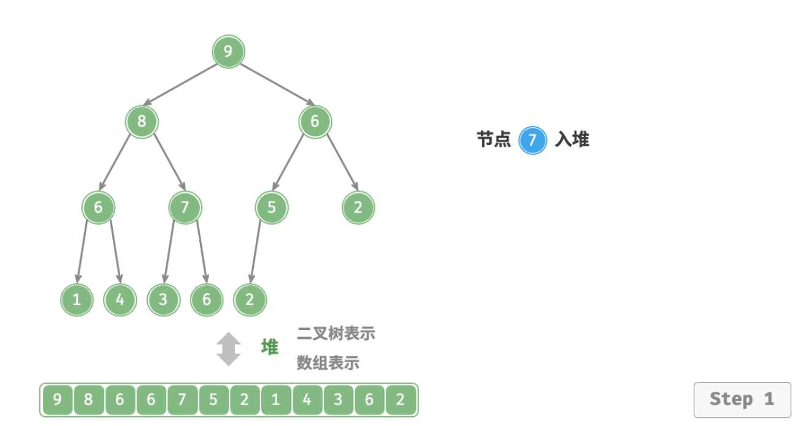
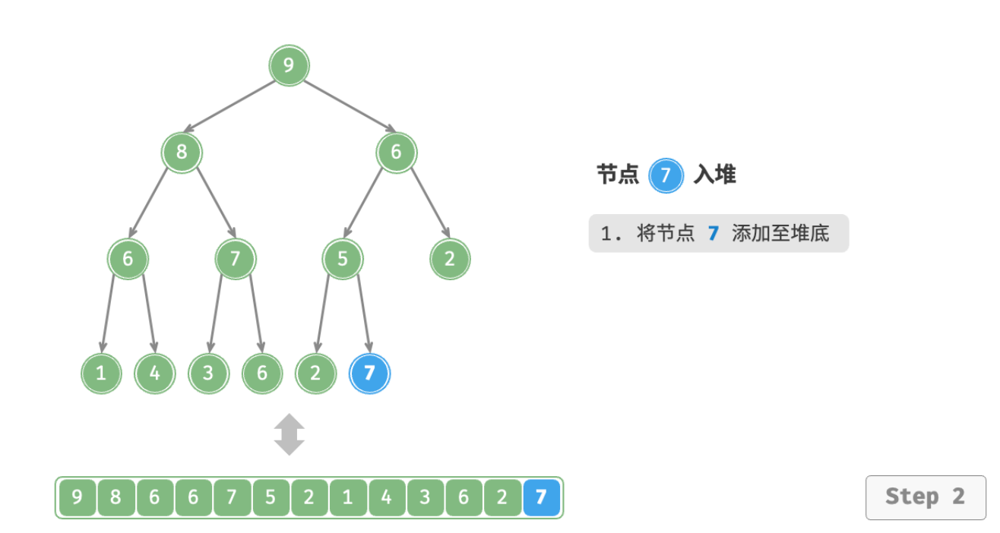
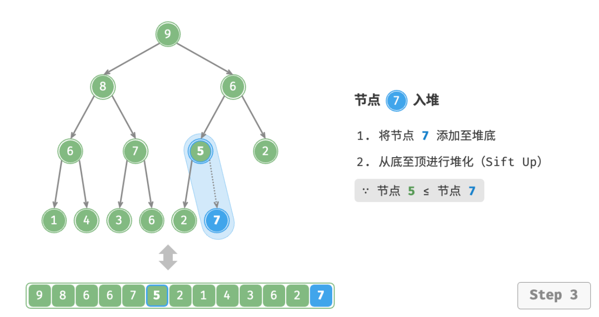
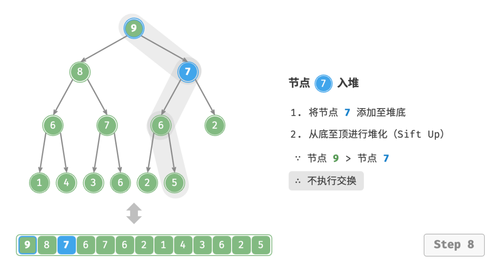
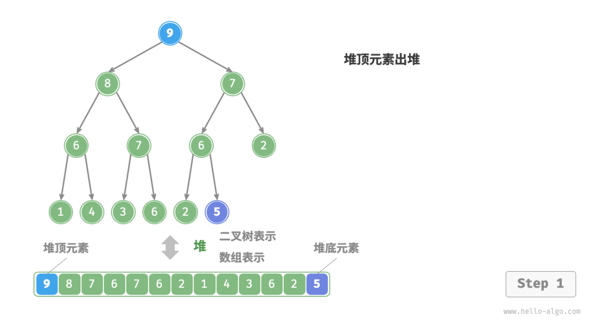
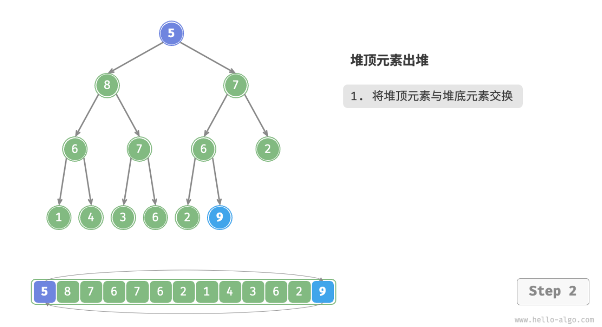
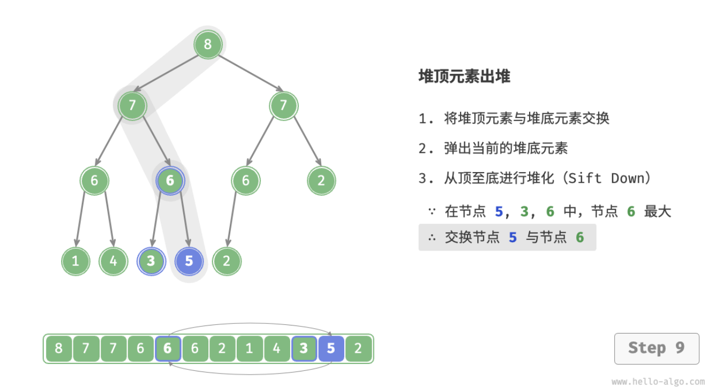

- > https://www.hello-algo.com/chapter_heap/heap/
-
- # 堆
	- **「堆 Heap」**是一种满足特定条件的完全二叉树，可分为两种类型：
		- **「大顶堆 Max Heap」**，任意节点的值 ≥ 其子节点的值；
		- **「小顶堆 Min Heap」**，任意节点的值 ≤ 其子节点的值；
	- 
	- 堆作为完全二叉树的一个特例，具有以下特性：
		- 1. 最底层节点靠左填充，其他层的节点都被填满。
		  2. 我们将二叉树的根节点称为「堆顶」，将底层最靠右的节点称为「堆底」。
		  3. 对于大顶堆（小顶堆），堆顶元素（即根节点）的值分别是最大（最小）的。
	- ## 堆常用操作
	  background-color:: blue
		- **堆通常用作实现优先队列，大顶堆相当于元素按从大到小顺序出队的优先队列**。
		- 堆的常用操作见下表，方法名需要根据编程语言来确定。
		- |方法名|描述|时间复杂度|
		  |--|--|--|
		  |push()|元素入堆|$O(\log{n})$|
		  |pop()|堆顶元素出堆|$O(\log{n})$|
		  |peek()|访问堆顶元素（大 / 小顶堆分别为最大 / 小值）|$O(1)$|
		  |size()|获取堆的元素数量|$O(1)$|
		  |isEmpty()|判断堆是否为空|$O(1)$|
	- ## 堆的实现
	  background-color:: blue
		- ### 堆的存储与表示
		  background-color:: green
			- 完全二叉树非常适合用数组来表示。由于堆正是一种完全二叉树，**我们将采用数组来存储堆**。
			- 当使用数组表示二叉树时，元素代表节点值，索引代表节点在二叉树中的位置。**节点指针通过索引映射公式来实现**。
			- 具体而言，给定索引 $i$ ，其左子节点索引为 $2i+1$ ，右子节点索引为 $2i+2$ ，父节点索引为 $(i−1)/2$（向下取整）。当索引越界时，表示空节点或节点不存在。
			- 
			- ```
			  /* 获取左子节点索引 */
			  #left(i) {
			      return 2 * i + 1;
			  }
			  
			  /* 获取右子节点索引 */
			  #right(i) {
			      return 2 * i + 2;
			  }
			  
			  /* 获取父节点索引 */
			  #parent(i) {
			      return Math.floor((i - 1) / 2); // 向下整除
			  }
			  
			  ```
		- ### 访问堆顶元素
		  background-color:: green
			- 堆顶元素即为二叉树的根节点，也就是列表的首个元素。
			- ```
			  /* 访问堆顶元素 */
			  peek() {
			      return this.#maxHeap[0];
			  }
			  ```
		- ### 元素入堆
		  background-color:: green
			- 给定元素 `val` ，我们首先将其添加到堆底。添加之后，由于 val 可能大于堆中其他元素，堆的成立条件可能已被破坏。因此，**需要修复从插入节点到根节点的路径上的各个节点**，这个操作被称为「堆化 Heapify」。
			- **从底至顶执行堆化**。具体来说，我们比较插入节点与其父节点的值，如果插入节点更大，则将它们交换。然后继续执行此操作，从底至顶修复堆中的各个节点，直至越过根节点或遇到无需交换的节点时结束。
			- 
				- 
				-
				- 
				- ...
				- 
				- 设节点总数为 $n$ ，则树的高度为 $O(\log{n})$ 。由此可知，堆化操作的循环轮数最多为 $O(\log⁡{n})$ ，**元素入堆操作的时间复杂度为** $O(\log⁡{n})$。
			- ```
			  /* 元素入堆 */
			  push(val) {
			      // 添加节点
			      this.#maxHeap.push(val);
			      // 从底至顶堆化
			      this.#siftUp(this.size() - 1);
			  }
			  
			  /* 从节点 i 开始，从底至顶堆化 */
			  #siftUp(i) {
			      while (true) {
			          // 获取节点 i 的父节点
			          const p = this.#parent(i);
			          // 当“越过根节点”或“节点无需修复”时，结束堆化
			          if (p < 0 || this.#maxHeap[i] <= this.#maxHeap[p]) break;
			          // 交换两节点
			          this.#swap(i, p);
			          // 循环向上堆化
			          i = p;
			      }
			  }
			  ```
		- ### 堆顶元素出堆
		  background-color:: green
			- 堆顶元素是二叉树的根节点，即列表首元素。[[#blue]]==如果我们直接从列表中删除首元素，那么二叉树中所有节点的索引都会发生变化，这将使得后续使用堆化修复变得困难。==为了尽量减少元素索引的变动，我们采取以下操作步骤：
				- 1. 交换堆顶元素与堆底元素（即交换**根节点**与**最右叶节点**）；
				  2. 交换完成后，将堆底从列表中删除（注意，由于已经交换，实际上删除的是原来的堆顶元素）；
				  3. 从根节点开始，**从顶至底执行堆化**；
			- 顾名思义，**从顶至底堆化的操作方向与从底至顶堆化相反**，我们[[#blue]]==将根节点的值与其两个子节点的值进行比较，将最大的子节点与根节点交换==；然后循环执行此操作，直到越过叶节点或遇到无需交换的节点时结束。
			- 
			- 
			- ...
			- 
			- 与元素入堆操作相似，堆顶元素出堆操作的时间复杂度也为 $O(\log⁡{n})$ 。
			- ```
			  /* 元素出堆 */
			  pop() {
			      // 判空处理
			      if (this.isEmpty()) throw new Error('堆为空');
			      // 交换根节点与最右叶节点（即交换首元素与尾元素）
			      this.#swap(0, this.size() - 1);
			      // 删除节点
			      const val = this.#maxHeap.pop();
			      // 从顶至底堆化
			      this.#siftDown(0);
			      // 返回堆顶元素
			      return val;
			  }
			  
			  /* 从节点 i 开始，从顶至底堆化 */
			  #siftDown(i) {
			      while (true) {
			          // 判断节点 i, l, r 中值最大的节点，记为 ma
			          const l = this.#left(i),
			              r = this.#right(i);
			          let ma = i;
			          if (l < this.size() && this.#maxHeap[l] > this.#maxHeap[ma]) ma = l;
			          if (r < this.size() && this.#maxHeap[r] > this.#maxHeap[ma]) ma = r;
			          // 若节点 i 最大或索引 l, r 越界，则无需继续堆化，跳出
			          if (ma == i) break;
			          // 交换两节点
			          this.#swap(i, ma);
			          // 循环向下堆化
			          i = ma;
			      }
			  }
			  ```
	- ## 堆常见应用
	  background-color:: blue
		- **优先队列**：堆通常作为实现优先队列的首选数据结构，其入队和出队操作的时间复杂度均为 $O(\log⁡{n})$ ，而建队操作为 $O(n)$ ，这些操作都非常高效。
		  **堆排序**：给定一组数据，我们可以用它们建立一个堆，然后不断地执行元素出堆操作，从而得到有序数据。然而，我们通常会使用一种更优雅的方式实现堆排序，详见后续的堆排序章节。
		  **获取最大的** $n$ **个元素**：这是一个经典的算法问题，同时也是一种典型应用，例如选择热度前 10 的新闻作为微博热搜，选取销量前 10 的商品等。
-