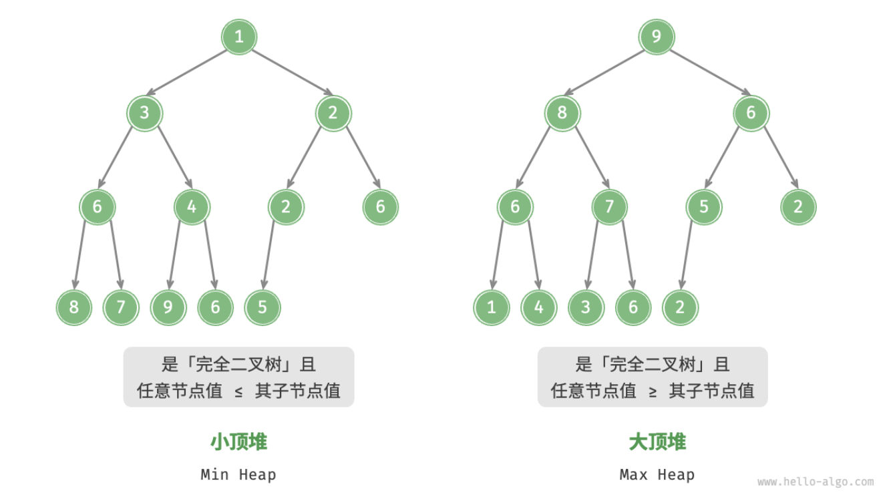
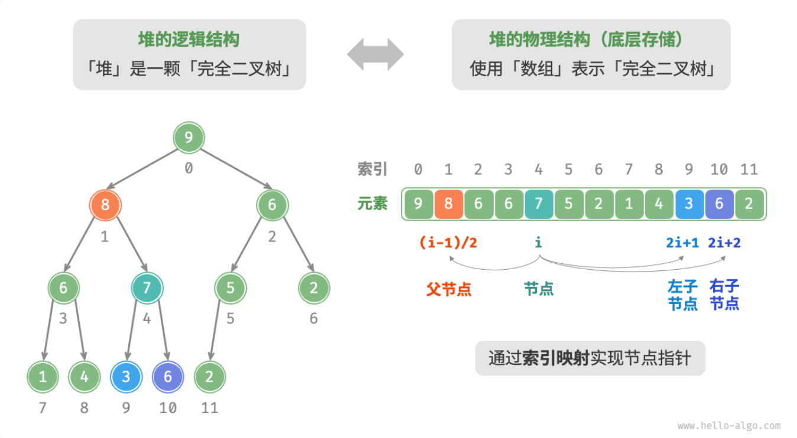

- > https://www.hello-algo.com/chapter_heap/heap/
-
- # 堆
	- **「堆 Heap」**是一种满足特定条件的完全二叉树，可分为两种类型：
		- **「大顶堆 Max Heap」**，任意节点的值 ≥ 其子节点的值；
		- **「小顶堆 Min Heap」**，任意节点的值 ≤ 其子节点的值；
	- 
	- 堆作为完全二叉树的一个特例，具有以下特性：
		- 1. 最底层节点靠左填充，其他层的节点都被填满。
		  2. 我们将二叉树的根节点称为「堆顶」，将底层最靠右的节点称为「堆底」。
		  3. 对于大顶堆（小顶堆），堆顶元素（即根节点）的值分别是最大（最小）的。
	- ## 堆常用操作
	  background-color:: blue
		- **堆通常用作实现优先队列，大顶堆相当于元素按从大到小顺序出队的优先队列**。
		- 堆的常用操作见下表，方法名需要根据编程语言来确定。
		- |方法名|描述|时间复杂度|
		  |--|--|--|
		  |push()|元素入堆|$O(\log{n})$|
		  |pop()|堆顶元素出堆|$O(\log{n})$|
		  |peek()|访问堆顶元素（大 / 小顶堆分别为最大 / 小值）|$O(1)$|
		  |size()|获取堆的元素数量|$O(1)$|
		  |isEmpty()|判断堆是否为空|$O(1)$|
	- ## 堆的实现
	  background-color:: blue
		- ### 堆的存储与表示
		  background-color:: green
			- 完全二叉树非常适合用数组来表示。由于堆正是一种完全二叉树，**我们将采用数组来存储堆**。
			- 当使用数组表示二叉树时，元素代表节点值，索引代表节点在二叉树中的位置。**节点指针通过索引映射公式来实现**。
			- 具体而言，给定索引 $i$ ，其左子节点索引为 $2i+1$ ，右子节点索引为 $2i+2$ ，父节点索引为 $(i−1)/2$（向下取整）。当索引越界时，表示空节点或节点不存在。
			- 
			- ```
			  /* 获取左子节点索引 */
			  #left(i) {
			      return 2 * i + 1;
			  }
			  
			  /* 获取右子节点索引 */
			  #right(i) {
			      return 2 * i + 2;
			  }
			  
			  /* 获取父节点索引 */
			  #parent(i) {
			      return Math.floor((i - 1) / 2); // 向下整除
			  }
			  
			  ```
		- ### 访问堆顶元素
		  background-color:: green
			- 堆顶元素即为二叉树的根节点，也就是列表的首个元素。
			- ```
			  /* 访问堆顶元素 */
			  peek() {
			      return this.#maxHeap[0];
			  }
			  ```
		- ### 元素入堆
		  background-color:: green
			- 给定元素 `val` ，我们首先将其添加到堆底。添加之后，由于 val 可能大于堆中其他元素，堆的成立条件可能已被破坏。因此，**需要修复从插入节点到根节点的路径上的各个节点**，这个操作被称为「堆化 Heapify」。
			- **从底至顶执行堆化**。具体来说，我们比较插入节点与其父节点的值，如果插入节点更大，则将它们交换。然后继续执行此操作，从底至顶修复堆中的各个节点，直至越过根节点或遇到无需交换的节点时结束。
			-
-