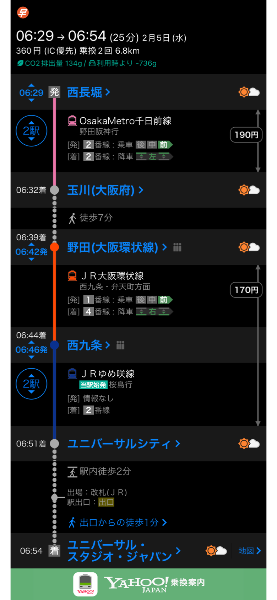

-
- Agenda
	- TODO 准备清单 >[2025-02-02](#agenda://?start=1738470600000&end=1738474200000)
		- DONE 护照、签证（电子签证截图、打印）>[2025-02-02](#agenda://?start=1738470600000&end=1738474200000)
		- DONE 转换头 >[2025-02-02](#agenda://?start=1738470600000&end=1738474200000)
		- TODO Visit Japan Web入境登记 -> 生成QR code 截图 >[2025-02-02](#agenda://?start=1738470600000&end=1738474200000)
		- TODO 金饰不可入境日本 >[2025-02-02](#agenda://?start=1738470600000&end=1738474200000)
		- TODO 现金日元 30000JPY >[2025-02-02](#agenda://?start=1738470600000&end=1738474200000)
		- DONE 银联卡、信用卡 >[2025-02-02](#agenda://?start=1738470600000&end=1738474200000)
		- DONE 流量卡（淘宝购买）、机场购买
		- DONE 租相机
	- TODO 春秋航空 9C6573 浦东T2 - 关西T2 >[2025-02-03 12:40 - 16:00](#agenda://?start=1738557600000&end=1738569600000&allDay=false)
		- TODO 机场 -> Check in
			- 南海特急Rapit 970JPY + 指定席 520JPY：到达难波站；千日前线（粉）190JPY：到达西長堀
			- 南海急行 970JPY：到达难波站；千日前线（粉）190JPY：到达西長堀
			  background-color:: green
			- check in 后看时间去心斋桥 or 阿波座 吃饭
	- TODO 东航 MU516 关西T1 - 浦东T1 >[2025-02-07 14:20 - 16:05](#agenda://?start=1738909200000&end=1738915500000&allDay=false)
- ## Day 1
	- TODO 大阪城公园 >[2025-02-04 09:30 - 12:00](#agenda://?start=1738632607840&end=1738641607840&allDay=false)
		- 浴衣妆照 待定 10:00
		- 天守阁需要门票，klook购买
	- TODO 心斋桥 逛街 午饭 >[2025-02-04 12:30 - 13:00](#agenda://?start=1738643400000&end=1738645200000&allDay=false)
		- 大丸百货 LOEWE围巾
		- YSL
		- united arrows
	- TODO 橘子街 购物 >[2025-02-04 14:30 - 18:00](#agenda://?start=1738650600000&end=1738663200000&allDay=false)
		- Sora
	- TODO 晚餐 烤肉 >[2025-02-04 19:00 - 21:00](#agenda://?start=1738666800000&end=1738674000000&allDay=false)
		- 记得预约
- ## Day 2
	- TODO USJ >[2025-02-05](#agenda://?start=1738765800000&end=1738769400000)
		- 6点起床
		- 交通
			- 
			-
		- 买票：提前绑定【电子号码券】—【登记入场券】，绑定方式二选一，可以同时绑定同行人的票
		- 园后立即打开【园区入场号码券/抽取券】，勾选姓名进行抢券。选择时间，预约成功
		- 入园后买马里奥手环
		- ### 马里奥园区
		  background-color:: green
			- 1、马里奥餐厅：达指定范围内扫码
			- 2、疯狂矿车
			- 3、耀西冒险
			- 4、餐厅就餐
			- 5、通关小游戏
			- 6、购物
		- ### 哈利波特园区
		  background-color:: pink
- ## Day 3
	- TODO 买LV包包 >[2025-02-06 10:00 - 12:30](#agenda://?start=1738807200000&end=1738816200000&allDay=false)
	- TODO 午餐 - 待定 >[2025-02-06 12:30 - 13:00](#agenda://?start=1738816200000&end=1738818000000&allDay=false)
	- TODO 梅田购物 >[2025-02-06 14:30 - 18:00](#agenda://?start=1738823400000&end=1738836000000&allDay=false)
		- 西太后、RL
		- Topologie水瓶包 - LUCUA110
		- Beams
	- TODO 晚餐 - 蓝天大厦展望台 >[2025-02-06 19:30 - 21:30](#agenda://?start=1738841400000&end=1738848600000&allDay=false)
- ## Day 4
	- TODO 关西机场买完化妆品再往里面走，有一个Sanrio gift gate，买Hellokitty 和服装
-
- 366.48
- 1790.24
- 661.70
- 192.69
- 900