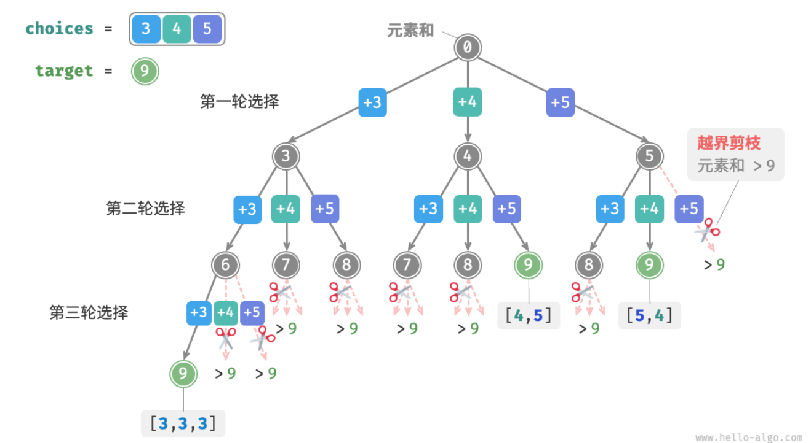
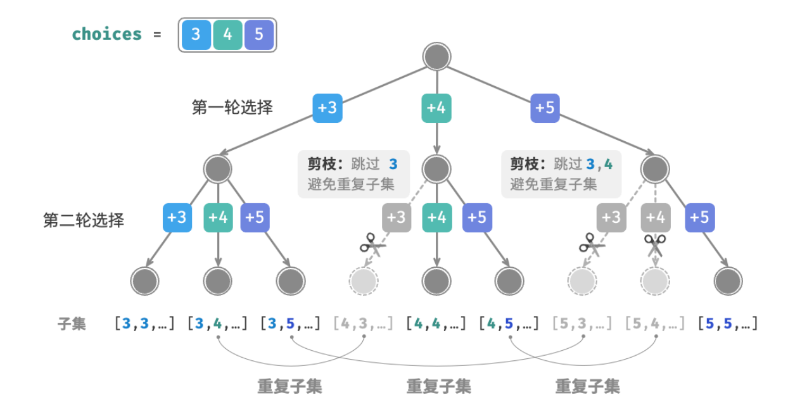
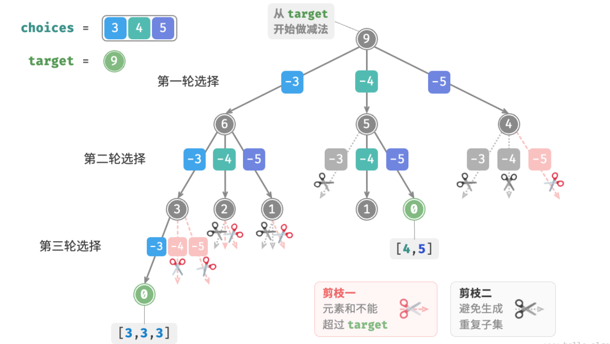

- > https://www.hello-algo.com/chapter_backtracking/subset_sum_problem/
-
- > ❓ **Question**
  >
  > 给定一个正整数数组 `nums` 和一个目标正整数 `target` ，请找出所有可能的组合，使得组合中的元素和等于 `target` 。给定数组无重复元素，每个元素可以被选取多次。请以列表形式返回这些组合，列表中不应包含重复组合。
- ## 从全排列引出解法
	- 本题允许重复选取同一元素，因此无需借助 `selected` 布尔列表来记录元素是否已被选择。我们可以对全排列代码进行小幅修改，初步得到解题代码。
	- ```
	  /* 回溯算法：子集和 I */
	  function backtrack(state, target, total, choices, res = []) {
	      // 子集和等于 target 时，记录解
	      if (total === target) {
	          res.push(state);
	          return;
	      }
	      // 遍历所有选择
	      for (let i = 0; i < choices.length; i++) {
	          // 剪枝：若子集和超过 target ，则跳过该选择
	          if (total + choices[i] > target) {
	              continue;
	          }
	          // 尝试：做出选择，更新元素和 total
	          state.push(choices[i]);
	          // 进行下一轮选择
	          backtrack(state, target, total + choices[i], choices, res);
	          // 回退：撤销选择，恢复到之前的状态
	          state.remove(state.size() - 1);
	      }
	  }
	  
	  /* 求解子集和 I（包含重复子集） */
	  function subsetSumINaive(nums, target) {
	      const state = []; // 状态（子集）
	      let total = 0; // 子集和
	      const res = []; // 结果列表（子集列表）
	      backtrack(state, target, total, nums, res);
	      return res;
	  }
	  ```
	- 
	- **虽然成功找出了所有和为 9 的子集，但其中存在重复的子集 [4,5] 和 [5,4]**
- ## 重复子集剪枝
	- 为了去除重复子集，**一种直接的思路是对结果列表进行去重**。但这个方法效率很低，因为：
		- 当数组元素较多，尤其是当 `target` 较大时，搜索过程会产生大量的重复子集。
		- 比较子集（数组）的异同是很耗时的，需要先排序数组，再比较数组中每个元素的异同。
	- 为了达到最佳效率，**我们希望在搜索过程中通过剪枝进行去重**。观察下图，重复子集是在以不同顺序选择数组元素时产生的，具体来看：
		- 1. 第一轮和第二轮分别选择 3 , 4 ，会生成包含这两个元素的所有子集，记为 [3,4,⋯] 。
		  2. 若第一轮选择 4 ，**则第二轮应该跳过 3** ，因为该选择产生的子集 [4,3,⋯] 和 `1.` 中提到的子集完全重复。
		  3. 同理，若第一轮选择 5 ，**则第二轮应该跳过 3 和 4** ，因为子集 [5,3,⋯] 和子集 [5,4,⋯] 和之前的子集重复。
	- 
	- 总结来看，给定输入数组 $[x_1,x_2,⋯,x_n]$ ，设搜索过程中的选择序列为 $[x_{i1},x_{i2},⋯,x_{im}]$ ，则该选择序列需要满足 $i_1≤i_2≤⋯≤i_m$ 。**不满足该条件的选择序列都是重复子集**。
	- 为实现该剪枝，我们初始化变量 `start` ，用于指示遍历起点。**当做出选择 $x_i$ 后，设定下一轮从索引 $i$ 开始遍历**，从而完成子集去重。
	- 除此之外，我们还对代码进行了两项优化。首先，我们在开启搜索前将数组 `nums` 排序，在搜索过程中，**当子集和超过 `target` 时直接结束循环**，因为后边的元素更大，其子集和都一定会超过 `target` 。其次，**我们通过在 `target` 上执行减法来统计元素和**，当 `target` 等于 0 时记录解，省去了元素和变量 `total` 。
	- ```
	  /* 回溯算法：子集和 I */
	  function backtrack(state, target, choices, start, res) {
	      // 子集和等于 target 时，记录解
	      if (target == 0) {
	          res.push(state)
	          return;
	      }
	      // 遍历所有选择
	      // 剪枝二：从 start 开始遍历，避免生成重复子集
	      for (let i = start; i < choices.length; i++) {
	          // 剪枝一：若子集和超过 target ，则直接结束循环
	          // 这是因为数组已排序，后边元素更大，子集和一定超过 target
	          if (target - choices[i] < 0) {
	              break;
	          }
	          // 尝试：做出选择，更新 target, start
	          state.push(choices[i]);
	          // 进行下一轮选择
	          backtrack(state, target - choices[i], choices, i, res);
	          // 回退：撤销选择，恢复到之前的状态
	          state.pop(state.size() - 1);
	      }
	  }
	  
	  /* 求解子集和 I */
	  function subsetSumI(nums, target) {
	      const state = []; 
	      Arrays.sort(nums); // 对 nums 进行排序
	      let start = 0; // 遍历起始点
	      const res = [];
	      backtrack(state, target, nums, start, res);
	      return res;
	  }
	  ```
	- 
- ## 相等元素剪枝
	-