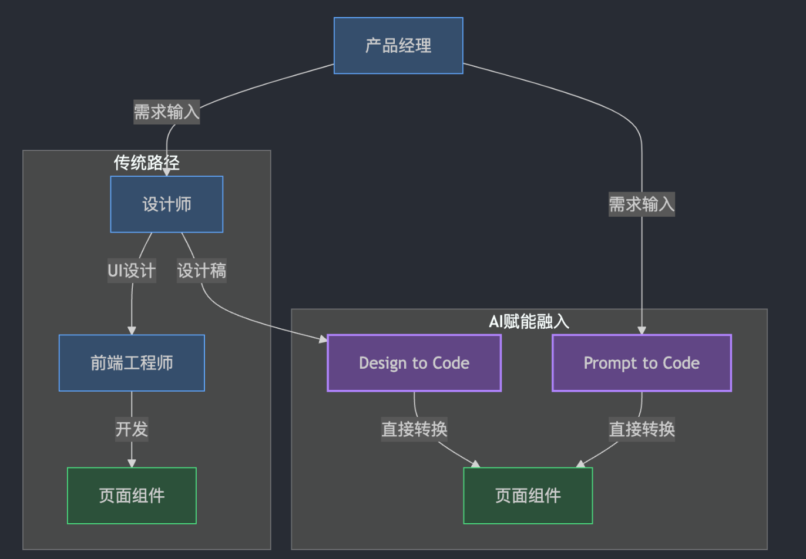

- > [Compoder README](https://github.com/IamLiuLv/compoder/blob/main/README_CN.md)
- ## 🔥 核心特性
	- **定制 Codegen（Component Code Generator）**：支持自由定制基于多种技术栈、组件库、场景、代码规范、AI 模型等的组件代码生成器。
- ## 🌟 基础功能
	- Prompt（文字、图片）To Code：输入文字或图片，即可生成组件代码
	- 代码版本迭代：支持代码版本迭代，可以查看历史版本，并基于任意版本生成新的代码
	- 代码在线微调：支持代码在线微调，集成了代码编辑器，可以直观对代码进行微调和保存
	- 代码实时预览：自建了一套代码实时预览沙箱环境，支持多种技术栈（如：React、Vue、开源包、私有包）的秒级渲染
- ## 环境准备与项目启动
	- [环境搭建](https://github.com/IamLiuLv/compoder/blob/main/CONTRIBUTING_CN.md)
- ## 设计理念
	- ### 产品设计
		- 
		-