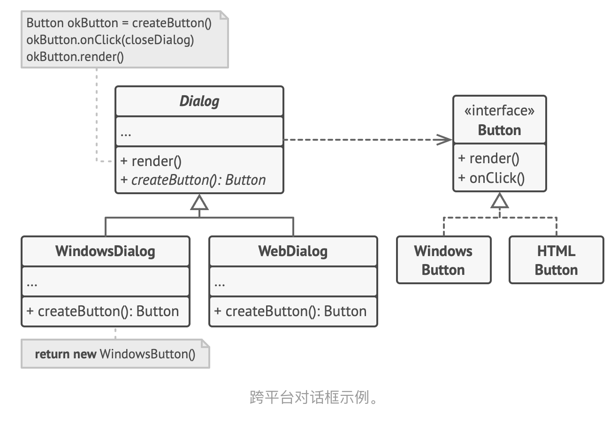

- > https://refactoringguru.cn/design-patterns/factory-method
- > **亦称： **虚拟构造函数、Virtual Constructor、Factory Method
- ## 意图
	- **工厂方法模式**是一种创建型设计模式， 其在父类中提供一个创建对象的方法， 允许子类决定实例化对象的类型。
- ## 问题
	- 假设你正在开发一款物流管理应用。 最初版本只能处理卡车运输， 因此大部分代码都在位于名为 `卡车`的类中。
	- 一段时间后， 这款应用变得极受欢迎。 你每天都能收到十几次来自海运公司的请求， 希望应用能够支持海上物流功能。
	- 这可是个好消息。 但是代码问题该如何处理呢？ 目前， 大部分代码都与 `卡车`类相关。 在程序中添加 `轮船`类需要修改全部代码。 更糟糕的是， 如果你以后需要在程序中支持另外一种运输方式， 很可能需要再次对这些代码进行大幅修改。
- ## 解决方案
	- 工厂方法模式建议使用特殊的*工厂*方法代替对于对象构造函数的直接调用 （即使用 `new`运算符）。 不用担心， 对象仍将通过 `new`运算符创建， 只是该运算符改在工厂方法中调用罢了。 工厂方法返回的对象通常被称作 “产品”。
	- 乍看之下， 这种更改可能毫无意义： 我们只是改变了程序中调用构造函数的位置而已。 但是， 仔细想一下， 现在你可以在子类中重写工厂方法， 从而改变其创建产品的类型。
	- 但有一点需要注意:仅当这些产品具有共同的基类或者接口时， 子类才能返回不同类型的产品， 同时基类中的工厂方法还应将其返回类型声明为这一共有接口。
	- 调用工厂方法的代码 （通常被称为*客户端*代码） 无需了解不同子类返回实际对象之间的差别。 客户端将所有产品视为抽象的 `运输` 。 客户端知道所有运输对象都提供 `交付`方法， 但是并不关心其具体实现方式。
- ## 工厂方法模式结构
	- 
- ## 伪代码
	- 以下示例演示了如何使用**工厂方法**开发跨平台 UI （用户界面） 组件， 并同时避免客户代码与具体 UI 类之间的耦合。
	- 
	- ```
	  // 创建者类声明的工厂方法必须返回一个产品类的对象。创建者的子类通常会提供该方法的实现。
	  class Dialog is
	      // 创建者还可提供一些工厂方法的默认实现。
	      abstract method createButton():Button
	  
	      // 请注意，创建者的主要职责并非是创建产品。其中通常会包含一些核心业务
	      // 逻辑，这些逻辑依赖于由工厂方法返回的产品对象。子类可通过重写工厂方
	      // 法并使其返回不同类型的产品来间接修改业务逻辑。
	      method render() is
	          // 调用工厂方法创建一个产品对象。
	          Button okButton = createButton()
	          // 现在使用产品。
	          okButton.onClick(closeDialog)
	          okButton.render()
	  
	  // 具体创建者将重写工厂方法以改变其所返回的产品类型。
	  class WindowsDialog extends Dialog is
	      method createButton():Button is
	          return new WindowsButton()
	  
	  class WebDialog extends Dialog is
	      method createButton():Button is
	          return new HTMLButton()
	  
	  ```
	- ```
	  // 产品接口中将声明所有具体产品都必须实现的操作。
	  interface Button is
	      method render()
	      method onClick(f)
	  
	  // 具体产品需提供产品接口的各种实现。
	  class WindowsButton implements Button is
	      method render(a, b) is
	          // 根据 Windows 样式渲染按钮。
	      method onClick(f) is
	          // 绑定本地操作系统点击事件。
	  
	  class HTMLButton implements Button is
	      method render(a, b) is
	          // 返回一个按钮的 HTML 表述。
	      method onClick(f) is
	          // 绑定网络浏览器的点击事件。
	  ```
	- ```
	  class Application is
	      field dialog: Dialog
	  
	      // 程序根据当前配置或环境设定选择创建者的类型。
	      method initialize() is
	          config = readApplicationConfigFile()
	  
	          if (config.OS == "Windows") then
	              dialog = new WindowsDialog()
	          else if (config.OS == "Web") then
	              dialog = new WebDialog()
	          else
	              throw new Exception("错误！未知的操作系统。")
	  
	      // 当前客户端代码会与具体创建者的实例进行交互，但是必须通过其基本接口
	      // 进行。只要客户端通过基本接口与创建者进行交互，你就可将任何创建者子
	      // 类传递给客户端。
	      method main() is
	          this.initialize()
	          dialog.render()
	  ```
- ## 工厂方法模式适合应用场景
	- ### 当你在编写代码的过程中，如果无法预知对象确切类别及其依赖关系时，可使用工厂方法。
		- 工厂方法将创建产品的代码与实际使用产品的代码分离， 从而能在不影响其他代码的情况下扩展产品创建部分代码。
		- 例如， 如果需要向应用中添加一种新产品， 你只需要开发新的创建者子类， 然后重写其工厂方法即可。
	- ### 如果你希望用户能扩展你软件库或框架的内部组件，可使用工厂方法。
	- ### 如果你希望复用现有对象来节省系统资源，而不是每次都重新创建对象，可使用工厂方法。
- ## 工厂方法模式 优缺点
	- [[#green]]==你可以避免创建者和具体产品之间的紧密耦合。==
	- [[#green]]==*单一职责原则*。 你可以将产品创建代码放在程序的单一位置， 从而使得代码更容易维护。==
	- [[#green]]==*开闭原则*。 无需更改现有客户端代码， 你就可以在程序中引入新的产品类型。==
	- [[#red]]==应用工厂方法模式需要引入许多新的子类， 代码可能会因此变得更复杂。 最好的情况是将该模式引入创建者类的现有层次结构中。==
- ## 代码示例
	-