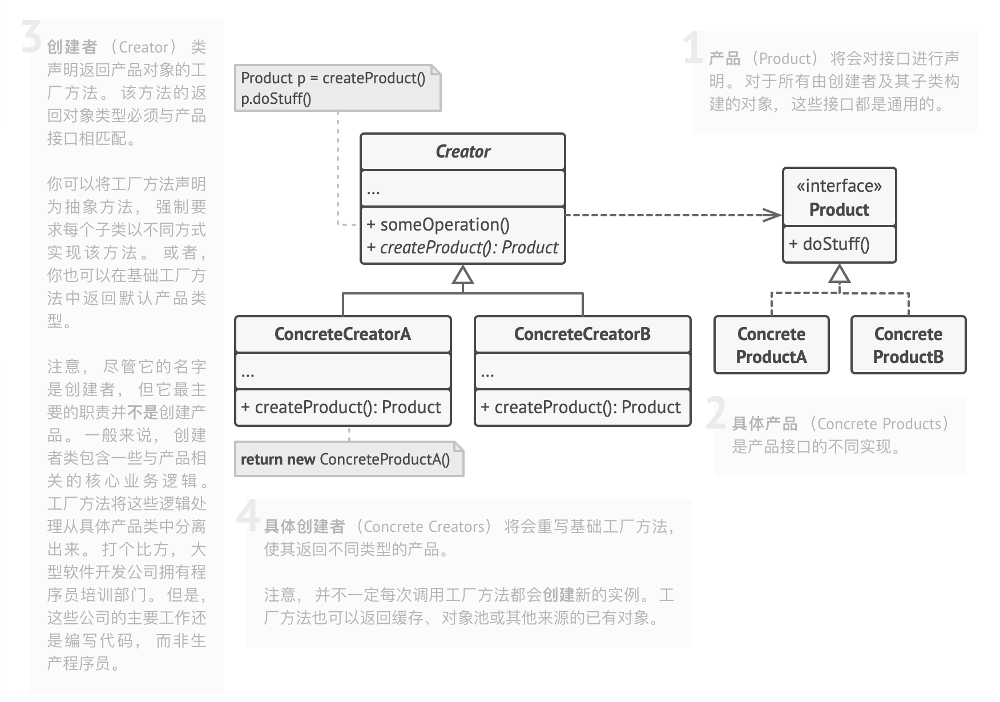

- > https://refactoringguru.cn/design-patterns/factory-method
- > **亦称： **虚拟构造函数、Virtual Constructor、Factory Method
- ## 意图
	- **工厂方法模式**是一种创建型设计模式， 其在父类中提供一个创建对象的方法， 允许子类决定实例化对象的类型。
- ## 问题
	- 假设你正在开发一款物流管理应用。 最初版本只能处理卡车运输， 因此大部分代码都在位于名为 `卡车`的类中。
	- 一段时间后， 这款应用变得极受欢迎。 你每天都能收到十几次来自海运公司的请求， 希望应用能够支持海上物流功能。
	- 这可是个好消息。 但是代码问题该如何处理呢？ 目前， 大部分代码都与 `卡车`类相关。 在程序中添加 `轮船`类需要修改全部代码。 更糟糕的是， 如果你以后需要在程序中支持另外一种运输方式， 很可能需要再次对这些代码进行大幅修改。
- ## 解决方案
	- 工厂方法模式建议使用特殊的*工厂*方法代替对于对象构造函数的直接调用 （即使用 `new`运算符）。 不用担心， 对象仍将通过 `new`运算符创建， 只是该运算符改在工厂方法中调用罢了。 工厂方法返回的对象通常被称作 “产品”。
	- 乍看之下， 这种更改可能毫无意义： 我们只是改变了程序中调用构造函数的位置而已。 但是， 仔细想一下， 现在你可以在子类中重写工厂方法， 从而改变其创建产品的类型。
	- 但有一点需要注意:仅当这些产品具有共同的基类或者接口时， 子类才能返回不同类型的产品， 同时基类中的工厂方法还应将其返回类型声明为这一共有接口。
	- 调用工厂方法的代码 （通常被称为*客户端*代码） 无需了解不同子类返回实际对象之间的差别。 客户端将所有产品视为抽象的 `运输` 。 客户端知道所有运输对象都提供 `交付`方法， 但是并不关心其具体实现方式。
- ## 工厂方法模式结构
	- 
-