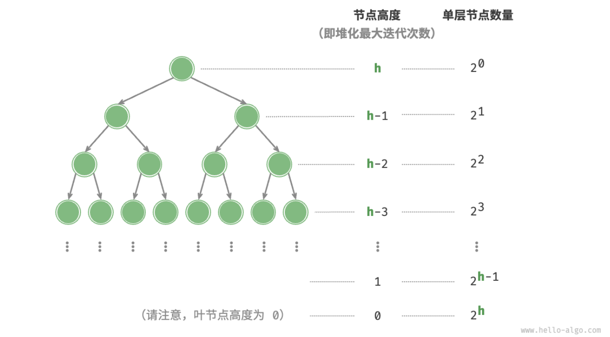

- > https://www.hello-algo.com/chapter_heap/build_heap/
-
- 如果我们想要根据输入列表生成一个堆，这个过程被称为「建堆」。
- ## 借助入堆方法实现
	- 最直接的方法是借助“**元素入堆操作**”实现，首先创建一个空堆，然后将列表元素依次添加到堆中。
	- 设元素数量为 $n$ ，则最后一个元素入堆的时间复杂度为 $O(\log{n})$ 。在依次添加元素时，堆的平均长度为 $\frac{n}{2}$ ，因此该方法的总体时间复杂度为 $O(n\log⁡{n})$ 。
- ## 基于堆化操作实现
	- 有趣的是，存在一种更高效的建堆方法，其时间复杂度仅为 $O(n)$。
	- 我们先将列表所有元素原封不动添加到堆中，**然后迭代地对各个节点执行“从顶至底堆化”**。当然，**我们不需要对叶节点执行堆化操作**，因为它们没有子节点。
	- ```
	  /* 构造方法，建立空堆或根据输入列表建堆 */
	  constructor(nums) {
	      // 将列表元素原封不动添加进堆
	      this.#maxHeap = nums === undefined ? [] : [...nums];
	      // 堆化除叶节点以外的其他所有节点
	      for (let i = this.#parent(this.size() - 1); i >= 0; i--) {
	          this.#siftDown(i);
	      }
	  }
	  ```
- ## 复杂度分析
	- 为什么第二种建堆方法的时间复杂度是 $O(n)$ ？我们来展开推算一下。
		- 1. 完全二叉树中，设节点总数为 $n$ ，则根据 {{embed ((64883207-c377-4091-b6c1-fd0413fa15af))}} ， 叶节点数量为 $(n+1)/2$ ，其中 / 为向下整除。因此，在排除叶节点后，需要堆化的节点数量为 $(n−1)/2$ ，复杂度为 $O(n)$；
		- 2. 在从顶至底堆化的过程中，每个节点最多堆化到叶节点，因此最大迭代次数为二叉树高度 $O(\log⁡{n})$ ；
	- 将上述两者相乘，可得到建堆过程的时间复杂度为 $O(n\log⁡{n})$ 。然而，[[#red]]==这个估算结果并不准确，因为我们没有考虑到二叉树底层节点数量远多于顶层节点的特性==。
	-
	- 为了减小计算难度，我们假设树是一个“完美二叉树”，该假设不会影响计算结果的正确性。设二叉树（即堆）节点数量为 $n$ ，树高度为 $h$ 。上文提到，**节点堆化最大迭代次数等于该节点到叶节点的距离，而该距离正是“节点高度”**。
	- 
	-
	-
-