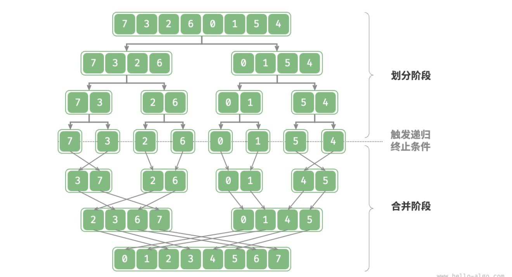

- > https://www.hello-algo.com/chapter_sorting/merge_sort/
-
- **「归并排序 Merge Sort」**基于分治思想实现排序，包含**“划分”**和**“合并”**两个阶段：
	- **划分阶段**：通过递归不断地将数组从中点处分开，将长数组的排序问题转换为短数组的排序问题；
	- **合并阶段**：当子数组长度为 1 时终止划分，开始合并，持续地将左右两个较短的有序数组合并为一个较长的有序数组，直至结束；
	- 
- ## 算法流程
	- **“划分阶段”**从顶至底递归地将数组从中点切为两个子数组，直至长度为 1 ：
		- 1. 计算数组中点 `mid` ，递归划分左子数组（区间 `[left, mid]` ）和右子数组（区间 `[mid + 1, right]` ）；
		- 2. 递归执行步骤 `1.` ，直至子数组区间长度为 1 时，终止递归划分；
	- **“合并阶段”**从底至顶地将左子数组和右子数组合并为一个有序数组。需要注意的是，从长度为 1 的子数组开始合并，合并阶段中的每个子数组都是有序的。
	- 观察发现，归并排序的递归顺序与二叉树的后序遍历相同，具体来看：
		- **后序遍历**：先递归左子树，再递归右子树，最后处理根节点。
		- **归并排序**：先递归左子数组，再递归右子数组，最后处理合并。
	- ```
	  /* 合并左子数组和右子数组 */
	  // 左子数组区间 [left, mid]
	  // 右子数组区间 [mid + 1, right]
	  function merge(nums, left, mid, right) {
	      // 初始化辅助数组
	      let tmp = nums.slice(left, right + 1);
	      // 左子数组的起始索引和结束索引
	      let leftStart = left - left,
	          leftEnd = mid - left;
	      // 右子数组的起始索引和结束索引
	      let rightStart = mid + 1 - left,
	          rightEnd = right - left;
	      // i, j 分别指向左子数组、右子数组的首元素
	      let i = leftStart,
	          j = rightStart;
	      // 通过覆盖原数组 nums 来合并左子数组和右子数组
	      for (let k = left; k <= right; k++) {
	          if (i > leftEnd) {
	              // 若“左子数组已全部合并完”，则选取右子数组元素，并且 j++
	              nums[k] = tmp[j++];
	          } else if (j > rightEnd || tmp[i] <= tmp[j]) {
	              // 否则，若“右子数组已全部合并完”或“左子数组元素 <= 右子数组元素”，则选取左子数组元素，并且 i++
	              nums[k] = tmp[i++];
	          } else {
	              // 否则，若“左右子数组都未全部合并完”且“左子数组元素 > 右子数组元素”，则选取右子数组元素，并且 j++
	              nums[k] = tmp[j++];
	          }
	      }
	  }
	  
	  /* 归并排序 */
	  function mergeSort(nums, left, right) {
	      // 终止条件
	      if (left >= right) return; // 当子数组长度为 1 时终止递归
	      // 划分阶段
	      let mid = Math.floor((left + right) / 2); // 计算中点
	      mergeSort(nums, left, mid); // 递归左子数组
	      mergeSort(nums, mid + 1, right); // 递归右子数组
	      // 合并阶段
	      merge(nums, left, mid, right);
	  }
	  ```
	- 合并方法 `merge()` 代码中的难点包括：
		- **在阅读代码时，需要特别注意各个变量的含义**。`nums` 的待合并区间为 `[left, right]` ，但由于 `tmp` 仅复制了 `nums` 该区间的元素，因此 `tmp` 对应区间为 `[0, right - left]` 。
		- 在比较 `tmp[i]` 和 `tmp[j]` 的大小时，**还需考虑子数组遍历完成后的索引越界问题**，即 `i > leftEnd` 和 `j > rightEnd` 的情况。索引越界的优先级是最高的，如果左子数组已经被合并完了，那么不需要继续比较，直接合并右子数组元素即可。
- ## 算法特性
	- **时间复杂度 $O(n\log⁡{n})$ 、非自适应排序** ：划分产生高度为 $\log{n}$ 的递归树，每层合并的总操作数量为 $n$ ，因此总体时间复杂度为 $O(n\log{n})$ 。
	- **空间复杂度 $O(n)$ 、非原地排序** ：递归深度为 $\log⁡{n}$ ，使用 $O(\log{n})$ 大小的栈帧空间。合并操作需要借助辅助数组实现，使用 $O(n)$ 大小的额外空间。
- ## 链表排序 *
	- 归并排序在排序链表时具有显著优势，空间复杂度可以优化至 $O(1)$ ，原因如下：
		- 由于链表仅需改变指针就可实现节点的增删操作，因此合并阶段（将两个短有序链表合并为一个长有序链表）无需创建辅助链表。
		  通过使用“迭代划分”替代“递归划分”，可省去递归使用的栈帧空间；