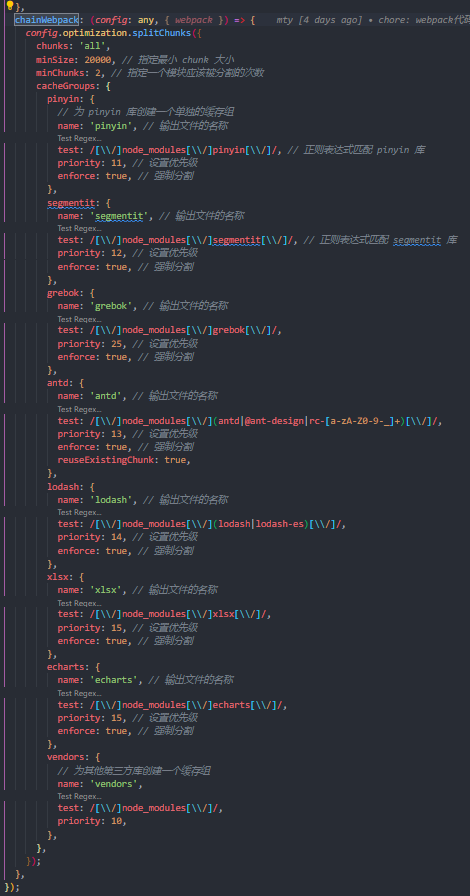

## 动态导入
	- 
	- > 动态导入的依赖会被代码分割为独立的打包，按需引入；注意有些第三方库需要同步调用，使用useEffect。
- ## umi中代码分割配置
	- ### 构建产物分析
		- `npm run analyze` 或 `ANALYZE=1 umi build`
		- 
	- ### 代码分割规则
		- 
	- ### umi 在本地验证build构建产物
		- `npm run preview` 或 `npm run build && max preview --port 8000`
		- 子应用打包后复制到主应用dist下，将文件夹名改为子应用app name即可。
- ## 服务端gzip压缩
	- `nginx`配置 response header：`Content-Encoding: gzip`
	- 注意 `gzip on` 的 `Content-Type` 要包含要压缩的资源
	- 
	- 
- ## 其他优化手段
	- ### 对打包体积较大的第三方依赖，例如 pinyin，替换为轻量化的 pinyin-pro
	- ### 对qiankun 微应用框架下的子应用可以提取公共依赖（从微应用理念上，不提倡提取公共依赖）
	- ### 微应用 prefetchApp 不在 login 页面触发，以减少登陆等待时间
- ## 优化结果
	- 1. Nginx服务端进行gzip配置
		- 12M资源可被压缩至4M左右
	- 2. 对umi下的项目进行code splitting，将echarts、antd、lodash、pinyin、组件库grebok等依赖拆分出来
		- 分拆后，umi主包减小到400k左右，总体资源包体积3M左右
	- 3. pinyin库是一个将中文转化为pinyin的纯前端库，自带分词词库segmentit，此词库体积较大（约1.7M），但实际项目中未使用到分词功能，因此将pinyin库替换为pinyin-pro库，打包体积减小为140k左右
	- 4. 首次进入登录页面时，prefetchApp加载会阻塞页面渲染，因此在登录界面不进行预加载