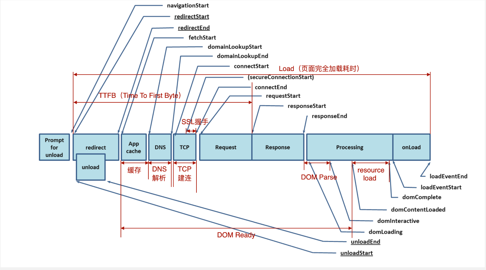

## RAIL 测量模型
	- ### Response 响应
	  background-color:: pink
		- 处理事件在 [[#green]]==50ms== 以内完成；
	- ### Animation 动画
	  background-color:: pink
		- 动画每 [[#green]]==10ms== 产生一帧；
	- ### Idle 空闲
	  background-color:: pink
		- 尽可能增加空闲时间；
	- ### Load 加载
	  background-color:: pink
		- 在 [[#green]]==5s== 内完成内容加载并可以交互；
- ## 性能测量工具
	- ### Chrome DevTools 开发调试、性能评测
	  background-color:: pink
		- Audit (Lighthouse)
		- Throttling 调整网络吞吐量
		- Performance 性能分析
		- Network 网络加载分析
	- ### Lighthouse 网站整体质量评估
	  background-color:: pink
	- ### WebPageTest 多测试地点、全面性能报告
	  background-color:: pink
	- ### 常用的性能测量 APIs
	  background-color:: green
		- 
		-
		- **1. 计算一些关键的性能指标：**
			- ```
			  // 计算一些关键的性能指标
			  window.addEventListener('load', (event) => {
			      // Time to Interactive
			      let timing = performance.getEntriesByType('navigation')[0];
			      console.log(timing.domInteractive);
			      console.log(timing.fetchStart);
			      let diff = timing.domInteractive - timing.fetchStart;
			      console.log("TTI: " + diff);
			  })
			  ```
		- **2. 监听长任务**
			- ```
			  // 观察长任务
			  const observer = new PerformanceObserver((list) => {
			      for (const entry of list.getEntries()) {
			          console.log(entry)
			      }
			  })
			  
			  observer.observe({entryTypes: ['longtask']})
			  ```
		- **3. 页面可见性的状态监听**
			- ```
			  // 页面可见性的状态监听
			  let vEvent = 'visibilitychange';
			  if (document.webkitHidden != undefined) {
			      // webkit prefix detected
			      vEvent = 'webkitvisibilitychange';
			  }
			  
			  function visibilityChanged() {
			      if (document.hidden || document.webkitHidden) {
			          console.log("Web page is hidden.")
			      } else {
			          console.log("Web page is visible.")
			      }
			  }
			  
			  document.addEventListener(vEvent, visibilityChanged, false);
			  ```
		- **4. 网络状态监听**
			- ```
			  const connection = navigator.connection || navigator.mozConnection || navigator.webkitConnection;
			  let type = connection.effectiveType;
			  
			  function updateConnectionStatus() {
			    console.log("Connection type changed from " + type + " to " + connection.effectiveType);
			    type = connection.effectiveType;
			  }
			  
			  connection.addEventListener('change', updateConnectionStatus);
			  ```