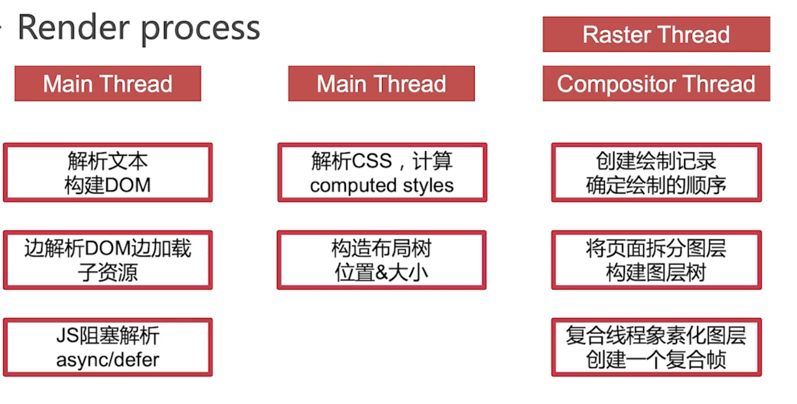
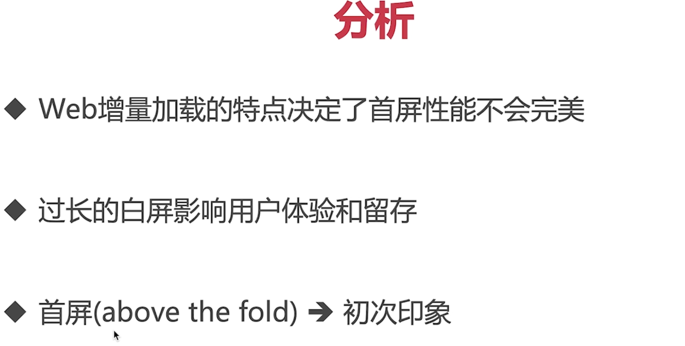
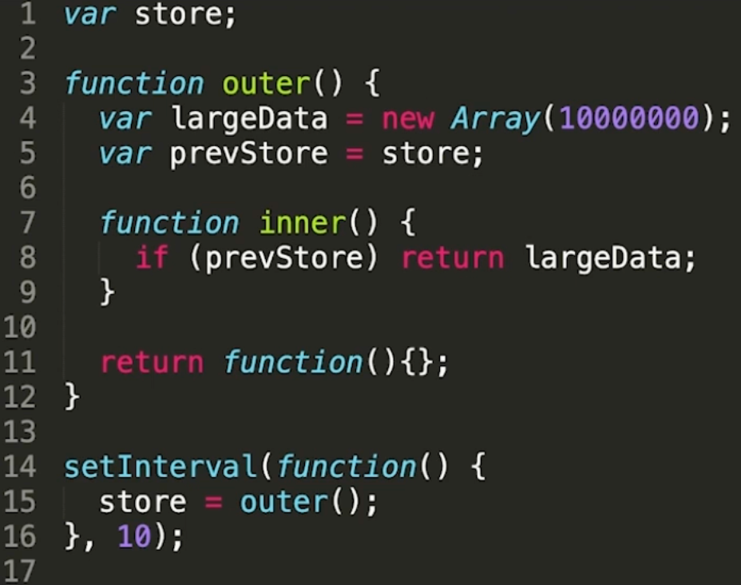
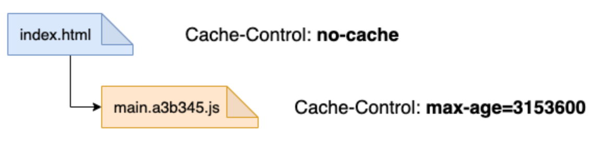
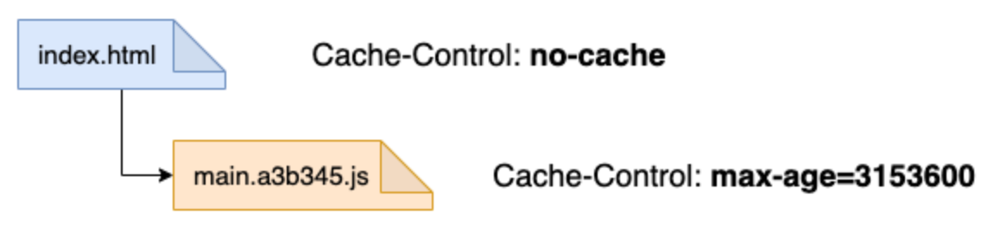
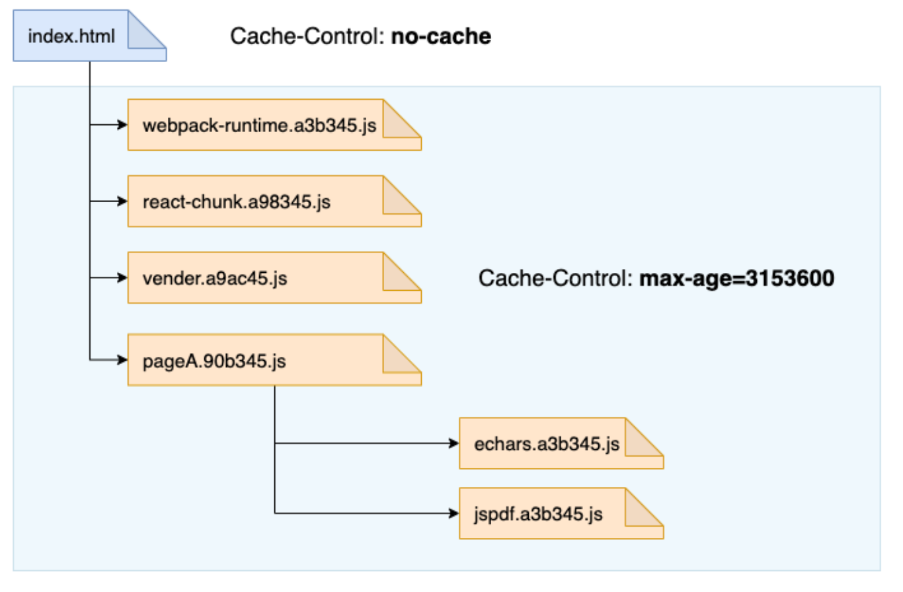

## web 加载和渲染基本原理
	- 从输入 URL 到页面加载显示完都发生了什么？ #card #web
		- ((65261d1d-800d-4aff-b7a8-96a60ad3d9b0))
		- **渲染过程是重点**：
			- 
- ## 首屏加载优化
  collapsed:: true
	- 什么是首屏加载？怎么优化？#card #web
		- 
		- ### 用户体验关键指标
			- First Contentful Paint (FCP)
				- 
			- Largest Contentful Paint (LCP)
				- 
			- Time to Interactive (TTI)
				- 
		- ### 优化方案
			- #### 资源体积优化
				- 资源压缩
				- 传输压缩
				- 代码拆分
				- Tree Shaking
				- HTTP/2
				- 缓存
			- #### 首页内容优化
				- 组件 lazy-loading
				- 预渲染 / SSR
				- Inline CSS
			- #### 加载顺序优化
				- preload
				- prefetch
- ## JavaScript 内存管理
  collapsed:: true
	- JS 是怎么管理内存？什么情况会造成内存泄漏？#card #JavaScript
		- `GC - Garbage Collection`：变量创建时自动分配内存，不使用“自动”释放内存
			- **局部变量**：函数执行完，没有闭包引用，就会被标记回收；
			- **全局变量**：浏览器卸载页面时释放
		- `GC 实现`：
			- 引用计数：无法解决循环引用的问题
			- [[#green]]==标记清除==：mark and sweep
		- #### 避免内存泄漏
			- 避免意外的全局变量产生
			- 避免反复运行引发大量闭包
				- 
			- 避免脱离的 DOM 元素
				-
- ## 网站的缓存控制策略最佳实践及注意事项
  id:: 655b7127-9f32-4319-9fcd-f606c86997d3
  collapsed:: true
	- 一个较好的缓存策略只需要两部分，而它们只需要通过 `Cache-Control` 控制：
		- 带指纹资源: 永久缓存
		  logseq.order-list-type:: number
		- 非带指纹资源: 每次进行新鲜度校验
		  logseq.order-list-type:: number
	- {:height 140, :width 548}
	- ### 带指纹资源: 永久缓存
	  background-color:: pink
		- `Cache-Control: public,max-age=31536000,immutable`
			- 资源请求最快的方式就是**不向服务器发起请求**，通过以上响应头可以对资源设置永久缓存。(因此性能：[[#green]]==强制缓存== 好于 [[#red]]==协商缓存==)
		- 静态资源带有 hash 值，即指纹
		  logseq.order-list-type:: number
		- 对资源设置一年过期时间，即 31536000，一般认为是永久缓存
		  logseq.order-list-type:: number
		- 在永久缓存期间浏览器不需要向服务器发送请求
		  logseq.order-list-type:: number
		- #### [[#green]]==那为什么带有 hash 值的资源可以永久缓存呢？==
			- **因为该文件的内容发生变化时，会生成一个带有新的 hash 值的 URL。** 前端将会发起一个新的 URL 的请求。
	- ### 非带指纹资源: 每次进行新鲜度校验
	  background-color:: pink
		- `Cache-Control: no-cache, Etag: helloshanyue`
		- 由于不带有指纹，每次都需要校验资源的新鲜度。(从缓存中取到资源，可能是过期资源)
		  logseq.order-list-type:: number
		- 如果校验为最新资源，则从浏览器的缓存中加载资源
		  logseq.order-list-type:: number
		- #### [[#blue]]==`index.html` 为不带有指纹资源==，如果把它置于缓存中，则如何保证服务器刷新数据时，被浏览器可以获取到新鲜的资源？
			- 使用 `Cache-Control: no-cache` 时，客户端每次对服务器进行新鲜度校验。
		- 即使每次校验新鲜度，也不需要每次都从服务器下载资源: **如果浏览器/CDN上缓存经校验没有过期**。这被称为[[#blue]]==协商缓存==，此时 http 状态码返回 304，指 `Not Modified`，即没有变更。
		- **关于协商缓存，你无需管理，也无需配置，** `nginx` 或者一些 `OSS` 都会自动配置协商缓存。
		- 协商缓存的背后基于响应头 `Last-Modified/ETag`。浏览器每次请求资源时，会携带上次服务器响应的 `ETag/Last-Modified` 作为标志，与服务端此时的 `ETag/Last-Modified` 作比较，来判断内容更改。
		- >> [http 响应头中的 ETag 值是如何生成的？](https://github.com/shfshanyue/Daily-Question/issues/112)
	- ### 一定要为你的资源添加 Cache-Control 响应头
	  background-color:: pink
		- **那如果不添加 `Cache-Control` 这个响应头会怎么样？**
			- **此时会对资源进行强制缓存，而对不带有指纹信息的资源很有可能获取到过期资源。** 如果过期资源存在于浏览器上，还可以通过强制刷新浏览器来获取最新资源。但是如果过期资源存在于 CDN 的边缘节点上，CDN 的刷新就会复杂很多，而且有可能需要多人协作解决。
		- **那默认的强制缓存时间是多少?**
			- 首先要明确两个响应头代表的含义：
				- `Date`: 指源服务器响应报文生成的时间，差不多与发请求的时间等价
				  logseq.order-list-type:: number
				- `Last-Modified`: 指静态资源上次修改的时间，取决于 `mtime`
				  logseq.order-list-type:: number
			- `LM factor` 算法认为当请求服务器时，如果没有设置 `Cache-Control`，如果距离上次的 `Last-Modified` 越远，则生成的强制缓存时间越长。
			- 用公式表示如下，其中 `factor` 介于 0 与 1 之间：
				- `MaxAge = (Date - LastModified) * factor`
	- ### Bundle Splitting：尽量减少资源变更
	  background-color:: pink
		- 基本上所有资源都是带有指纹信息的，这意味着[[#green]]==所有的资源都是能够设置永久缓存==。打包策略如下图所示：
			- {:height 153, :width 495}
			- **但是当有一行文件进行修改时，这一个大包的指纹信息发生改变，永久缓存失效。**
		- [[#blue]]==所以我们现在需要做到的是：当修改文件后，造成最小范围的缓存失效。==
		- 使用 `webpack` 把资源打包为多个 `chunk`:
			- 
		- `webpack-runtime`: 应用中的 `webpack` 的版本比较稳定，分离出来，保证长久的永久缓存
		  logseq.order-list-type:: number
		- `react/react-dom`: `react` 的版本更新频次也较低
		  logseq.order-list-type:: number
		- `vendor`: 常用的第三方模块打包在一起，如 `lodash`，`classnames` 基本上每个页面都会引用到，但是它们的更新频率会更高一些。另外对低频次使用的第三方模块不要打进来
		  logseq.order-list-type:: number
		- `pageA`: A 路由页面，当 A 页面的组件发生变更后，它的缓存将会失效
		  logseq.order-list-type:: number
		- `pageB`: B 路由页面
		  logseq.order-list-type:: number
		- `echarts`: 不常用且过大的第三方模块单独打包
		  logseq.order-list-type:: number
		- `mathjax`: 不常用且过大的第三方模块单独打包
		  logseq.order-list-type:: number
		- `jspdf`: 不常用且过大的第三方模块单独打包
		  logseq.order-list-type:: number
-