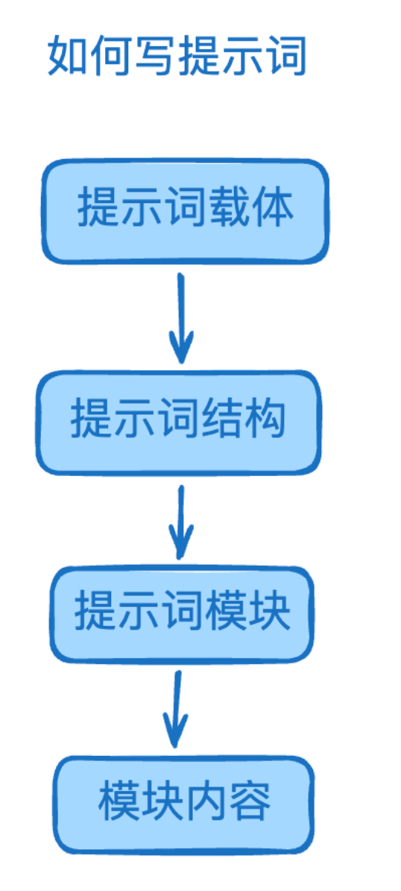
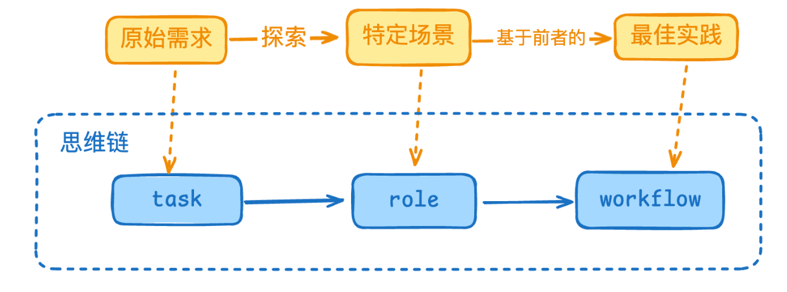

- {:height 656, :width 286}
-
- ## 提示词载体
	- 常见提示词载体：[[#green]]==自然语言、XML、MD、JSON、伪代码==...
	- ### 自然语言
	  background-color:: pink
		- ```
		  生成一首关于春天的诗。要有美感，体现自然风光和生机。
		  ```
		- 优点：直观、容易理解、适合普通用户
		- 缺点：可能存在歧义、结构性较差
		- 适用场景：简单任务
	- ### XML格式
	  background-color:: pink
		- ```xml
		  <task>写诗</task>
		  <topic>春天</topic>
		  <requirements>
		    <style>有美感</style>
		    <elements>
		      <element>自然风光</element>
		      <element>生机</element>
		    </elements>
		  </requirements>
		  ```
		- 优点：结构清晰、层次分明、便于**程序解析**
		- 缺点：较繁琐、普通用户理解有难度
		- 适用场景：复杂任务场景、表达结构化内容
	- ### MD格式
	  background-color:: pink
		- ```markdown
		  # 任务：创作春天主题诗歌
		  ## 要求
		  - 主题：春天
		  - 风格：优美
		  - 内容要素：
		    * 自然景色
		    * 生机勃勃
		  ```
		- 优点：结构化程度适中、易读易写、与文章结构高度映射
		- 缺点：格式不够严格
		- 适用场景：文章逻辑
	- ### JSON格式
	  background-color:: pink
		- ```json
		  {
		    "task": "写诗",
		    "parameters": {
		      "theme": "春天",
		      "style": "有美感",
		      "elements": [
		        "自然风光",
		        "生机"
		      ]
		    }
		  }
		  ```
		- 优点：结构化程度高、便于数据交换
		- 缺点：不太直观、不易表达层级结构、输出较繁琐
		- 适用场景：**结构化输出**
	- ### 伪代码格式
	  background-color:: pink
		- ```json
		  GeneratePoem(
		    theme = "春天"
		    style = 有美感
		    include = [自然风光, 生机]
		    format = "经典"
		  )
		  ```
		- 优点：逻辑性强、简洁
		- 缺点：需要编程知识
		- 适用场景：程序员描述的复杂业务场景
- ## 提示词结构
	- ### CO-STAR结构
	  background-color:: green
		- C：context 上下文 要做事的背景信息
		- O：Objective 目标 明确要实现什么目标
		- S：Style 风格 写作风格
		- T：Tone 语气 输出的语气
		- A：Audience 受众 输出的受众，会根据受众理解能力调整输出
		- R：Response 响应 规定输出的格式，JSON、专业报告等
	- ### **LangGPT**
	  background-color:: green
		- 全称 [Language For GPT like llm](https://github.com/langgptai/LangGPT/tree/main)
		- 核心理念：将复杂任务分解成结构化的指令
			- Role
			- Task
			- Rules
			- Workflows
- ## 提示词模块（以LangGPT为例）
	- 模块按需组装，常见模块：
		- [[#blue]]==role==：设定AI助手的专业背景和行为模式，明确特定场景
		- [[#blue]]==task==：具体执行的任务，原始需求
		- constraints：对内容输出的限定条件
		- global：定义贯穿整个会话的全局变量
		- [[#blue]]==workflow==：规范任务执行步骤，特定场景下的最佳实践
		- output_format：限定输出格式，功能类似formatInstructions
		- error_handling：当遇到不符合规范的输入时如何处理
	- 
- ## 模块内容（以LangGPT为例）
- ## 总结：如何写提示词
  id:: 67b5f204-02fd-4f8a-be9b-9ad4bd141f65
	- 确定特定场景下的最佳实践
	  logseq.order-list-type:: number
	- 判断最佳实践的复杂度
	  logseq.order-list-type:: number
		- 简单：自然语言输出
		- 中等：MD格式输出
		- 复杂：选定提示词载体和结构（默认LangGPT）
	- 提示词生成工具，输入步骤1的输出：
	  logseq.order-list-type:: number
		- [月之暗面 Kimi × LangGPT 提示词专家](https://kimi.moonshot.cn/kimiplus/conpg00t7lagbbsfqkq0)
		- [OpenAI 商店 LangGPT 提示词专家](https://chatgpt.com/g/g-Apzuylaqk-langgpt-ti-shi-ci-zhuan-jia)
		- [302提示词专家](https://dash.302.ai/tools/list)
		- [Claude提示词工具](https://console.anthropic.com/)
	- 调试并优化输出的提示词
	  logseq.order-list-type:: number