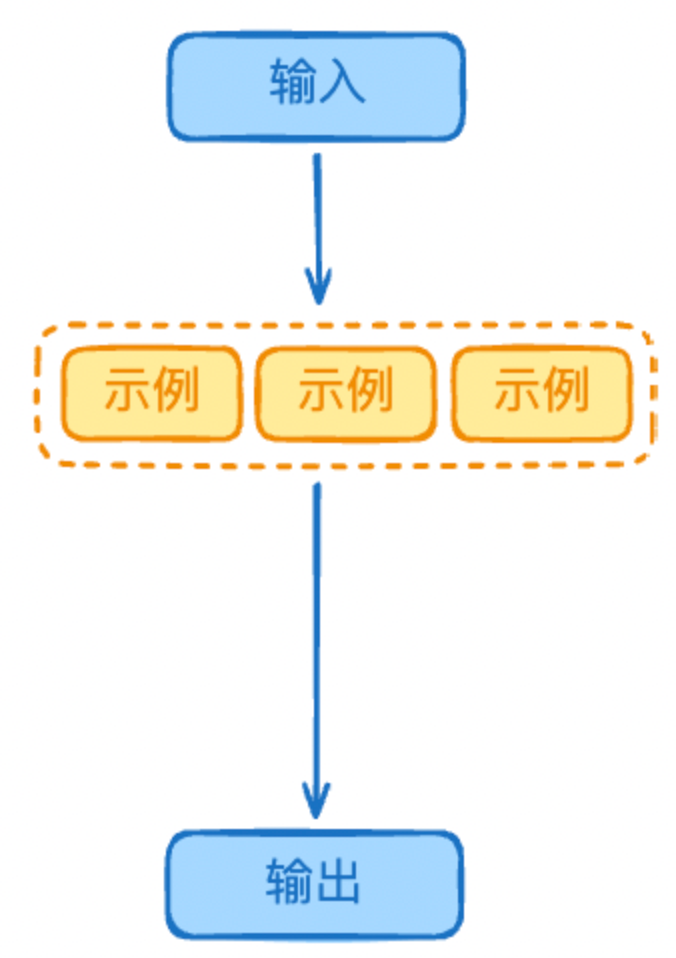
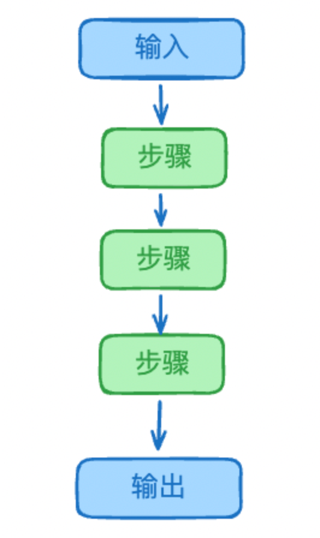
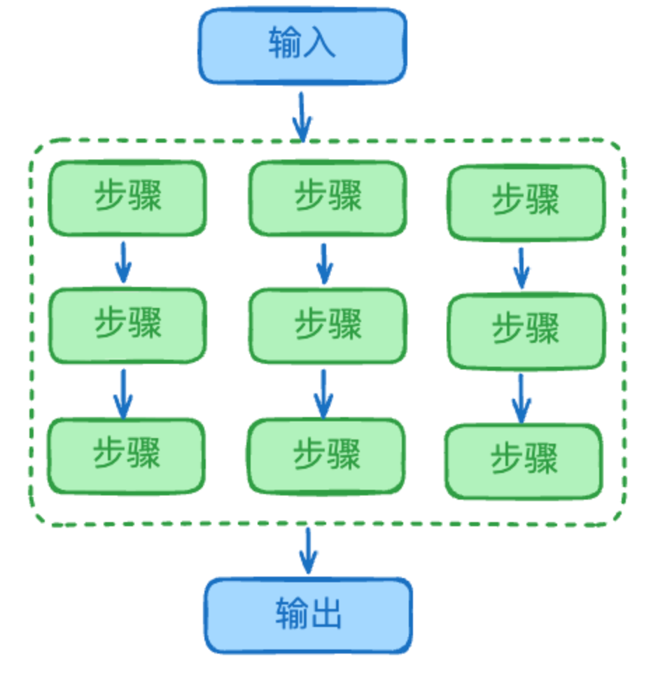

## 0-shot 零样本提示
	- ### 解释
		- 不需要示例，依靠模型原生能力得出结果，适用于通用任务。
		- {:height 306, :width 136}
	- ### 缺点
		- 无法胜任有明确规则、要求的任务
- ## few-shot 少样本提示
	- ### 解释
		- 提供少量样本，对抗生成结果的随机性
		- {:height 333, :width 230}
	- ### 适合场景
		- 需要特定格式或结构的输出
		  logseq.order-list-type:: number
			- 特定格式的文档生成（简历、报告等）
			  logseq.order-list-type:: number
			- 特定格式的代码实现
			  logseq.order-list-type:: number
			- 特定风格的文章写作
			  logseq.order-list-type:: number
		- 任务规则复杂或含糊
		  logseq.order-list-type:: number
			- 当规则用文字难以准确描述
			  logseq.order-list-type:: number
			- 规则包含多个特殊情况
			  logseq.order-list-type:: number
			- 最好通过例子来展示规则
			  logseq.order-list-type:: number
		- 需要保持一致性的任务
		  logseq.order-list-type:: number
			- 批量数据处理
			  logseq.order-list-type:: number
			- 标准化命名
			  logseq.order-list-type:: number
			- 统一的文本风格
			  logseq.order-list-type:: number
		- 涉及主观判断的任务
		  logseq.order-list-type:: number
			- 情感分析
			  logseq.order-list-type:: number
			- 文本分类
			  logseq.order-list-type:: number
			- 风格转换
			  logseq.order-list-type:: number
	- ### 缺点
		- 没有推理过程，不适合 需要**多步骤执行** 的任务，适合作为单次输入、输出流程。
- ## CoT Chain-Of-Thought 思维链
	- ### 解释
		- 要求模型展示推理步骤，随着步骤的明确，生成随机性降低
		- {:height 316, :width 176}
	- ### 适合场景
		- 对于 需要多步骤推理过程才能得出答案 的任务
	- ### 工作原理
		- 可以从两个角度解释：
		- 推理能力角度：CoT 让模型能更好利用预训练时学到的推理能力，通过推理步骤激活了模型内部更多相关知识的展示，减少了模型在单步大跨度推理时的信息损失
		- token 预测角度：模型的本质是预测下一个 token，使用 CoT 时，如果输出的当前执行步骤正确，那输出新步骤时之前正确的步骤将作为上下文，以此降低生成 token 的随机性
	- ### 缺点
		- 只有单一视角的推理过程
- ## Self-Consistency CoT 自我一致性
	- ### 解释
		- 并行执行多条不同的 CoT 推理路径，对比不同推理路径的结果，投票评估最终结果
		- {:height 250, :width 234}
	- ### 适合场景
		- 复杂推理问题
			- 数学题、逻辑题等需要多步骤推导的问题
			- 问题求解有多种可能的思路和路径
			- 需要确保推理过程的可靠性
		- 有歧义的开放性问题
			- 存在多个合理答案
			- 需要从不同角度分析问题
			- 答案具有不确定性
		- 需要验证结果的场景
			- 通过多次独立推理交叉验证
			- 检查答案的一致性
			- 提高结果的可信度
	- ### 缺点
		-