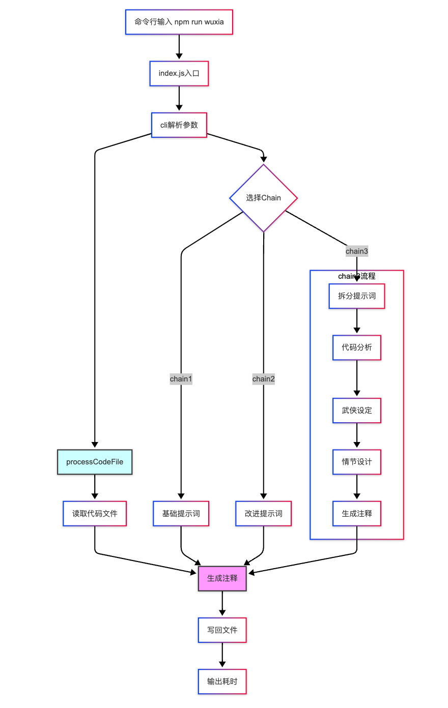
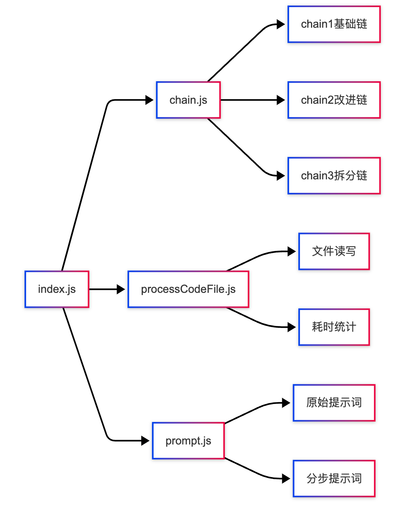
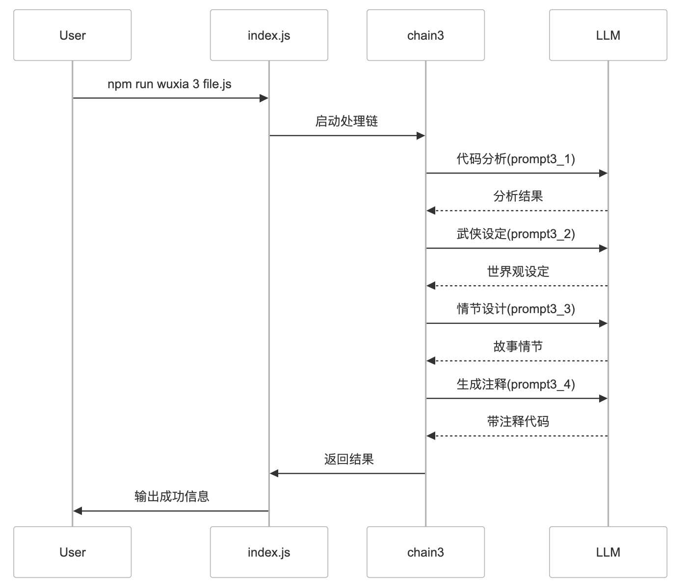

- > 需求：根据代码逻辑为代码生成武侠风格的注释
  > 项目仓库地址：[https://github.com/AI-FE/wuxia-comment](https://github.com/AI-FE/wuxia-comment)
- 
- ## 项目结构和工作流程
	- ### 项目结构
	  background-color:: pink
		- ```markdown
		  graph TD
		      A[命令行输入 npm run wuxia] --> B[index.js入口]
		      B --> C[cli解析参数]
		      C --> D{选择Chain}
		      D --> |chain1| E1[基础提示词]
		      D --> |chain2| E2[改进提示词]
		      D --> |chain3| E3[拆分提示词]
		      
		      subgraph chain3流程
		          E3 --> F1[代码分析]
		          F1 --> F2[武侠设定]
		          F2 --> F3[情节设计]
		          F3 --> F4[生成注释]
		      end
		      
		      C --> F[processCodeFile]
		      F --> G[读取代码文件]
		      G --> H[生成注释]
		      E1 --> H
		      E2 --> H
		      F4 --> H
		      H --> I[写回文件]
		      I --> J[输出耗时]
		  
		      style H fill:#f9f,stroke:#333
		      style F fill:#cff,stroke:#333
		  ```
		- {:height 1049, :width 658}
	- ### 核心模块
	  background-color:: green
		- `关键流程说明`：
			- 1. 命令行输入触发index.js
			- 2. 通过cli()解析chain版本和文件路径
			- 3. 根据chain版本选择处理流程
			- 4. processCodeFile处理文件读写和注释生成
			- 5. chain模块负责具体的AI处理逻辑
			- 6. prompt模块管理所有提示词模板
		- ```markdown
		  graph LR
		      A[index.js] --> B[chain.js]
		      A --> C[processCodeFile.js]
		      A --> D[prompt.js]
		      B --> E1[chain1基础链]
		      B --> E2[chain2改进链]
		      B --> E3[chain3拆分链]
		      C --> F1[文件读写]
		      C --> F2[耗时统计]
		      D --> G1[原始提示词]
		      D --> G2[分步提示词]
		  ```
		- 
	- ### chain3的详细处理流程
	  background-color:: green
		- ```markdown
		  sequenceDiagram
		      participant User
		      participant index.js
		      participant chain3
		      participant LLM
		      
		      User->>index.js: npm run wuxia 3 file.js
		      index.js->>chain3: 启动处理链
		      chain3->>LLM: 代码分析(prompt3_1)
		      LLM-->>chain3: 分析结果
		      chain3->>LLM: 武侠设定(prompt3_2)
		      LLM-->>chain3: 世界观设定
		      chain3->>LLM: 情节设计(prompt3_3)
		      LLM-->>chain3: 故事情节
		      chain3->>LLM: 生成注释(prompt3_4)
		      LLM-->>chain3: 带注释代码
		      chain3->>index.js: 返回结果
		      index.js->>User: 输出成功信息
		  ```
		- 