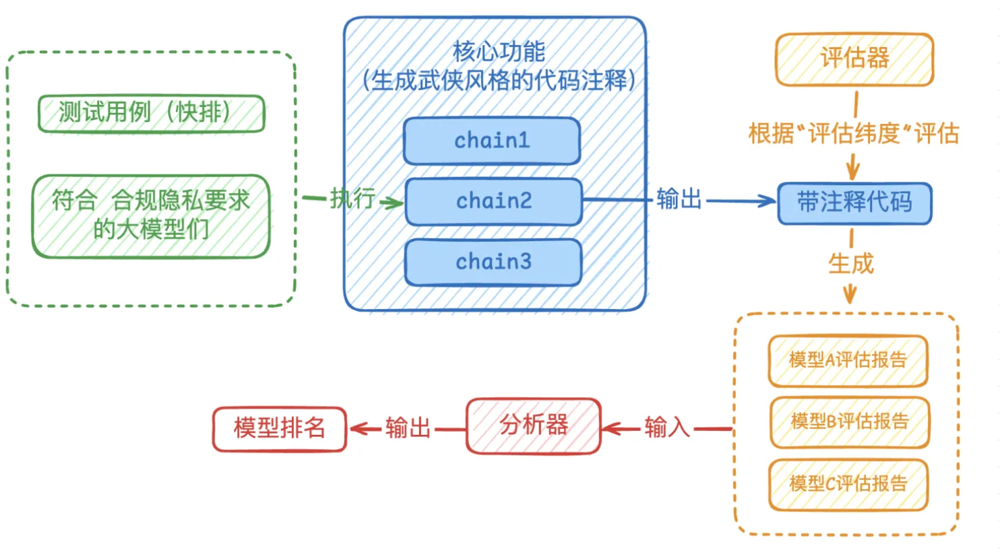

## **流程**
	- 合规隐私要求：筛选符合条件的模型
	  logseq.order-list-type:: number
	  id:: 67b1fca1-7b21-4783-b640-4daa2cbfe5f8
	- 领域能力评估：构建评估指标
	  logseq.order-list-type:: number
	- 验证与测试：评估并筛选最终的模型
	  logseq.order-list-type:: number
- ## **合规隐私要求**
	- 对于2C国内业务，满足“输出内容合规要求”有两个途径：
		- 使用国内模型
		  logseq.order-list-type:: number
		- 在产品设计上，不要将大模型能力包装成产品，而是利用模型能力提效
		  logseq.order-list-type:: number
	- 对于数据不能出境的业务，主要考虑：
		- 使用合规模型
		  logseq.order-list-type:: number
		- 部署开源模型
		  logseq.order-list-type:: number
- ## **领域能力评估**
	- 专业模型：
		- [度小满XuanYuan-70B金融大模型](https://huggingface.co/Duxiaoman-DI/XuanYuan-70B)
		- [北大 ChatLaw 法律大模型](https://github.com/PKU-YuanGroup/ChatLaw)
		- [Cursor Small Model](https://docs.cursor.com/advanced/models)
- ## **benchmark的架构**
	- 