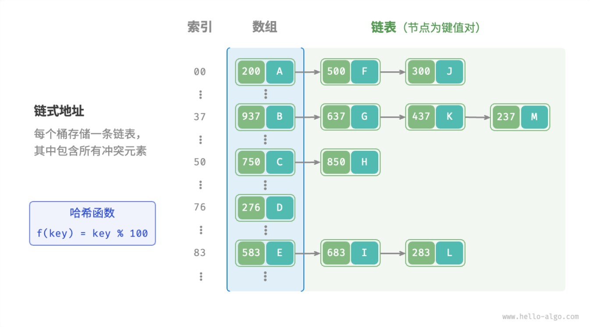

- > https://www.hello-algo.com/chapter_hashing/hash_map/
-
- ## 哈希表
  collapsed:: true
	- 哈希表通过建立「键 key」与「值 value」之间的映射，实现高效的元素查询。具体而言，我们向哈希表输入一个 key，则可以在 $O(1)$ 时间内获取对应的 value 。
	- 在哈希表中增删查改的时间复杂度都是 $O(1)$ ，全面胜出！因此，哈希表常用于[[#blue]]==对查找效率要求较高==的场景。
	- [[#blue]]==哈希表常用操作==
	  collapsed:: true
		- 哈希表的基本操作包括 **初始化、查询操作、添加与删除键值对**。
			- ```
			  /* 初始化哈希表 */
			  const map = new ArrayHashMap();
			  /* 添加操作 */
			  // 在哈希表中添加键值对 (key, value)
			  map.set(12836, '小哈');
			  map.set(15937, '小啰');
			  map.set(16750, '小算');
			  map.set(13276, '小法');
			  map.set(10583, '小鸭');
			  
			  /* 查询操作 */
			  // 向哈希表输入键 key ，得到值 value
			  let name = map.get(15937);
			  
			  /* 删除操作 */
			  // 在哈希表中删除键值对 (key, value)
			  map.delete(10583);
			  ```
		- 遍历哈希表有三种方式，即 **遍历键值对、遍历键、遍历值**。
			- ```
			  /* 遍历哈希表 */
			  console.info('\n遍历键值对 Key->Value');
			  for (const [k, v] of map.entries()) {
			      console.info(k + ' -> ' + v);
			  }
			  console.info('\n单独遍历键 Key');
			  for (const k of map.keys()) {
			      console.info(k);
			  }
			  console.info('\n单独遍历值 Value');
			  for (const v of map.values()) {
			      console.info(v);
			  }
			  ```
	- [[#blue]]==哈希函数==
		- 哈希表的底层实现为**数组**，同时可能包含链表、二叉树（红黑树）等数据结构，以提高查询性能（将在下节讨论）。
		- 首先考虑最简单的情况，**仅使用一个数组来实现哈希表**。通常，我们将数组中的每个空位称为「桶 Bucket」，用于存储键值对。
		- 我们将键值对 key, value 封装成一个类 `Entry` ，并将所有 `Entry` 放入数组中。这样，数组中的每个 `Entry` 都具有唯一的索引。为了建立 key 和索引之间的映射关系，我们需要使用「哈希函数 Hash Function」。
		- 设哈希表的数组为 `buckets` ，哈希函数为 `f(x)` ，那么查询操作的步骤如下：
			- 1. 输入 `key` ，通过哈希函数计算出索引 `index` ，即 `index = f(key)` ；
			  2. 通过索引在数组中访问到键值对 `entry` ，即 `entry = buckets[index]` ，然后从 `entry` 中获取对应的 `value` ；
		- ```
		  /* 键值对 Number -> String */
		  class Entry {
		      constructor(key, val) {
		          this.key = key;
		          this.val = val;
		      }
		  }
		  
		  /* 基于数组简易实现的哈希表 */
		  class ArrayHashMap {
		      #buckets;
		      constructor() {
		          // 初始化数组，包含 100 个桶
		          this.#buckets = new Array(100).fill(null);
		      }
		  
		      /* 哈希函数 */
		      #hashFunc(key) {
		          return key % 100;
		      }
		  
		      /* 查询操作 */
		      get(key) {
		          let index = this.#hashFunc(key);
		          let entry = this.#buckets[index];
		          if (entry === null) return null;
		          return entry.val;
		      }
		  
		      /* 添加操作 */
		      set(key, val) {
		          let index = this.#hashFunc(key);
		          this.#buckets[index] = new Entry(key, val);
		      }
		  
		      /* 删除操作 */
		      delete(key) {
		          let index = this.#hashFunc(key);
		          // 置为 null ，代表删除
		          this.#buckets[index] = null;
		      }
		  
		      /* 获取所有键值对 */
		      entries() {
		          let arr = [];
		          for (let i = 0; i < this.#buckets.length; i++) {
		              if (this.#buckets[i]) {
		                  arr.push(this.#buckets[i]);
		              }
		          }
		          return arr;
		      }
		  
		      /* 获取所有键 */
		      keys() {
		          let arr = [];
		          for (let i = 0; i < this.#buckets.length; i++) {
		              if (this.#buckets[i]) {
		                  arr.push(this.#buckets[i]?.key);
		              }
		          }
		          return arr;
		      }
		  
		      /* 获取所有值 */
		      values() {
		          let arr = [];
		          for (let i = 0; i < this.#buckets.length; i++) {
		              if (this.#buckets[i]) {
		                  arr.push(this.#buckets[i]?.val);
		              }
		          }
		          return arr;
		      }
		  
		      /* 打印哈希表 */
		      print() {
		          let entrySet = this.entries();
		          for (const entry of entrySet) {
		              if (!entry) continue;
		              console.info(`${entry.key} -> ${entry.val}`);
		          }
		      }
		  }
		  ```
	- [[#blue]]==哈希冲突==
		- **在某些情况下，哈希函数** $f(x)$ **可能无法正常工作**。不同的key经过哈希函数的计算结果可能冲突。我们把这种情况称为**「哈希冲突 Hash Collision」**
		- 一个优秀的哈希函数应具备以下特性：
			- 1. 尽可能减少哈希冲突的发生；
			  2. 查询效率高且稳定，能够在绝大多数情况下达到 $O(1)$ 时间复杂度；
			  3. 较高的空间利用率，即使“键值对占用空间 / 哈希表总占用空间”比例最大化；
- ## 哈希冲突
	- 从本质上看，由于**哈希函数的输入空间通常远大于输出空间**，因此多个输入产生相同输出的情况是不可避免的。
	- 为了减轻哈希冲突，一方面，**可以通过扩大哈希表容量来降低冲突概率**。极端情况下，当输入空间和输出空间大小相等时，哈希表等同于数组，每个 key 都对应唯一的数组索引，可谓“大力出奇迹”。
	- 另一方面，**可以考虑优化哈希表的表示以缓解哈希冲突**，常用方法包括「链式地址 Separate Chaining」和「开放寻址 Open Addressing」。
	- [[#blue]]==哈希表扩容==
		- **当哈希表内的冲突总体较为严重时，编程语言通常通过扩容哈希表来缓解冲突**。类似于数组扩容，哈希表扩容需将所有键值对从原哈希表迁移至新哈希表，开销较大。
		- 编程语言通常使用[[#blue]]==「负载因子 Load Factor」==来衡量哈希冲突的严重程度，**定义为哈希表中元素数量除以桶数量**，常作为哈希表扩容的触发条件。在 Java 中，当负载因子 $>0.75$ 时，系统会将 HashMap 容量扩展为原先的 2 倍。
	- [[#blue]]==链式地址==
		- 在原始哈希表中，每个桶仅能存储一个键值对。**链式地址将单个元素转换为链表，将键值对作为链表节点，将所有发生冲突的键值对都存储在同一链表中**。
		- {:height 401, :width 718}
		- 链式地址下，哈希表的操作方法包括：
			- **查询元素**：输入 key ，经过哈希函数得到数组索引，即可访问链表头节点，然后遍历链表并对比 key 以查找目标键值对。
			- **添加元素**：先通过哈希函数访问链表头节点，然后将节点（即键值对）添加到链表中。
			- **删除元素**：根据哈希函数的结果访问链表头部，接着遍历链表以查找目标节点，并将其删除。
		- 尽管链式地址法解决了哈希冲突问题，但仍存在一些局限性，包括：
			- **占用空间增大**，由于链表或二叉树包含节点指针，相比数组更加耗费内存空间；
			- **查询效率降低**，因为需要线性遍历链表来查找对应元素；
		- 为了提高操作效率，**可以将链表转换为「AVL 树」或「红黑树」**，将查询操作的时间复杂度优化至 $O(\log⁡{n})$ 。
	- [[#blue]]==开放寻址==
		- 「开放寻址」方法不引入额外的数据结构，而是通过“[[#blue]]==多次探测==”来解决哈希冲突，探测方主要包括`线性探测`、`平方探测`、`多次哈希`。
		- `线性探测`
			- 「线性探测」采用**固定步长**的线性查找来解决哈希冲突。
			- **插入元素**：若出现哈希冲突，则从冲突位置向后线性遍历（步长通常为 1 ），直至找到空位，将元素插入其中。
			- **查找元素**：在出现哈希冲突时，使用相同步长进行线性查找，可能遇到以下两种情况。
				- 1. 找到对应元素，返回 value 即可；
				- 2. 若遇到空位，说明目标键值对不在哈希表中；
			- 线性探测存在以下缺陷：
				- **不能直接删除元素**。删除元素会在数组内产生一个空位，查找其他元素时，该空位可能导致程序误判元素不存在（即上述第 `2.` 种情况）。因此，需要借助一个标志位来标记已删除元素。
				- **容易产生聚集**。数组内连续被占用位置越长，这些连续位置发生哈希冲突的可能性越大，进一步促使这一位置的“聚堆生长”，最终导致增删查改操作效率降低。
		- `多次哈希`
			- 顾名思义，「多次哈希」方法是使用多个哈希函数 $f_1(x)$ , $f_2(x)$ , $f_3(x)$ , ⋯ 进行探测。
			- **插入元素**：若哈希函数 �1(�) 出现冲突，则尝试 �2(�) ，以此类推，直到找到空位后插入元素。
		-
-