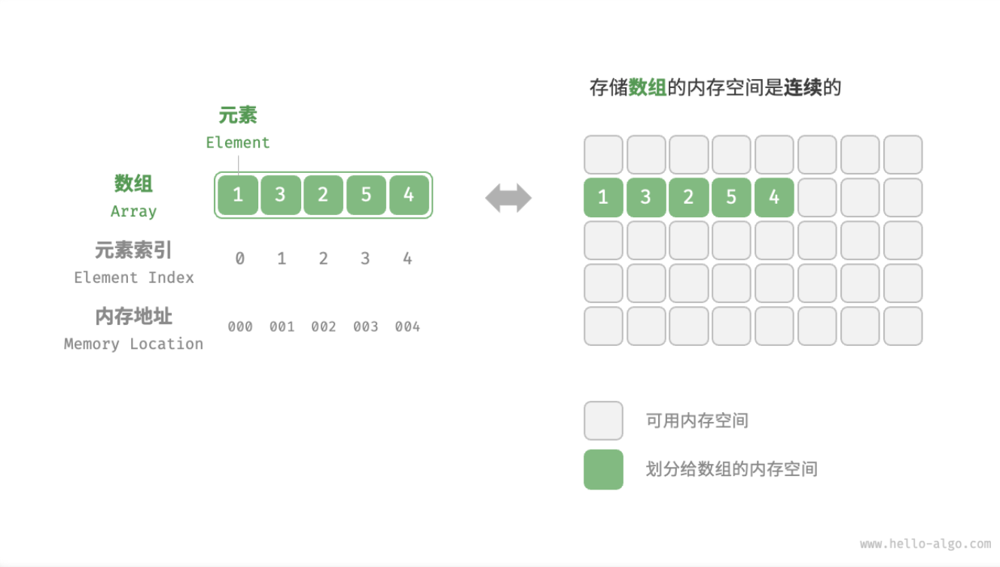
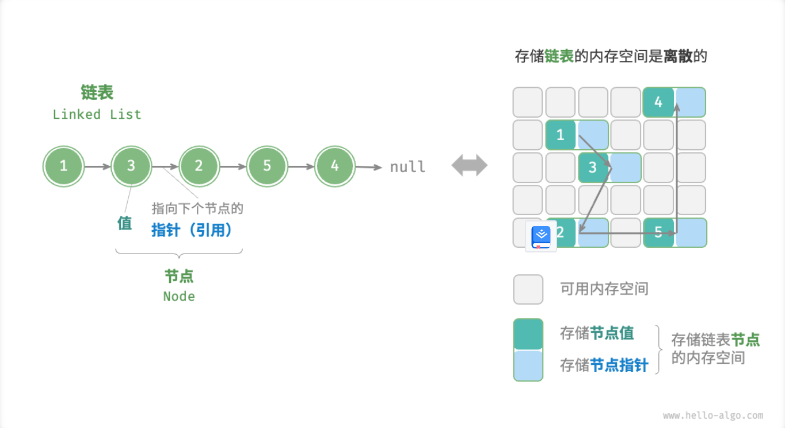
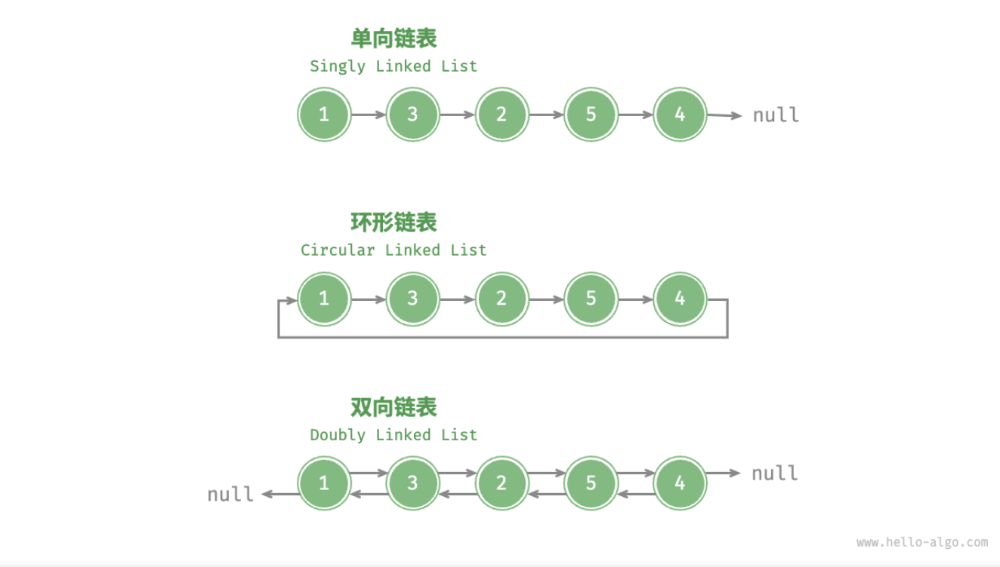

- > [https://www.hello-algo.com/chapter_array_and_linkedlist/array/](https://www.hello-algo.com/chapter_array_and_linkedlist/array/)
-
- ## 数组
	- 「数组 Array」是一种线性数据结构，其将相同类型元素存储在连续的内存空间中。我们将元素在数组中的位置称为元素的「索引 Index」。
	- {:height 438, :width 742}
	- [[#blue]]==数组优点==
		- **在数组中访问元素非常高效**。
	- [[#red]]==数组缺点==
		- **数组在初始化后长度不可变**。（Python List, Go Slice, JS/TS Array, C++ vector 都采用了动态数组的策略，用户最常用的是动态数组，底层实现了扩容机制。）
		- **数组中插入或删除元素效率低下**。如果我们想要在数组中间插入一个元素，由于数组元素在内存中是“紧挨着的”，它们之间没有空间再放任何数据。因此，我们不得不将此索引之后的所有元素都向后移动一位，然后再把元素赋值给该索引。
	- [[#green]]==数组常用操作==
		- `数组遍历`。以下介绍两种常用的遍历方法。
			- ```
			  /* 遍历数组 */
			  function traverse(nums) {
			      let count = 0;
			      // 通过索引遍历数组
			      for (let i = 0; i < nums.length; i++) {
			          count++;
			      }
			      // 直接遍历数组
			      for (let num of nums) {
			          count += 1;
			      }
			  }
			  ```
		- `数组查找`。通过遍历数组，查找数组内的指定元素，并输出对应索引。
			- ```
			  /* 在数组中查找指定元素 */
			  function find(nums, target) {
			      for (let i = 0; i < nums.length; i++) {
			          if (nums[i] == target) return i;
			      }
			      return -1;
			  }
			  ```
- ## 链表
	- 与数组相比，链表更具灵活性，它可以被存储在非连续的内存空间中。
	- 「链表 Linked List」是一种线性数据结构，其每个元素都是一个节点对象，各个节点之间通过指针连接，从当前节点通过指针可以访问到下一个节点。**由于指针记录了下个节点的内存地址，因此无需保证内存地址的连续性**，从而可以将各个节点分散存储在内存各处。
	- {:height 425, :width 774}
	- ```
	  /* 链表节点类 */
	  class ListNode {
	      val;
	      next;
	      constructor(val, next) {
	          this.val = (val === undefined ? 0 : val);       // 节点值
	          this.next = (next === undefined ? null : next); // 指向下一节点的引用
	      }
	  }
	  ```
	- **链表初始化方法**。建立链表分为两步，第一步是初始化各个节点对象，第二步是构建引用指向关系。完成后，即可以从链表的头节点（即首个节点）出发，通过指针 `next` 依次访问所有节点。
	- ```
	  /* 初始化链表 1 -> 3 -> 2 -> 5 -> 4 */
	  // 初始化各个节点
	  const n0 = new ListNode(1);
	  const n1 = new ListNode(3);
	  const n2 = new ListNode(2);
	  const n3 = new ListNode(5);
	  const n4 = new ListNode(4);
	  // 构建引用指向
	  n0.next = n1;
	  n1.next = n2;
	  n2.next = n3;
	  n3.next = n4;
	  ```
	- [[#blue]]==链表优点==
		- **链表中插入与删除节点的操作效率高**。例如，如果我们想在链表中间的两个节点 `A` , `B` 之间插入一个新节点 `P` ，我们只需要改变两个节点指针即可，时间复杂度为 $O(1)$ ；相比之下，数组的插入操作效率要低得多。
		- ```
		  /* 在链表的节点 n0 之后插入节点 P */
		  function insert(n0, P) {
		      const n1 = n0.next;
		      P.next = n1;
		      n0.next = P;
		  }
		  
		  /* 删除链表的节点 n0 之后的首个节点 */
		  function remove(n0) {
		      if (!n0.next) return;
		      // n0 -> P -> n1
		      const P = n0.next;
		      const n1 = P.next;
		      n0.next = n1;
		  }
		  
		  ```
	- [[#red]]==链表缺点==
		- **链表访问节点效率较低**。
		- **链表的内存占用较大**。链表以节点为单位，每个节点除了保存值之外，还需额外保存指针（引用）。这意味着在相同数据量的情况下，链表比数组需要占用更多的内存空间。
	- [[#green]]==链表常用操作==
		- **遍历链表查找**。遍历链表，查找链表内值为 `target` 的节点，输出节点在链表中的索引。
			- ```
			  /* 在链表中查找值为 target 的首个节点 */
			  function find(head, target) {
			      let index = 0;
			      while (head !== null) {
			          if (head.val === target) {
			              return index;
			          }
			          head = head.next;
			          index += 1;
			      }
			      return -1;
			  }
			  ```
	- [[#blue]]==常见链表类型==
		- **单向链表**。即上述介绍的普通链表。单向链表的节点包含值和指向下一节点的指针（引用）两项数据。我们将首个节点称为头节点，将最后一个节点成为尾节点，尾节点指向 null 。
		- **环形链表**。如果我们令单向链表的尾节点指向头节点（即首尾相接），则得到一个环形链表。在环形链表中，任意节点都可以视作头节点。
		- **双向链表**。与单向链表相比，双向链表记录了两个方向的指针（引用）。双向链表的节点定义同时包含指向后继节点（下一节点）和前驱节点（上一节点）的指针。相较于单向链表，双向链表更具灵活性，可以朝两个方向遍历链表，但相应地也需要占用更多的内存空间。
			- ```
			  /* 双向链表节点类 */
			  class ListNode {
			      val;
			      next;
			      prev;
			      constructor(val, next) {
			          this.val = val  ===  undefined ? 0 : val;        // 节点值
			          this.next = next  ===  undefined ? null : next;  // 指向后继节点的指针（引用）
			          this.prev = prev  ===  undefined ? null : prev;  // 指向前驱节点的指针（引用）
			      }
			  }
			  ```
		- {:height 435, :width 690}
		-
- ## 列表 `动态数组List`
	- 「动态数组 Dynamic Array」的数据结构，即长度可变的数组，也常被称为「列表 List」。
	- [[#green]]==列表常用操作==
		- **初始化列表**。通常我们会使用“无初始值”和“有初始值”的两种初始化方法。
			- ```
			  /* 初始化列表 */
			  // 无初始值
			  const list1 = [];
			  // 有初始值
			  const list = [1, 3, 2, 5, 4];
			  ```
		- **访问与更新元素**。由于列表的底层数据结构是数组，因此可以在 $O(1)$ 时间内访问和更新元素，效率很高。
			- ```
			  /* 访问元素 */
			  const num = list[1];  // 访问索引 1 处的元素
			  
			  /* 更新元素 */
			  list[1] = 0;  // 将索引 1 处的元素更新为 0
			  ```
		- **在列表中添加、插入、删除元素**。相较于数组，列表可以自由地添加与删除元素。在列表尾部添加元素的时间复杂度为 $O(1)$ ，但**插入和删除元素的效率仍与数组相同**，时间复杂度为 $O(n)$ 。
			- ```
			  /* 清空列表 */
			  list.length = 0;
			  
			  /* 尾部添加元素 */
			  list.push(1);
			  list.push(3);
			  list.push(2);
			  list.push(5);
			  list.push(4);
			  
			  /* 中间插入元素 */
			  list.splice(3, 0, 6);
			  
			  /* 删除元素 */
			  list.splice(3, 1);
			  ```
		- **遍历列表**。与数组一样，列表可以根据索引遍历，也可以直接遍历各元素。
			- ```
			  /* 通过索引遍历列表 */
			  let count = 0;
			  for (let i = 0; i < list.length; i++) {
			      count++;
			  }
			  
			  /* 直接遍历列表元素 */
			  count = 0;
			  for (const n of list) {
			      count++;
			  }
			  ```
		- **拼接两个列表**。给定一个新列表 `list1` ，我们可以将该列表拼接到原列表的尾部。
		- ```
		  /* 拼接两个列表 */
		  const list1 = [6, 8, 7, 10, 9];
		  list.push(...list1);  // 将列表 list1 拼接到 list 之后
		  ```
		- **排序列表**。排序也是常用的方法之一。完成列表排序后，我们便可以使用在数组类算法题中经常考察的「二分查找」和「双指针」算法。
			- ```
			  /* 排序列表 */  
			  list.sort((a, b) => a - b);  // 排序后，列表元素从小到大排列
			  ```
	- [[#green]]==列表实现 *==
		- 为了帮助加深对列表的理解，我们在此提供一个简易版列表实现。需要关注三个核心点：
			- **初始容量**：选取一个合理的数组初始容量。在本示例中，我们选择 10 作为初始容量。
			- **数量记录**：声明一个变量 size，用于记录列表当前元素数量，并随着元素插入和删除实时更新。根据此变量，我们可以定位列表尾部，以及判断是否需要扩容。
			- **扩容机制**：插入元素时可能超出列表容量，此时需要扩容列表。扩容方法是根据扩容倍数创建一个更大的数组，并将当前数组的所有元素依次移动至新数组。在本示例中，我们规定每次将数组扩容至之前的 2 倍。
		- 本示例旨在帮助读者直观理解列表的工作机制。实际编程语言中，列表实现更加标准和复杂，各个参数的设定也非常有考究，例如初始容量、扩容倍数等。感兴趣的读者可以查阅源码进行学习。
		- ```
		  /* 列表类简易实现 */
		  class MyList {
		      #nums = new Array(); // 数组（存储列表元素）
		      #capacity = 10; // 列表容量
		      #size = 0; // 列表长度（即当前元素数量）
		      #extendRatio = 2; // 每次列表扩容的倍数
		  
		      /* 构造方法 */
		      constructor() {
		          this.#nums = new Array(this.#capacity);
		      }
		  
		      /* 获取列表长度（即当前元素数量）*/
		      size() {
		          return this.#size;
		      }
		  
		      /* 获取列表容量 */
		      capacity() {
		          return this.#capacity;
		      }
		  
		      /* 访问元素 */
		      get(index) {
		          // 索引如果越界则抛出异常，下同
		          if (index < 0 || index >= this.#size) throw new Error('索引越界');
		          return this.#nums[index];
		      }
		  
		      /* 更新元素 */
		      set(index, num) {
		          if (index < 0 || index >= this.#size) throw new Error('索引越界');
		          this.#nums[index] = num;
		      }
		  
		      /* 尾部添加元素 */
		      add(num) {
		          // 如果长度等于容量，则需要扩容
		          if (this.#size === this.#capacity) {
		              this.extendCapacity();
		          }
		          // 将新元素添加到列表尾部
		          this.#nums[this.#size] = num;
		          this.#size++;
		      }
		  
		      /* 中间插入元素 */
		      insert(index, num) {
		          if (index < 0 || index >= this.#size) throw new Error('索引越界');
		          // 元素数量超出容量时，触发扩容机制
		          if (this.#size === this.#capacity) {
		              this.extendCapacity();
		          }
		          // 将索引 index 以及之后的元素都向后移动一位
		          for (let j = this.#size - 1; j >= index; j--) {
		              this.#nums[j + 1] = this.#nums[j];
		          }
		          // 更新元素数量
		          this.#nums[index] = num;
		          this.#size++;
		      }
		  
		      /* 删除元素 */
		      remove(index) {
		          if (index < 0 || index >= this.#size) throw new Error('索引越界');
		          let num = this.#nums[index];
		          // 将索引 index 之后的元素都向前移动一位
		          for (let j = index; j < this.#size - 1; j++) {
		              this.#nums[j] = this.#nums[j + 1];
		          }
		          // 更新元素数量
		          this.#size--;
		          // 返回被删除元素
		          return num;
		      }
		  
		      /* 列表扩容 */
		      extendCapacity() {
		          // 新建一个长度为 size 的数组，并将原数组拷贝到新数组
		          this.#nums = this.#nums.concat(
		              new Array(this.capacity() * (this.#extendRatio - 1))
		          );
		          // 更新列表容量
		          this.#capacity = this.#nums.length;
		      }
		  
		      /* 将列表转换为数组 */
		      toArray() {
		          let size = this.size();
		          // 仅转换有效长度范围内的列表元素
		          const nums = new Array(size);
		          for (let i = 0; i < size; i++) {
		              nums[i] = this.get(i);
		          }
		          return nums;
		      }
		  }
		  ```
-