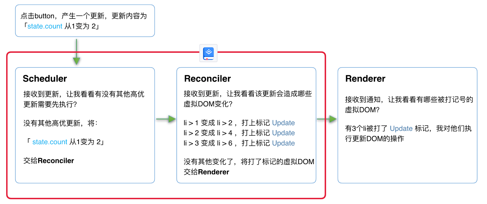

- > https://react.iamkasong.com/preparation/newConstructure.html
-
- ## React16架构
	- React16架构可以分为三层：
		- `Scheduler（调度器）`—— 调度任务的优先级，高优任务优先进入**Reconciler**
		- `Reconciler（协调器）`—— 负责找出变化的组件
		- `Renderer（渲染器）`—— 负责将变化的组件渲染到页面上
	- ### Scheduler（调度器）
	  background-color:: blue
		- 以浏览器是否有剩余时间作为任务中断的标准，当浏览器有剩余时间时通知我们。
		- 部分浏览器已经实现了这个API，这就是[requestIdleCallback (opens new window)](https://developer.mozilla.org/zh-CN/docs/Web/API/Window/requestIdleCallback)。但是由于以下因素，`React`放弃使用：
			- 1. 浏览器兼容性
			- 2. 触发频率不稳定，受很多因素影响。比如当我们的浏览器切换tab后，之前tab注册的`requestIdleCallback`触发的频率会变得很低
		- 基于以上原因，`React`实现了功能更完备的`requestIdleCallback`polyfill，这就是**Scheduler**。除了在空闲时触发回调的功能外，**Scheduler**还提供了多种调度优先级供任务设置。
		- > [Scheduler (opens new window)](https://github.com/facebook/react/blob/1fb18e22ae66fdb1dc127347e169e73948778e5a/packages/scheduler/README.md)是独立于`React`的库
	- ### Reconciler（协调器）
	  background-color:: blue
		- 更新工作从递归变成了可以中断的循环过程。每次循环都会调用`shouldYield`判断当前是否有剩余时间。
		- ```
		  /** @noinline */
		  function workLoopConcurrent() {
		    // Perform work until Scheduler asks us to yield
		    while (workInProgress !== null && !shouldYield()) {
		      workInProgress = performUnitOfWork(workInProgress);
		    }
		  }
		  ```
		- 那么React16是如何解决中断更新时DOM渲染不完全的问题呢？
		- 在React16中，**Reconciler**与**Renderer**不再是交替工作。当**Scheduler**将任务交给**Reconciler**后，**Reconciler**会为变化的虚拟DOM打上代表增/删/更新的标记，类似这样：
			- ```
			  export const Placement = /*             */ 0b0000000000010;
			  export const Update = /*                */ 0b0000000000100;
			  export const PlacementAndUpdate = /*    */ 0b0000000000110;
			  export const Deletion = /*              */ 0b0000000001000;
			  ```
		- 整个**Scheduler**与**Reconciler**的工作都在内存中进行。[[#green]]==只有当所有组件都完成**Reconciler**的工作，才会统一交给**Renderer**。==
	- ### Renderer（渲染器）
	  background-color:: blue
		- **Renderer**根据**Reconciler**为虚拟DOM打的标记，同步执行对应的DOM操作。
		- > [乘法demo](https://codesandbox.io/s/fervent-sutherland-pf7sg?file=/src/App.js)
		- 在React16架构中整个更新流程为：
		- {:height 279, :width 644}
		- 其中红框中的步骤随时可能由于以下原因被中断：
			- 有其他更高优任务需要先更新
			  logseq.order-list-type:: number
			- 当前帧没有剩余时间
			  logseq.order-list-type:: number
		- > 实际上，由于**Scheduler**和**Reconciler**都是平台无关的，所以`React`为他们单独发了一个包[react-Reconciler (opens new window)](https://www.npmjs.com/package/react-reconciler)。你可以用这个包自己实现一个`ReactDOM`，具体见**参考资料**
- ## 总结
	- 通过本节我们知道了`React16`采用新的`Reconciler`。
	- `Reconciler`内部采用了`Fiber`的架构。
- ## 参考资料
	- [「英文 外网」Building a Custom React Renderer | React前经理Sophie Alpert](https://www.youtube.com/watch?v=CGpMlWVcHok&list=PLPxbbTqCLbGHPxZpw4xj_Wwg8-fdNxJRh&index=7)
	- > [同步/Debounce/Throttle/并发 情况下性能对比Demo](https://codesandbox.io/s/concurrent-3h48s?file=/src/index.js)
-