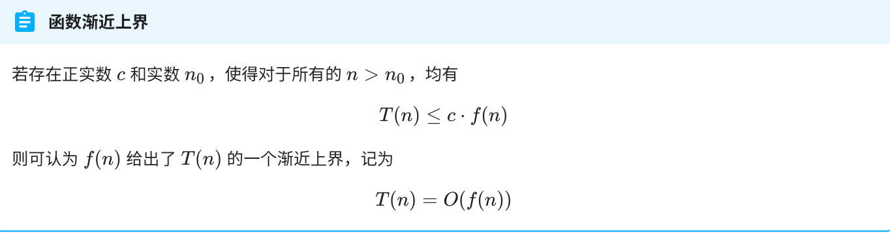
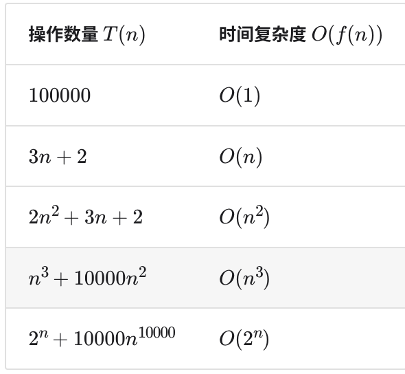
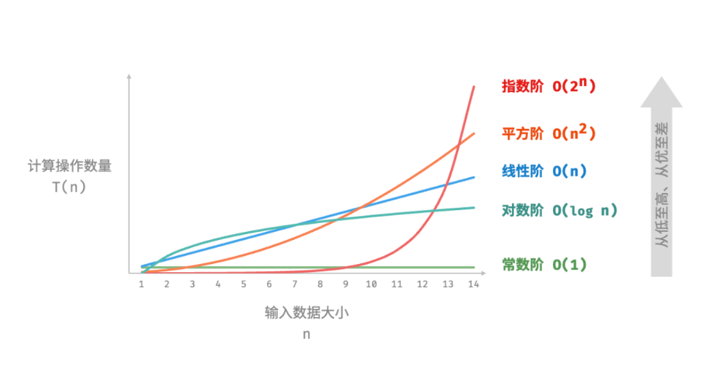
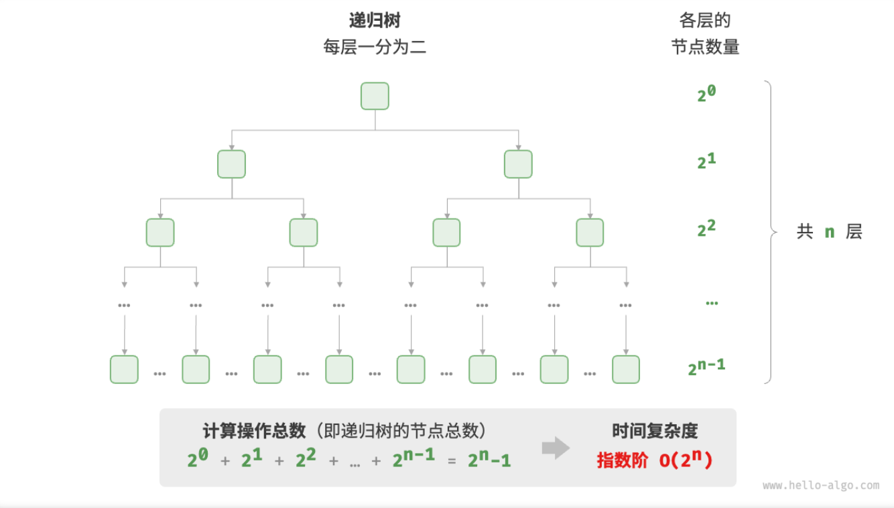
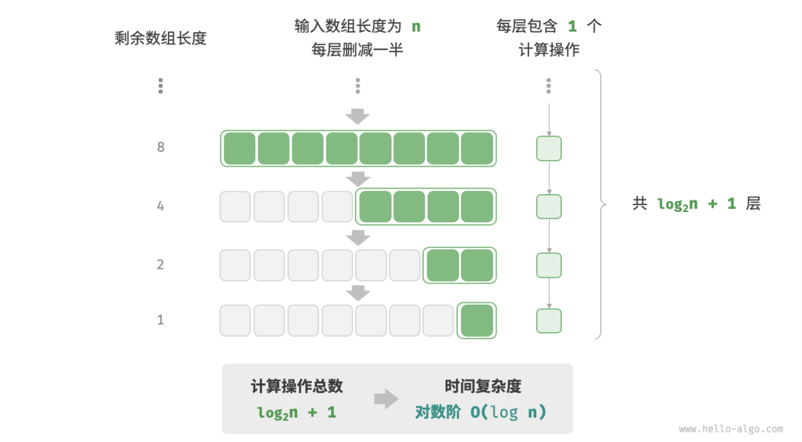
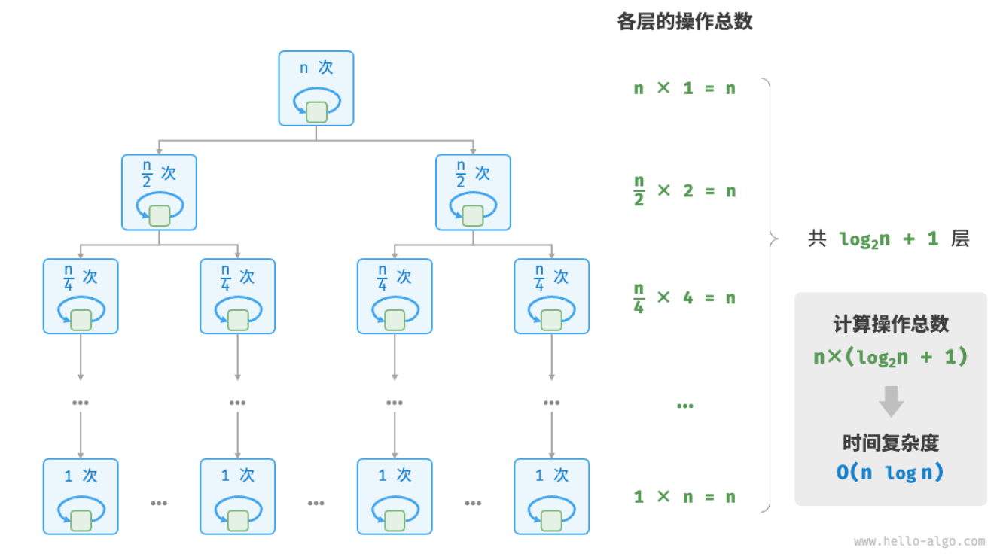
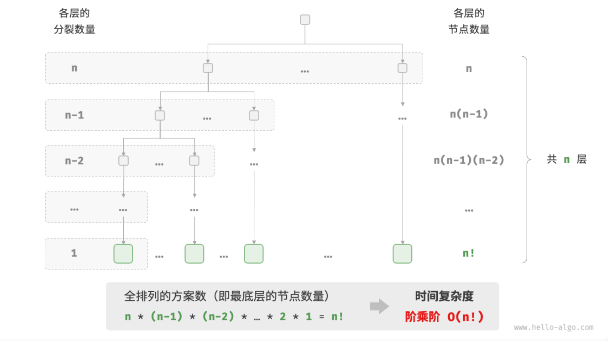

- > [Hello 算法 ](https://www.hello-algo.com/)
-
- ## 时间复杂度$O(n)$
  collapsed:: true
	- [[#blue]]==时间复杂度分析==，其统计的不是算法运行时间，**而是算法运行时间随着数据量变大时的增长趋势**。
	- [[#blue]]==函数渐近上界==，大 $O$ 记号Big-$O$ Notation」，表示函数 $T(n)$的「渐近上界 Asymptotic Upper Bound」。
		- {:height 177, :width 762}
		- 从本质上讲，计算渐近上界就是寻找一个函数 $f(n)$ ，使得当 $n$ 趋向于无穷大时，$T(n)$ 和 $f(n)$ 处于相同的增长级别，仅相差一个常数项 $c$ 的倍数。
	- 推算方法：[[#blue]]==首先统计操作数量，然后判断渐近上界。==
	  collapsed:: true
		- 统计操作数量
			- 1.  **忽略与 $n$ 无关的操作**。
			  2. **省略所有系数**。例如，循环 2$n$ 次、5$n$+1 次等，都可以简化记为 $n$ 次，因为 $n$ 前面的系数对时间复杂度没有影响。
			  3. **循环嵌套时使用乘法**。总操作数量等于外层循环和内层循环操作数量之积，每一层循环依然可以分别套用上述 `1.` 和 `2.` 技巧。
		- 判断渐近上界
			- **时间复杂度由多项式** $T(n)$ **中最高阶的项来决定。**
			- 
			-
		- ```
		  function algorithm(n) {
		      let a = 1;  // +0（技巧 1）
		      a = a + n;  // +0（技巧 1）
		      // +n（技巧 2）
		      for (let i = 0; i < 5 * n + 1; i++) {
		          console.log(0);
		      }
		      // +n*n（技巧 3）
		      for (let i = 0; i < 2 * n; i++) {
		          for (let j = 0; j < n + 1; j++) {
		              console.log(0);
		          }
		      }
		  }
		  
		  ```
		- 以下示例展示了使用上述技巧前、后的统计结果。
			- > $T(n)=2n(n+1)+(5n+1)+2$                   完整统计
			- > $T(n)=n^2+n$                                                       简化技巧
			- 最终，两者都能推出相同的时间复杂度结果，即 $O(n^2)$。
	- 常见类型
		- $$O(1)<O(\log{n})<O(n)<O(n \log{n})<O(n^2)<O(2^n)<O(n!)$$
		- {:height 340, :width 715}
		- [[#blue]]==常数阶==$O(1)$
			- 常数阶的操作数量与输入数据大小 $n$ 无关，即不随着 $n$ 的变化而变化。
			- ```
			  /* 常数阶 */
			  function constant(n) {
			      let count = 0;
			      const size = 100000;
			      for (let i = 0; i < size; i++) count++;
			      return count;
			  }
			  ```
		- [[#blue]]==线性阶==$O(n)$
			- 线性阶的操作数量相对于输入数据大小以线性级别增长。线性阶通常出现在单层循环中。
			- ```
			  /* 线性阶 */
			  function linear(n) {
			      let count = 0;
			      for (let i = 0; i < n; i++) count++;
			      return count;
			  }
			  ```
		- [[#blue]]==平方阶==$O(n^2)$
			- ```
			  /* 平方阶 */
			  function quadratic(n) {
			      let count = 0;
			      // 循环次数与数组长度成平方关系
			      for (let i = 0; i < n; i++) {
			          for (let j = 0; j < n; j++) {
			              count++;
			          }
			      }
			      return count;
			  }
			  ```
		- [[#blue]]==指数阶==$O(2^n)$
			- 指数阶增长非常迅速，在实际应用中[[#red]]==通常是不可接受==的。若一个问题使用「暴力枚举」求解的时间复杂度为 $O(2^n)$ ，那么通常需要使用「动态规划」或「贪心算法」等方法来解决。
			- ```
			  /* 指数阶（循环实现） */
			  function exponential(n) {
			      let count = 0,
			          base = 1;
			      // cell 每轮一分为二，形成数列 1, 2, 4, 8, ..., 2^(n-1)
			      for (let i = 0; i < n; i++) {
			          for (let j = 0; j < base; j++) {
			              count++;
			          }
			          base *= 2;
			      }
			      // count = 1 + 2 + 4 + 8 + .. + 2^(n-1) = 2^n - 1
			      return count;
			  }
			  ```
			- {:height 421, :width 676}
			- 在实际算法中，指数阶常出现于[[#blue]]==递归函数==。例如以下代码，不断地一分为二，经过 $n$ 次分裂后停止。
			- ```
			  /* 指数阶（递归实现） */
			  function expRecur(n) {
			      if (n == 1) return 1;
			      return expRecur(n - 1) + expRecur(n - 1) + 1;
			  }
			  ```
		- [[#blue]]==对数阶==$O(\log{n})$
			- 与指数阶相反，对数阶反映了“每轮缩减到一半的情况”。对数阶仅次于常数阶，时间增长缓慢，是[[#blue]]==理想的时间复杂度==。
			- 对数阶常出现于[[#blue]]==「二分查找」==和[[#blue]]==「分治算法」==中，体现了“一分为多”和“化繁为简”的算法思想。
			- ```
			  /* 对数阶（循环实现） */
			  function logarithmic(n) {
			      let count = 0;
			      while (n > 1) {
			          n = n / 2;
			          count++;
			      }
			      return count;
			  }
			  ```
			- {:height 374, :width 620}
			-
			- 与指数阶类似，对数阶也常出现于[[#blue]]==递归函数==。以下代码形成了一个高度为 $\log_2{n}$ 的递归树。
			- ```
			  /* 对数阶（递归实现） */
			  function logRecur(n) {
			      if (n <= 1) return 0;
			      return logRecur(n / 2) + 1;
			  }
			  ```
		- [[#blue]]==线性对数阶==$O(n\log{n})$
			- 线性对数阶常出现于[[#blue]]==嵌套循环==中，两层循环的时间复杂度分别为$O(n)$和$O(\log{n})$
			- 主流排序算法的时间复杂度通常为 $O(n\log{n})$ ，例如[[#green]]==快速排序==、[[#green]]==归并排序==、[[#green]]==堆排序==等。
			- ```
			  /* 线性对数阶 */
			  function linearLogRecur(n) {
			      if (n <= 1) return 1;
			      let count = linearLogRecur(n / 2) + linearLogRecur(n / 2);
			      for (let i = 0; i < n; i++) {
			          count++;
			      }
			      return count;
			  }
			  ```
			- {:height 406, :width 708}
		- [[#blue]]==阶乘阶==$O(n!)$
			- 阶乘阶对应数学上的「全排列」问题。给定 $n$ 个互不重复的元素，求其所有可能的排列方案，方案数量为：
			- $$n!=n\times(n-1)\times(n-2)\times\cdots\times2\times1$$
			- 阶乘通常使用[[#blue]]==递归实现==。
			- ```
			  /* 阶乘阶（递归实现） */
			  function factorialRecur(n) {
			      if (n == 0) return 1;
			      let count = 0;
			      // 从 1 个分裂出 n 个
			      for (let i = 0; i < n; i++) {
			          count += factorialRecur(n - 1);
			      }
			      return count;
			  }
			  ```
			- {:height 426, :width 736}
		-
	- 最差、最佳、平均时间复杂度
		- **某些算法的时间复杂度不是固定的，而是与输入数据的分布有关**。例如，假设输入一个长度为 $n$ 的数组 `nums` ，其中 `nums` 由从 1 至 $n$ 的数字组成，但元素顺序是随机打乱的；算法的任务是返回元素 1 的索引。我们可以得出以下结论：
			- 1. 当 `nums = [?, ?, ..., 1]` ，即当末尾元素是 1 时，需要完整遍历数组，此时达到 **最差时间复杂度**$O(n)$；
			  2. 当 `nums = [1, ?, ?, ...]` ，即当首个数字为 1 时，无论数组多长都不需要继续遍历，此时达到 **最佳时间复杂度**$\Omega(1)$；
		- [[#blue]]==函数渐近上界==使用大 $O$ 记号表示，代表**「最差时间复杂度」**。相应地，[[#blue]]==函数渐近下界==用 $\Omega$ 记号来表示，代表**「最佳时间复杂度」**。
		- > 实际应用中我们很少使用「最佳时间复杂度」，因为通常只有在很小概率下才能达到，可能会带来一定的误导性。相反，「最差时间复杂度」更为实用，因为它给出了一个“效率安全值”，让我们可以放心地使用算法。
		- 相较之下，**「平均时间复杂度」可以体现算法在随机输入数据下的运行效率**，用 $\Theta$ 记号来表示。
		- 但在实际应用中，尤其是较为复杂的算法，计算平均时间复杂度比较困难，因为很难简便地分析出在数据分布下的整体数学期望。在这种情况下，我们[[#blue]]==通常使用最差时间复杂度作为算法效率的评判标准==。
- ## 空间复杂度
	- > 用于衡量算法使用内存空间随着数据量变大时的增长趋势
	-
	- [[#blue]]==算法相关空间==
		- 算法运行过程中使用的内存空间主要包括以下几种：
			- 「输入空间」用于存储算法的输入数据；
			- 「暂存空间」用于存储算法运行过程中的变量、对象、函数上下文等数据；
			- 「输出空间」用于存储算法的输出数据；
		- 通常情况下，空间复杂度统计范围是**「暂存空间」**+**「输出空间」**。
		- **暂存空间**：
			- 「暂存数据」用于保存算法运行过程中的各种常量、变量、对象等。
			- 「栈帧空间」用于保存调用函数的上下文数据。系统在每次调用函数时都会在栈顶部创建一个栈帧，函数返回后，栈帧空间会被释放。
			- 「指令空间」用于保存编译后的程序指令，在实际统计中通常[[#blue]]==忽略不计==。
		- 因此，在分析一段程序的空间复杂度时，我们一般统计 **暂存数据、输出数据、栈帧空间** 三部分。
		- ```
		  /* 类 */
		  class Node {
		      val;
		      next;
		      constructor(val) {
		          this.val = val === undefined ? 0 : val; // 节点值
		          this.next = null;                       // 指向下一节点的引用
		      }
		  }
		  
		  /* 函数 */
		  function constFunc() {
		      // do something
		      return 0;
		  }
		  
		  function algorithm(n) {       // 输入数据
		      const a = 0;              // 暂存数据（常量）
		      let b = 0;                // 暂存数据（变量）
		      const node = new Node(0); // 暂存数据（对象）
		      const c = constFunc();    // 栈帧空间（调用函数）
		      return a + b + c;         // 输出数据
		  }
		  ```
	- [[#blue]]==推算方法==
		- 我们通常只关注**「最差空间复杂度」**
			-