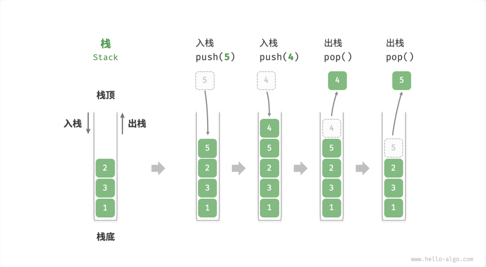
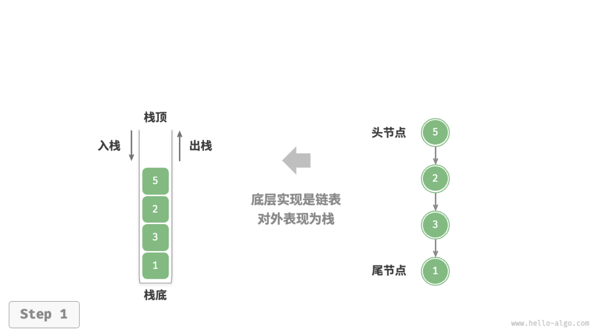
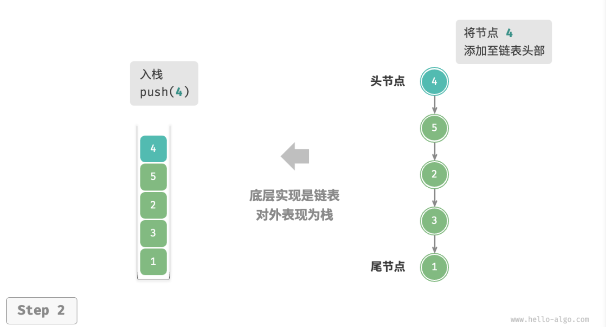
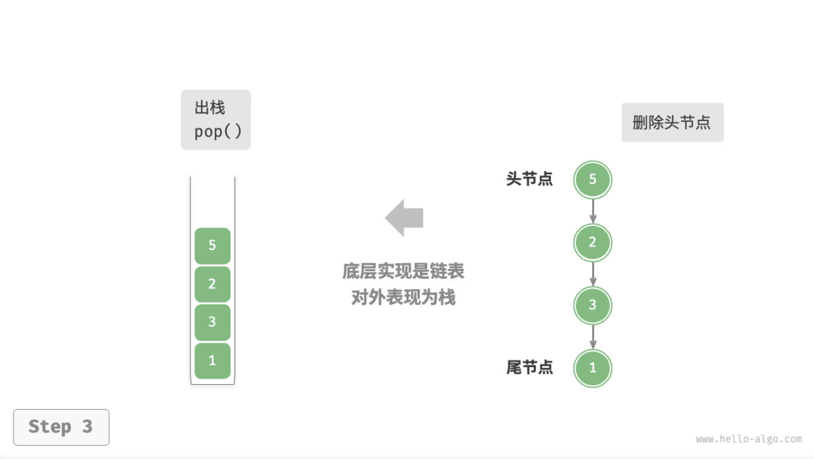

- > https://www.hello-algo.com/chapter_stack_and_queue/stack/
-
- ## 栈
	- `栈 Stack`是一种遵循[[#blue]]==先入后出（First In, Last Out）==原则的线性数据结构。
	- 在栈中，我们把堆叠元素的顶部称为**「栈顶」**，底部称为**「栈底」**。将把元素添加到栈顶的操作叫做**「入栈」**，而删除栈顶元素的操作叫做**「出栈」**。
	- {:height 431, :width 726}
	- [[#blue]]==栈常用操作==
		- |方法|描述|时间复杂度|
		  |--|--|--|
		  |push()|元素入栈（添加至栈顶）|$O(1)$|
		  |pop()|栈顶元素出栈|$O(1)$|
		  |peek()|访问栈顶元素|$O(1)$|
		- 通常情况下，我们可以直接使用编程语言内置的栈类。然而，某些语言可能没有专门提供栈类，这时我们可以将该语言的「数组」或「链表」视作栈来使用，并通过“脑补”来忽略与栈无关的操作。
		- ```
		  /* 初始化栈 */
		  // Javascript 没有内置的栈类，可以把 Array 当作栈来使用 
		  const stack = [];
		  
		  /* 元素入栈 */
		  stack.push(1);
		  stack.push(3);
		  stack.push(2);
		  stack.push(5);
		  stack.push(4);
		  
		  /* 访问栈顶元素 */
		  const peek = stack[stack.length-1];
		  
		  /* 元素出栈 */
		  const pop = stack.pop();
		  
		  /* 获取栈的长度 */
		  const size = stack.length;
		  
		  /* 判断是否为空 */
		  const is_empty = stack.length === 0;
		  ```
	- [[#blue]]==栈的实现==
		- `基于链表的实现`
			- 使用链表来实现栈时，我们可以将链表的头节点视为栈顶，尾节点视为栈底。
			- 对于入栈操作，我们只需将元素插入链表头部，这种节点插入方法被称为**头插法**。而对于出栈操作，只需将头节点从链表中删除即可。
			- {:height 328, :width 525}
			- {:height 360, :width 528}
			- {:height 363, :width 542}
			- 以下是基于链表实现栈的示例代码。
			- ```
			  /* 基于链表实现的栈 */
			  class LinkedListStack {
			      #stackPeek; // 将头节点作为栈顶
			      #stkSize = 0; // 栈的长度
			  
			      constructor() {
			          this.#stackPeek = null;
			      }
			  
			      /* 获取栈的长度 */
			      get size() {
			          return this.#stkSize;
			      }
			  
			      /* 判断栈是否为空 */
			      isEmpty() {
			          return this.size == 0;
			      }
			  
			      /* 入栈 */
			      push(num) {
			          const node = new ListNode(num);
			          node.next = this.#stackPeek;
			          this.#stackPeek = node;
			          this.#stkSize++;
			      }
			  
			      /* 出栈 */
			      pop() {
			          const num = this.peek();
			          this.#stackPeek = this.#stackPeek.next;
			          this.#stkSize--;
			          return num;
			      }
			  
			      /* 访问栈顶元素 */
			      peek() {
			          if (!this.#stackPeek) throw new Error('栈为空');
			          return this.#stackPeek.val;
			      }
			  
			      /* 将链表转化为 Array 并返回 */
			      toArray() {
			          let node = this.#stackPeek;
			          const res = new Array(this.size);
			          for (let i = res.length - 1; i >= 0; i--) {
			              res[i] = node.val;
			              node = node.next;
			          }
			          return res;
			      }
			  }
			  
			  ```
		-