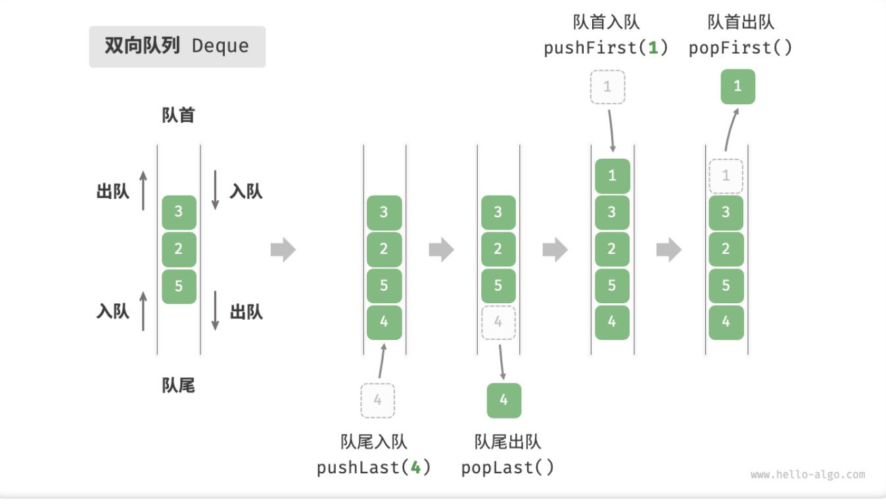

- > https://www.hello-algo.com/chapter_stack_and_queue/stack/
-
- ## 栈
	- `栈 Stack`是一种遵循[[#blue]]==先入后出（First In, Last Out）==原则的线性数据结构。
	- 在栈中，我们把堆叠元素的顶部称为**「栈顶」**，底部称为**「栈底」**。将把元素添加到栈顶的操作叫做**「入栈」**，而删除栈顶元素的操作叫做**「出栈」**。
	- {:height 431, :width 726}
	- [[#blue]]==栈常用操作==
		- |方法|描述|时间复杂度|
		  |--|--|--|
		  |push()|元素入栈（添加至栈顶）|$O(1)$|
		  |pop()|栈顶元素出栈|$O(1)$|
		  |peek()|访问栈顶元素|$O(1)$|
		- 通常情况下，我们可以直接使用编程语言内置的栈类。然而，某些语言可能没有专门提供栈类，这时我们可以将该语言的「数组」或「链表」视作栈来使用，并通过“脑补”来忽略与栈无关的操作。
		- ```
		  /* 初始化栈 */
		  // Javascript 没有内置的栈类，可以把 Array 当作栈来使用 
		  const stack = [];
		  
		  /* 元素入栈 */
		  stack.push(1);
		  stack.push(3);
		  stack.push(2);
		  stack.push(5);
		  stack.push(4);
		  
		  /* 访问栈顶元素 */
		  const peek = stack[stack.length-1];
		  
		  /* 元素出栈 */
		  const pop = stack.pop();
		  
		  /* 获取栈的长度 */
		  const size = stack.length;
		  
		  /* 判断是否为空 */
		  const is_empty = stack.length === 0;
		  ```
	- [[#blue]]==栈的实现==
		- `基于链表的实现`
		  collapsed:: true
			- 使用链表来实现栈时，我们可以将链表的头节点视为栈顶，尾节点视为栈底。
			- 对于入栈操作，我们只需将元素插入链表头部，这种节点插入方法被称为**头插法**。而对于出栈操作，只需将头节点从链表中删除即可。
			- {:height 328, :width 525}
			- {:height 360, :width 528}
			- {:height 363, :width 542}
			- 以下是基于链表实现栈的示例代码。
			- ```
			  /* 基于链表实现的栈 */
			  class LinkedListStack {
			      #stackPeek; // 将头节点作为栈顶
			      #stkSize = 0; // 栈的长度
			  
			      constructor() {
			          this.#stackPeek = null;
			      }
			  
			      /* 获取栈的长度 */
			      get size() {
			          return this.#stkSize;
			      }
			  
			      /* 判断栈是否为空 */
			      isEmpty() {
			          return this.size == 0;
			      }
			  
			      /* 入栈 */
			      push(num) {
			          const node = new ListNode(num);
			          node.next = this.#stackPeek;
			          this.#stackPeek = node;
			          this.#stkSize++;
			      }
			  
			      /* 出栈 */
			      pop() {
			          const num = this.peek();
			          this.#stackPeek = this.#stackPeek.next;
			          this.#stkSize--;
			          return num;
			      }
			  
			      /* 访问栈顶元素 */
			      peek() {
			          if (!this.#stackPeek) throw new Error('栈为空');
			          return this.#stackPeek.val;
			      }
			  
			      /* 将链表转化为 Array 并返回 */
			      toArray() {
			          let node = this.#stackPeek;
			          const res = new Array(this.size);
			          for (let i = res.length - 1; i >= 0; i--) {
			              res[i] = node.val;
			              node = node.next;
			          }
			          return res;
			      }
			  }
			  
			  ```
		- `基于数组的实现`
		  collapsed:: true
			- 在基于「数组」实现栈时，我们可以将[[#blue]]==数组的尾部作为栈顶==。在这样的设计下，入栈与出栈操作就分别对应在数组尾部添加元素与删除元素，时间复杂度都为 $O(1)$ 。
			- {:height 376, :width 662}
			- {:height 383, :width 661}
			- {:height 377, :width 658}
			- 由于入栈的元素可能会源源不断地增加，因此我们可以使用动态数组，这样就无需自行处理数组扩容问题。以下为示例代码。
			- ```
			  /* 基于数组实现的栈 */
			  class ArrayStack {
			      #stack;
			      constructor() {
			          this.#stack = [];
			      }
			  
			      /* 获取栈的长度 */
			      get size() {
			          return this.#stack.length;
			      }
			  
			      /* 判断栈是否为空 */
			      empty() {
			          return this.#stack.length === 0;
			      }
			  
			      /* 入栈 */
			      push(num) {
			          this.#stack.push(num);
			      }
			  
			      /* 出栈 */
			      pop() {
			          if (this.empty()) throw new Error('栈为空');
			          return this.#stack.pop();
			      }
			  
			      /* 访问栈顶元素 */
			      top() {
			          if (this.empty()) throw new Error('栈为空');
			          return this.#stack[this.#stack.length - 1];
			      }
			  
			      /* 返回 Array */
			      toArray() {
			          return this.#stack;
			      }
			  }
			  ```
			-
	- [[#blue]]==两种实现对比==
		- `支持操作`
			- 两种实现都支持栈定义中的各项操作。数组实现额外支持随机访问，但这已超出了栈的定义范畴，因此一般不会用到。
		- `时间效率`
			- 当入栈与出栈操作的元素是基本数据类型（如 `int` , `double` ）时，我们可以得出以下结论：
				- id:: 6465fe8a-815b-4fca-a843-5bc3ca4a1d08
				  1. 基于数组实现的栈在触发扩容时效率会降低，但由于扩容是低频操作，因此平均效率更高；
				  2. 基于链表实现的栈可以提供更加稳定的效率表现；
		- `空间效率`
			- **基于数组实现的栈可能造成一定的空间浪费**。
			- 然而，由于链表节点需要额外存储指针，**因此链表节点占用的空间相对较大**。
			- 综上，我们不能简单地确定哪种实现更加节省内存，需要针对具体情况进行分析。
	- [[#blue]]==栈典型应用==
		- **浏览器中的后退与前进、软件中的撤销与反撤销**。每当我们打开新的网页，浏览器就会将上一个网页执行入栈，这样我们就可以通过「后退」操作回到上一页面。后退操作实际上是在执行出栈。如果要同时支持后退和前进，那么需要两个栈来配合实现。
		- **程序内存管理**。每次调用函数时，系统都会在栈顶添加一个栈帧，用于记录函数的上下文信息。在递归函数中，向下递推阶段会不断执行入栈操作，而向上回溯阶段则会执行出栈操作。
- ## 队列
  collapsed:: true
	- `队列 Queue`是一种遵循[[#blue]]==先入先出（First In, First Out）==规则的线性数据结构。顾名思义，队列模拟了排队现象，即新来的人不断加入队列的尾部，而位于队列头部的人逐个离开。
	- 我们把队列的头部称为「队首」，尾部称为「队尾」，把将元素加入队尾的操作称为「入队」，删除队首元素的操作称为「出队」。
	- {:height 435, :width 742}
	- [[#blue]]==队列常用操作==
	  collapsed:: true
		- 队列的常见操作如下表所示。
		- |方法名|描述|时间复杂度|
		  |--|--|--|
		  |push()|元素入队，即将元素添加至队尾|$O(1)$|
		  |pop()|队首元素出队|$O(1)$|
		  |peek()|访问队首元素|$O(1)$|
		- 我们可以直接使用编程语言中现成的队列类。
		- ```
		  /* 初始化队列 */
		  // JavaScript 没有内置的队列，可以把 Array 当作队列来使用
		  const queue = [];
		  
		  /* 元素入队 */
		  queue.push(1);
		  queue.push(3);
		  queue.push(2);
		  queue.push(5);
		  queue.push(4);
		  
		  /* 访问队首元素 */
		  const peek = queue[0];
		  
		  /* 元素出队 */
		  // 底层是数组，因此 shift() 方法的时间复杂度为 O(n)
		  const pop = queue.shift();
		  
		  /* 获取队列的长度 */
		  const size = queue.length;
		  
		  /* 判断队列是否为空 */
		  const empty = queue.length === 0;
		  ```
	- [[#blue]]==队列实现==
	  collapsed:: true
		- `基于链表的实现`
		  collapsed:: true
			- 对于链表实现，我们可以将链表的「头节点」和「尾节点」分别视为队首和队尾，规定队尾仅可添加节点，而队首仅可删除节点。
			- ```
			  /* 基于链表实现的队列 */
			  class LinkedListQueue {
			      #front; // 头节点 #front
			      #rear; // 尾节点 #rear
			      #queSize = 0;
			  
			      constructor() {
			          this.#front = null;
			          this.#rear = null;
			      }
			  
			      /* 获取队列的长度 */
			      get size() {
			          return this.#queSize;
			      }
			  
			      /* 判断队列是否为空 */
			      isEmpty() {
			          return this.size === 0;
			      }
			  
			      /* 入队 */
			      push(num) {
			          // 尾节点后添加 num
			          const node = new ListNode(num);
			          // 如果队列为空，则令头、尾节点都指向该节点
			          if (!this.#front) {
			              this.#front = node;
			              this.#rear = node;
			              // 如果队列不为空，则将该节点添加到尾节点后
			          } else {
			              this.#rear.next = node;
			              this.#rear = node;
			          }
			          this.#queSize++;
			      }
			  
			      /* 出队 */
			      pop() {
			          const num = this.peek();
			          // 删除头节点
			          this.#front = this.#front.next;
			          this.#queSize--;
			          return num;
			      }
			  
			      /* 访问队首元素 */
			      peek() {
			          if (this.size === 0) throw new Error('队列为空');
			          return this.#front.val;
			      }
			  
			      /* 将链表转化为 Array 并返回 */
			      toArray() {
			          let node = this.#front;
			          const res = new Array(this.size);
			          for (let i = 0; i < res.length; i++) {
			              res[i] = node.val;
			              node = node.next;
			          }
			          return res;
			      }
			  }
			  
			  ```
		- `基于数组的实现`
			- 由于数组删除首元素的时间复杂度为 $O(n)$ ，这会导致出队操作效率较低。然而，我们可以采用以下巧妙方法来避免这个问题。
			- 我们可以使用一个变量 `front` 指向队首元素的索引，并维护一个变量 `queSize` 用于记录队列长度。定义 `rear = front + queSize` ，这个公式计算出的 `rear` 指向队尾元素之后的下一个位置。[[#green]]==这样数组删除首元素后不再需要整体向前移动一位，降低了操作复杂度==。
			- 基于此设计，**数组中包含元素的有效区间为 [front, rear - 1]**，进而：
				- 1. 对于入队操作，将输入元素赋值给 `rear` 索引处，并将 `queSize` 增加 1 ；
				- 2. 对于出队操作，只需将 `front` 增加 1 ，并将 `queSize` 减少 1 ；
			- {:height 368, :width 610}
			- {:height 372, :width 609}
			- {:height 338, :width 594}
			- 你可能会发现一个问题：在不断进行入队和出队的过程中，`front` 和 `rear` 都在向右移动，**当它们到达数组尾部时就无法继续移动了**。为解决此问题，我们可以将数组视为首尾相接的**「环形数组」**。
			- 对于环形数组，我们需要让 `front` 或 `rear` 在越过数组尾部时，直接回到数组头部继续遍历。这种周期性规律可以通过“[[#green]]==取余操作==”来实现，代码如下所示。
			- ```
			  /* 基于环形数组实现的队列 */
			  class ArrayQueue {
			      #nums; // 用于存储队列元素的数组
			      #front = 0; // 队首指针，指向队首元素
			      #queSize = 0; // 队列长度
			  
			      constructor(capacity) {
			          this.#nums = new Array(capacity);
			      }
			  
			      /* 获取队列的容量 */
			      get capacity() {
			          return this.#nums.length;
			      }
			  
			      /* 获取队列的长度 */
			      get size() {
			          return this.#queSize;
			      }
			  
			      /* 判断队列是否为空 */
			      empty() {
			          return this.#queSize == 0;
			      }
			  
			      /* 入队 */
			      push(num) {
			          if (this.size == this.capacity) {
			              console.log('队列已满');
			              return;
			          }
			          // 计算尾指针，指向队尾索引 + 1
			          // 通过取余操作，实现 rear 越过数组尾部后回到头部
			          const rear = (this.#front + this.size) % this.capacity;
			          // 将 num 添加至队尾
			          this.#nums[rear] = num;
			          this.#queSize++;
			      }
			  
			      /* 出队 */
			      pop() {
			          const num = this.peek();
			          // 队首指针向后移动一位，若越过尾部则返回到数组头部
			          this.#front = (this.#front + 1) % this.capacity;
			          this.#queSize--;
			          return num;
			      }
			  
			      /* 访问队首元素 */
			      peek() {
			          if (this.empty()) throw new Error('队列为空');
			          return this.#nums[this.#front];
			      }
			  
			      /* 返回 Array */
			      toArray() {
			          // 仅转换有效长度范围内的列表元素
			          const arr = new Array(this.size);
			          for (let i = 0, j = this.#front; i < this.size; i++, j++) {
			              arr[i] = this.#nums[j % this.capacity];
			          }
			          return arr;
			      }
			  }
			  ```
	- [[#blue]]==队列典型应用==
		- **淘宝订单**。购物者下单后，订单将加入队列中，系统随后会根据顺序依次处理队列中的订单。在双十一期间，短时间内会产生海量订单，高并发成为工程师们需要重点攻克的问题。
		  **各类待办事项**。任何需要实现“先来后到”功能的场景，例如打印机的任务队列、餐厅的出餐队列等。队列在这些场景中可以有效地维护处理顺序。
- ## 双向队列
	- 对于队列，我们仅能在头部删除或在尾部添加元素。然而，**「双向队列 Deque」**提供了更高的灵活性，允许在头部和尾部执行元素的添加或删除操作。
	- {:height 403, :width 700}
	- [[#blue]]==双向队列常用操作==
	  collapsed:: true
		- |方法名|描述|时间复杂度|
		  |--|--|--|
		  |pushFirst()|将元素添加至队首|$O(1)$|
		  |pushLast()|将元素添加至队尾|$O(1)$|
		  |popFirst()|删除队首元素|$O(1)$|
		  |popLast()|删除队尾元素|$O(1)$|
		  |peekFirst()|访问队首元素|$O(1)$|
		  |peekLast()|访问队尾元素|$O(1)$|
		- ```
		  /* 初始化双向队列 */
		  // JavaScript 没有内置的双端队列，只能把 Array 当作双端队列来使用
		  const deque = [];
		  
		  /* 元素入队 */
		  deque.push(2);
		  deque.push(5);
		  deque.push(4);
		  // 请注意，由于是数组，unshift() 方法的时间复杂度为 O(n)
		  deque.unshift(3);
		  deque.unshift(1);
		  console.log("双向队列 deque = ", deque);
		  
		  /* 访问元素 */
		  const peekFirst = deque[0];
		  console.log("队首元素 peekFirst = " + peekFirst);
		  const peekLast = deque[deque.length - 1];
		  console.log("队尾元素 peekLast = " + peekLast);
		  
		  /* 元素出队 */
		  // 请注意，由于是数组，shift() 方法的时间复杂度为 O(n)
		  const popFront = deque.shift();
		  console.log("队首出队元素 popFront = " + popFront + "，队首出队后 deque = " + deque);
		  const popBack = deque.pop();
		  console.log("队尾出队元素 popBack = " + popBack + "，队尾出队后 deque = " + deque);
		  
		  /* 获取双向队列的长度 */
		  const size = deque.length;
		  console.log("双向队列长度 size = " + size);
		  
		  /* 判断双向队列是否为空 */
		  const isEmpty = size === 0;
		  console.log("双向队列是否为空 = " + isEmpty);
		  ```
		-
	- [[#blue]]==双向队列实现 *==
		- `基于双向链表的实现`
			- 我们将双向链表的头节点和尾节点视为双向队列的队首和队尾，同时实现在两端添加和删除节点的功能。
			-