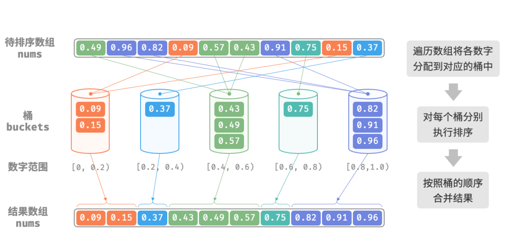
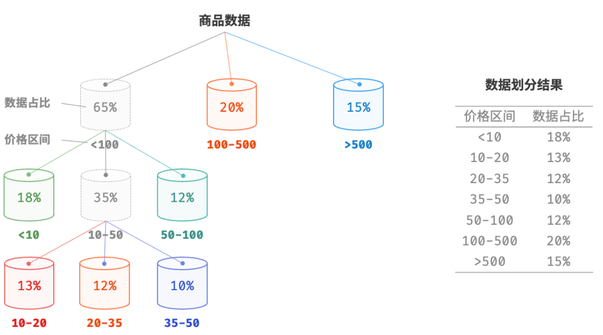
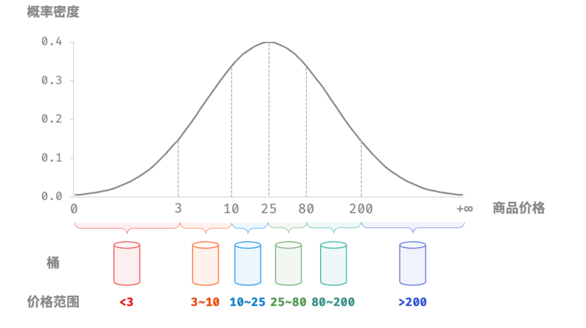

- > https://www.hello-algo.com/chapter_sorting/bucket_sort/
-
- > 前述的几种排序算法都属于“基于比较的排序算法”，它们通过比较元素间的大小来实现排序。此类排序算法的时间复杂度无法超越 $O(n\log⁡{n})$ 。接下来，我们将探讨几种“非比较排序算法”，它们的时间复杂度可以达到**线性水平**。
- **「桶排序 Bucket Sort」**是分治思想的一个典型应用。它通过设置一些具有大小顺序的桶，每个桶对应一个数据范围，将数据平均分配到各个桶中；然后，在每个桶内部分别执行排序；最终按照桶的顺序将所有数据合并。
- ## 算法流程
	- 考虑一个长度为 $n$ 的数组，元素是范围 [0,1) 的浮点数。桶排序的流程如下：
		- 1. 初始化 $k$ 个桶，将 $n$ 个元素分配到 $k$ 个桶中；
		  2. 对每个桶分别执行排序（本文采用编程语言的内置排序函数）；
		  3. 按照桶的从小到大的顺序，合并结果；
	- 
	- ```
	  /* 桶排序 */
	  function bucketSort(nums) {
	      // 初始化 k = n/2 个桶，预期向每个桶分配 2 个元素
	      const k = nums.length / 2;
	      const buckets = [];
	      for (let i = 0; i < k; i++) {
	          buckets.push([]);
	      }
	      // 1. 将数组元素分配到各个桶中
	      for (const num of nums) {
	          // 输入数据范围 [0, 1)，使用 num * k 映射到索引范围 [0, k-1]
	          const i = Math.floor(num * k);
	          // 将 num 添加进桶 i
	          buckets[i].push(num);
	      }
	      // 2. 对各个桶执行排序
	      for (const bucket of buckets) {
	          // 使用内置排序函数，也可以替换成其他排序算法
	          bucket.sort((a, b) => a - b);
	      }
	      // 3. 遍历桶合并结果
	      let i = 0;
	      for (const bucket of buckets) {
	          for (const num of bucket) {
	              nums[i++] = num;
	          }
	      }
	  }
	  ```
	- > ❔ **桶排序的适用场景是什么？**
	  >
	  > 桶排序适用于处理[[#green]]==体量很大的数据==。例如，输入数据包含 100 万个元素，由于空间限制，系统内存无法一次性加载所有数据。此时，可以将数据分成 1000 个桶，然后分别对每个桶进行排序，最后将结果合并。
- ## 算法特性
	- **时间复杂度** $O(n+k)$ ：假设元素在各个桶内平均分布，那么每个桶内的元素数量为 $\frac{n}{k}$ 。假设排序单个桶使用 $O(\frac{n}{k}\log{\frac{n}{k}})$ 时间，则排序所有桶使用 $O(n\log{\frac{n}{k}})$ 时间。**当桶数量** $k$ **比较大时，时间复杂度则趋向于** $O(n)$ 。合并结果时需要遍历 $k$ 个桶，花费 $O(k)$ 时间。
	- **自适应排序**：在最坏情况下，所有数据被分配到一个桶中，且排序该桶使用 $O(n^2)$ 时间。
	- **空间复杂度** $O(n+k)$ **、非原地排序** ：需要借助 $k$ 个桶和总共 $n$ 个元素的额外空间。
	- 桶排序是否稳定取决于排序桶内元素的算法是否稳定。
- ## 如何实现平均分配
	- 桶排序的时间复杂度理论上可以达到 $O(n)$ ，**关键在于将元素均匀分配到各个桶中**
	- ### 递归划分桶
	  background-color:: pink
		- 为实现平均分配，我们可以先设定一个大致的分界线，将数据粗略地分到 3 个桶中。
		  logseq.order-list-type:: number
		- **分配完毕后，再将商品较多的桶继续划分为 3 个桶，直至所有桶中的元素数量大致相等**。
		  logseq.order-list-type:: number
		- 这种方法本质上是创建一个递归树，使叶节点的值尽可能平均。当然，不一定要每轮将数据划分为 3 个桶，具体划分方式可根据数据特点灵活选择。
		- 
	- ### 根据概率分布划分桶
	  background-color:: pink
		- 