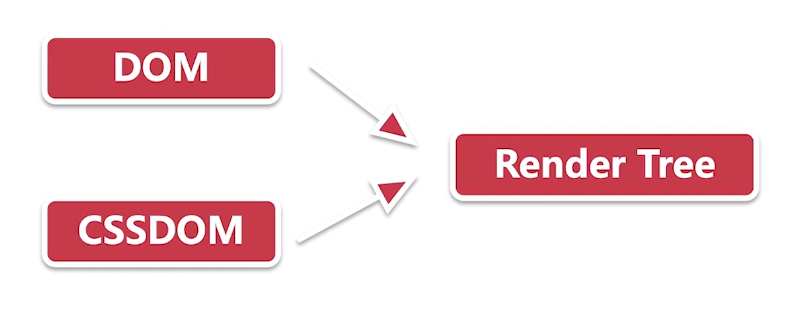
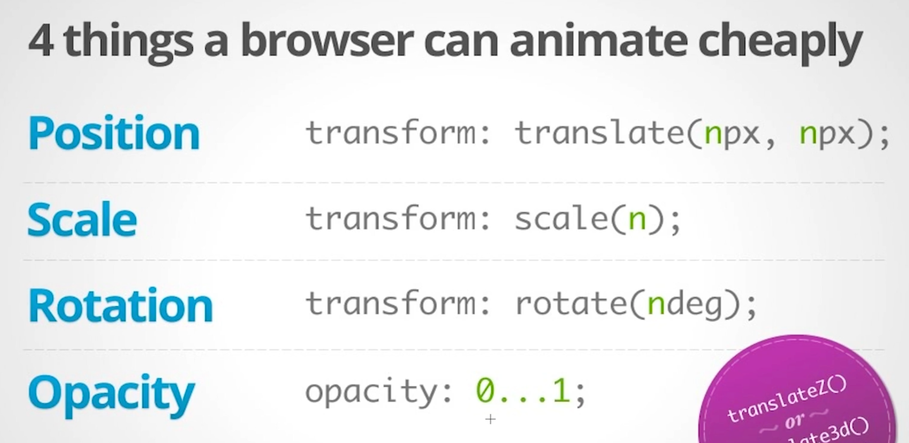
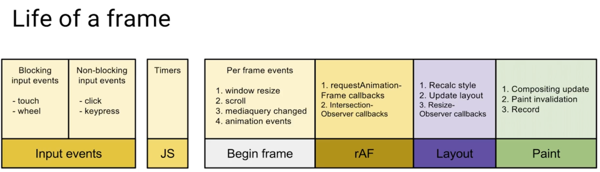

- ## 浏览器渲染原理
	- ### 关键渲染路径 (critical rendering path)
	  background-color:: pink
		- 
	- ### 浏览器构建渲染树
	  background-color:: pink
		- 构建 DOM 对象：`HTML`  -- > `DOM`
		- 构建 CSSOM 对象：`CSS` --> `CSSOM`
		- 
- ## 回流与重绘，如何避免布局抖动
	- ### 布局 (layouts) 与绘制 (paint)
	  background-color:: pink
		- 渲染树 (Render Tree) 只包含网页需要的节点；
		- **布局** - 回流 (Reflow)，计算每个节点精确的位置和大小 - “盒模型”；
		- **绘制** - 重绘 (Repaint) 是像素化每个节点的过程；
		- #### 影响回流的操作
		  background-color:: green
			- 添加/删除元素
			- 操作 styles
			- display: none
			- offsetLeft, scrollTop, clientWidth
			- 移动元素位置
			- 修改浏览器大小，字体大小
	- ### 避免布局抖动 (layout thrashing)
	  background-color:: pink
		- **避免回流**
			- 例如，`transform` 代替直接修改元素大小，`transform` 不会引起回流和重绘；
		- **读写分离，批量修改**
		  collapsed:: true
			- #### 使用 [FastDom](https://github.com/wilsonpage/fastdom)
			  background-color:: green
				- FastDom 充当应用程序/库和 DOM 之间的监管层。通过批处理 DOM 访问，我们可以避免不必要的文档重排并显着提高布局性能。
				- `fastdom.measure`：读取操作
				- `fastdom.mutate`：写入操作
				- 批量更新：
					- ```
					  fastdom.measure(() => {
					    console.log('measure');
					  });
					  
					  fastdom.mutate(() => {
					    console.log('mutate');
					  });
					  
					  fastdom.measure(() => {
					    console.log('measure');
					  });
					  
					  fastdom.mutate(() => {
					    console.log('mutate');
					  });
					  
					  // 输出
					  measure
					  measure
					  mutate
					  mutate
					  ```
	- ### 复合线程 (compositor thread) 与图层 (layers)
	  background-color:: pink
		- #### 复合线程做什么？
		  background-color:: green
			- 将页面拆分图层进行绘制，再进行复合
		- #### 哪些样式只影响复合？
		  background-color:: green
			- 
		- #### 避免重绘
		  background-color:: green
			- `DevTools` 设置：`cmd` + `shift` + `P`，run `show Rendering`，勾选 `Paint flashing`
				- > 页面如果发生重绘，重绘区域会用绿色标注
			- 使用只影响复合的 CSS 属性，例如 `transform`、`opacity`
				- > transform可以借用GPU对动画进行处理，省去布局和重绘。但浏览器不一定会建立单独图层，属于底层的实现。
			- 利用 `will-change` 创建新图层
				- > will-change是让浏览器有一个预判，不仅用于transform和opacity。但用于它们时可以让浏览器根据需要提前准备建层优化。根据标准如果用于width浏览器也要提前进行优化准备的。[[#red]]==不过它是有开销的，不能大量应用，多数情况还是进行一些动画的优化处理。==
- ## 高频事件防抖
  collapsed:: true
	- ### 页面卡顿的原因
	  background-color:: pink
		- scroll、touch、mouse event事件触发频率超出了帧的刷新速率(60 fps)
	- ### Life of a frame
	  background-color:: pink
		- 
		- `rAF`: requestAnimationFrame
	- ### 防抖和节流
	  background-color:: pink
- ## React 时间调度实现
	-