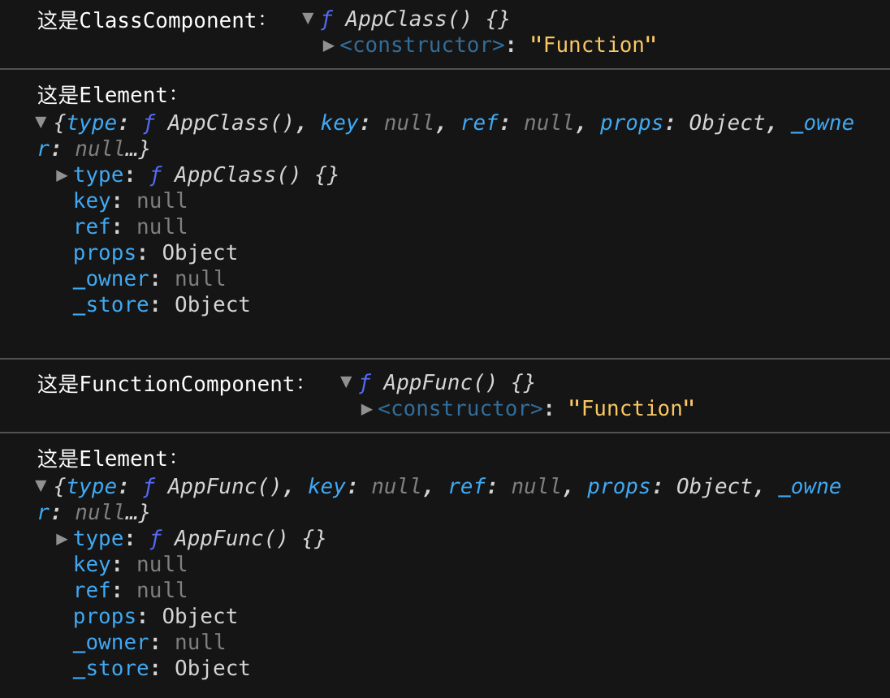

- > https://react.iamkasong.com/preparation/jsx.html
-
- > `JSX`和`Fiber节点`是同一个东西么？
  > `React Component`、`React Element`是同一个东西么，他们和`JSX`有什么关系？
- ## JSX简介
	- `JSX`在编译时会被`Babel`编译为`React.createElement`方法。
	- `<div id="foo">bar</div>`
	- Babel 会将其转译为：
	- `React.createElement("div", {id: "foo"}, "bar");`
	- > **注意**
	  > 在React17中，已经不需要显式导入React了。详见[介绍全新的 JSX 转换](https://zh-hans.reactjs.org/blog/2020/09/22/introducing-the-new-jsx-transform.html)
	- `JSX`并不是只能被编译为`React.createElement`方法，你可以通过[@babel/plugin-transform-react-jsx](https://babeljs.io/docs/en/babel-plugin-transform-react-jsx)插件显式告诉`Babel`编译时需要将`JSX`编译为什么函数的调用（默认为`React.createElement`）。
- ## [React.createElement](https://github.com/facebook/react/blob/1fb18e22ae66fdb1dc127347e169e73948778e5a/packages/react/src/ReactElement.js#L348)
	- [[React 之 createElement 源码解读]]
	- ```
	  export function createElement(type, config, children) {
	    let propName;
	  
	    const props = {};
	  
	    let key = null;
	    let ref = null;
	    let self = null;
	    let source = null;
	  
	    if (config != null) {
	      // 将 config 处理后赋值给 props(key, ref, self, source)
	      // let key = '' + config.key;
	      // let ref = config.ref;
	    	// let self = config.__self;
	    	// let source = config.__source;
	      // ...省略
	    }
	  
	    const childrenLength = arguments.length - 2;
	    // 处理 children，会被赋值给props.children
	    // ...省略
	  
	    // 处理 defaultProps
	    // ...省略
	  
	    return ReactElement(
	      type,
	      key,
	      ref,
	      self,
	      source,
	      ReactCurrentOwner.current,
	      props,
	    );
	  }
	  
	  const ReactElement = function(type, key, ref, self, source, owner, props) {
	    const element = {
	      // 标记这是个 React Element
	      $$typeof: REACT_ELEMENT_TYPE,
	  
	      type: type,
	      key: key,
	      ref: ref,
	      props: props,
	      _owner: owner,
	    };
	  
	    return element;
	  };
	  ```
	- `React.createElement`最终会调用`ReactElement`方法返回一个包含组件数据的对象，该对象有个参数`$$typeof: REACT_ELEMENT_TYPE`标记了该对象是个`React Element`。
	- `$$typeof === REACT_ELEMENT_TYPE`的非`null`对象就是一个合法的`React Element`。换言之，在`React`中，所有`JSX`在运行时的返回结果（即`React.createElement()`的返回值）都是`React Element`。
- ## React Component
	- 在`React`中，我们常使用`ClassComponent`与`FunctionComponent`构建组件。
	- ```
	  class AppClass extends React.Component {
	    render() {
	      return <p>KaSong</p>
	    }
	  }
	  console.log('这是ClassComponent：', AppClass);
	  console.log('这是Element：', <AppClass/>);
	  
	  
	  function AppFunc() {
	    return <p>KaSong</p>;
	  }
	  console.log('这是FunctionComponent：', AppFunc);
	  console.log('这是Element：', <AppFunc/>);
	  ```
	- 
	- `ClassComponent`：对应的`Element`的`type`字段为`AppClass`自身。
	- `FunctionComponent`：对应的`Element`的`type`字段为`AppFunc`自身。
	- `React`通过`ClassComponent`实例原型上的`isReactComponent`变量判断是否是`ClassComponent`。
		- ```
		  ClassComponent.prototype.isReactComponent = {};
		  ```
- ## JSX与Fiber节点
	- `JSX`是一种描述当前组件内容的数据结构，他不包含组件**schedule**、**reconcile**、**render**所需的相关信息。
	- 如下信息就不包括在`JSX`中：
		- 组件在更新中的`优先级`
		- 组件的`state`
		- 组件被打上的用于**Renderer**的`标记`
	- 这些内容都包含在`Fiber节点`中。
	- [[#blue]]==在组件`mount`时==：`Reconciler`根据`JSX`描述的组件内容生成组件对应的`Fiber节点`。
	- [[#blue]]==在`update`时==：`Reconciler`将`JSX`与`Fiber节点`保存的数据对比，生成组件对应的`Fiber节点`，并根据对比结果为`Fiber节点`打上`标记`。
- ## 参考资料
	- [如何干掉知乎的全部DIV -- 通过这篇文章在运行时修改`React.createElement`达到消除页面所有`div`元素的效果(opens new window)](https://mp.weixin.qq.com/s/ICjOlJL-fUGRb2S_xqBT7Q)
	- [React官网Blog，关于React Component, Element, Instance, Reconciliation的简介](https://reactjs.org/blog/2015/12/18/react-components-elements-and-instances.html)
	-