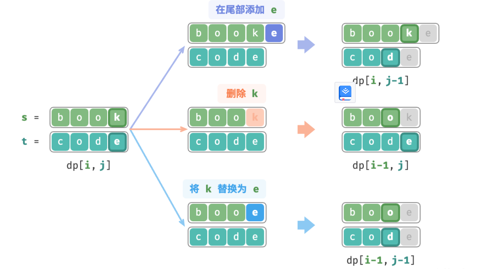

- > https://www.hello-algo.com/chapter_dynamic_programming/edit_distance_problem/
-
- 编辑距离，也被称为 Levenshtein 距离，[[#blue]]==是两个字符串之间互相转换的最小修改次数，通常用于在信息检索和自然语言处理中度量两个序列的相似度。==
- > ❔ **Question**
  >
  > 输入两个字符串 $s$ 和 $t$ ，返回将 $s$ 转换为 $t$ 所需的最少编辑步数。
  你可以在一个字符串中进行三种编辑操作：插入一个字符、删除一个字符、替换字符为任意一个字符。
- **编辑距离问题可以很自然地用决策树模型来解释**。字符串对应树节点，一轮决策（一次编辑操作）对应树的一条边。
	- ### 第一步：思考每轮的决策，定义状态，从而得到 $dp$ 表
	  background-color:: pink
		- 每一轮的决策是对字符串 $s$ 进行一次编辑操作。
		- 我们希望在编辑操作的过程中，问题的规模逐渐缩小，这样才能构建子问题。设字符串 $s$ 和 $t$ 的长度分别为 $n$ 和 $m$ ，我们先考虑两字符串尾部的字符 $s[n-1]$ 和 $t[m-1]$ ：
			- 若 $s[n-1]$ 和 $t[m-1]$ 相同，我们可以直接跳过它们，接下来考虑 $s[n-2]$ 和 $t[m-2]$ ;
			- 若 $s[n-1]$ 和 $t[m-1]$ 不同，我们需要对 $s$ 进行一次编辑（插入、删除、替换），使得两字符串尾部的字符相同，从而可以跳过它们，考虑规模更小的问题；
		- 也就是说，我们在字符串 $s$ 中进行的每一轮决策（编辑操作），都会使得 $s$ 和 $t$ 中剩余的待匹配字符发生变化。因此，状态为当前在 $s$ , $t$ 中考虑的第 $i$ , $j$ 个字符，记为 $[i,j]$ 。
		- 状态 $[i,j]$ 对应的子问题：**将** $s$ **的前** $i$ **个字符更改为** $t$ **的前** $j$ **个字符所需的最少编辑步数**。
		- 至此得到一个尺寸为 $(i+1)×(j+1)$ 的二维 $dp$ 表。
	- ### 第二步：找出最优子结构，进而推导出状态转移方程
	  background-color:: pink
		- 考虑子问题 $dp[i,j]$ ，其对应的两个字符串的尾部字符为 $s[i-1]$ 和 $t[j-1]$ ，可根据不同编辑操作分为三种情况：
			- 在 $s[i-1]$ 之后添加 $t[j-1]$ ，则剩余子问题 $dp[i,j-1]$ ；
			  logseq.order-list-type:: number
			- 删除 $s[i-1]$ ，则剩余子问题 $dp[i-1,j]$ ；
			  logseq.order-list-type:: number
			- 将 $s[i-1]$ 替换为 $t[j-1]$ ，则剩余子问题 $dp[i-1,j-1]$ ；
			  logseq.order-list-type:: number
		- 
		- 对应的状态转移方程为：
		- $$dp[i,j]=\min(dp[i,j-1],dp[i-1,j],dp[i-1,j-1])+1$$
		- 请注意，**当** $s[i-1]$ **和** $t[j-1]$ **相同时，无需编辑当前字符**，此时状态转移方程为：
		- $$dp[i,j]=dp[i-1,j-1]$$
	- ### 第三步：确定边界条件和状态转移顺序
	  background-color:: pink
		- 当两字符串都为空时，编辑步数为 0 ，即 $dp[0,0]=0$ 。当 $s$ 为空但 $t$ 不为空时，最少编辑步数等于 $t$ 的长度，即 $dp[0,j]=j$ 。当 $s$ 不为空但 $t$ 为空时，等于 $s$ 的长度，即 $dp[i,0]=i$ 。
		- 观察状态转移方程，解 $dp[i,j]$ 依赖左方、上方、左上方的解，因此通过两层循环正序遍历整个 $dp$ 表即可。
	- ```
	  /* 编辑距离：动态规划 */
	  function editDistanceDP(s = '', t = '') {
	      const n = s.length, m = t.length;
	      const dp = Array(n + 1).fill(Array(m + 1));
	      // 状态转移：首行首列
	      for (let i = 1; i <= n; i++) {
	          dp[i][0] = i;
	      }
	      for (let j = 1; j <= m; j++) {
	          dp[0][j] = j;
	      }
	      // 状态转移：其余行列
	      for (let i = 1; i <= n; i++) {
	          for (let j = 1; j <= m; j++) {
	              if (s[i - 1] == t[j - 1]) {
	                  // 若两字符相等，则直接跳过此两字符
	                  dp[i][j] = dp[i - 1][j - 1];
	              } else {
	                  // 最少编辑步数 = 插入、删除、替换这三种操作的最少编辑步数 + 1
	                  dp[i][j] = Math.min(Math.min(dp[i][j - 1], dp[i - 1][j]), dp[i - 1][j - 1]) + 1;
	              }
	          }
	      }
	      return dp[n][m];
	  }
	  ```
	-