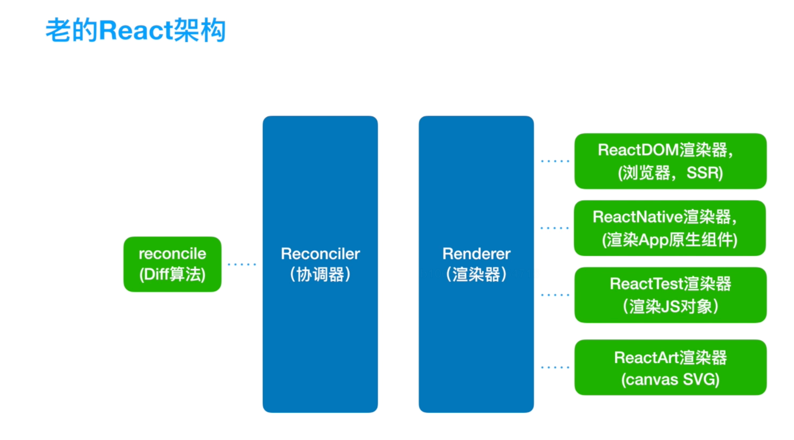

- > https://react.iamkasong.com/preparation/oldConstructure.html
-
- ## React15架构
	- `Reconciler（协调器）`—— 负责找出变化的组件
	- `Renderer（渲染器）`—— 负责将变化的组件渲染到页面上
	- 
	- ### Reconciler（协调器）
	  background-color:: blue
		- 在`React`中可以通过`this.setState`、`this.forceUpdate`、`ReactDOM.render`等API触发更新。
		- 每当有更新发生时，**Reconciler**会做如下工作：
			- - 调用函数组件、或class组件的`render`方法，将返回的JSX转化为虚拟DOM
			- - 将虚拟DOM和上次更新时的虚拟DOM对比
			- - 通过对比找出本次更新中变化的虚拟DOM
			- - 通知**Renderer**将变化的虚拟DOM渲染到页面上
		- > 你可以在[这里 (opens new window)](https://zh-hans.reactjs.org/docs/codebase-overview.html#reconcilers)看到`React`官方对**Reconciler**的解释
	- ### Renderer（渲染器）
	  background-color:: blue
		- 由于`React`支持跨平台，所以不同平台有不同的**Renderer**。我们前端最熟悉的是负责在浏览器环境渲染的**Renderer** —— [ReactDOM (opens new window)](https://www.npmjs.com/package/react-dom)。
		- 在每次更新发生时，**Renderer**接到**Reconciler**通知，将变化的组件渲染在当前宿主环境。
		- > 你可以在[这里 (opens new window)](https://zh-hans.reactjs.org/docs/codebase-overview.html#renderers)看到`React`官方对**Renderer**的解释
- ## React15架构的缺点
	- 在**Reconciler**中，`mount`的组件会调用[mountComponent (opens new window)](https://github.com/facebook/react/blob/15-stable/src/renderers/dom/shared/ReactDOMComponent.js#L498)，`update`的组件会调用[updateComponent (opens new window)](https://github.com/facebook/react/blob/15-stable/src/renderers/dom/shared/ReactDOMComponent.js#L877)。这两个方法都会递归更新子组件。
	- ### 递归更新的缺点
	  background-color:: blue
		- 由于递归执行，所以更新一旦开始，**中途就无法中断**。当层级很深时，递归更新时间超过了16ms，用户交互就会卡顿。
		- **Reconciler**和**Renderer**是交替工作的，由于整个过程都是同步的，所以在用户看来所有 DOM 是同时更新的。