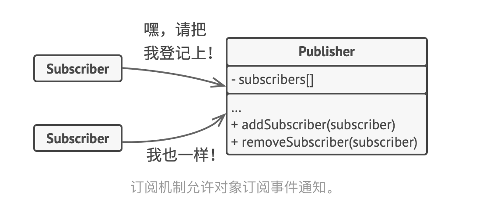
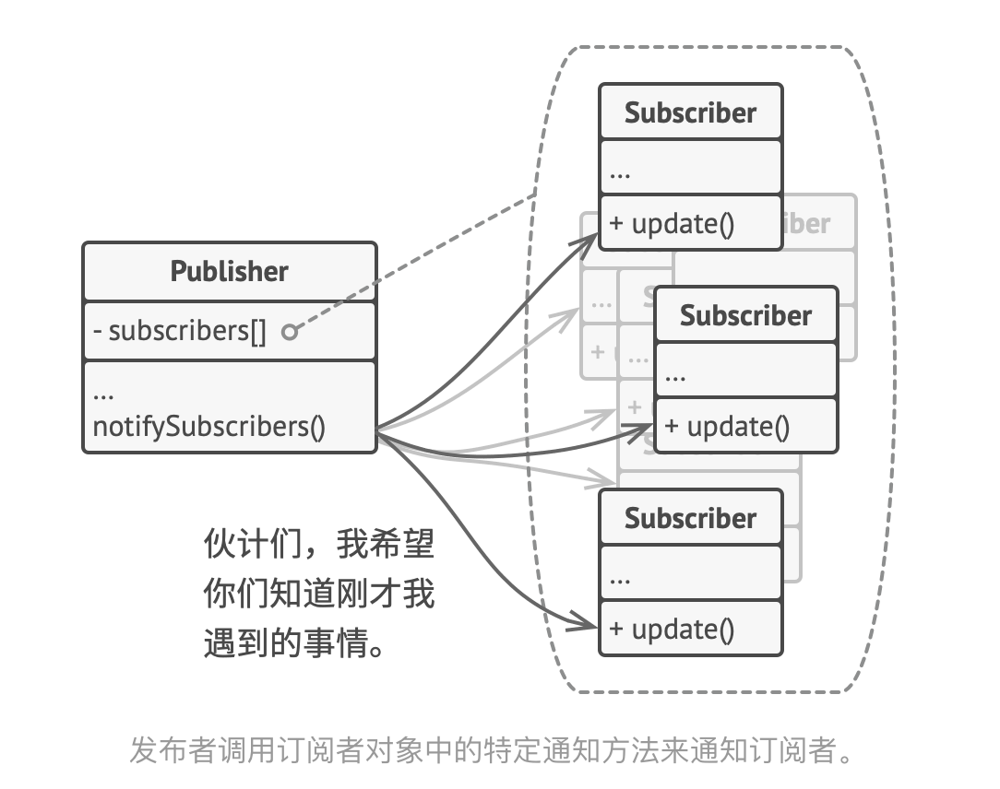
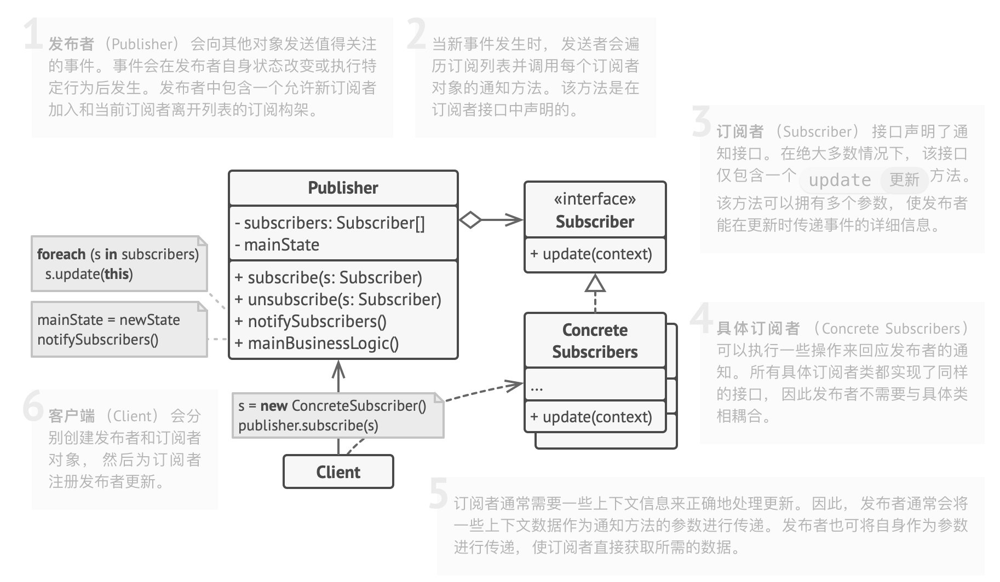
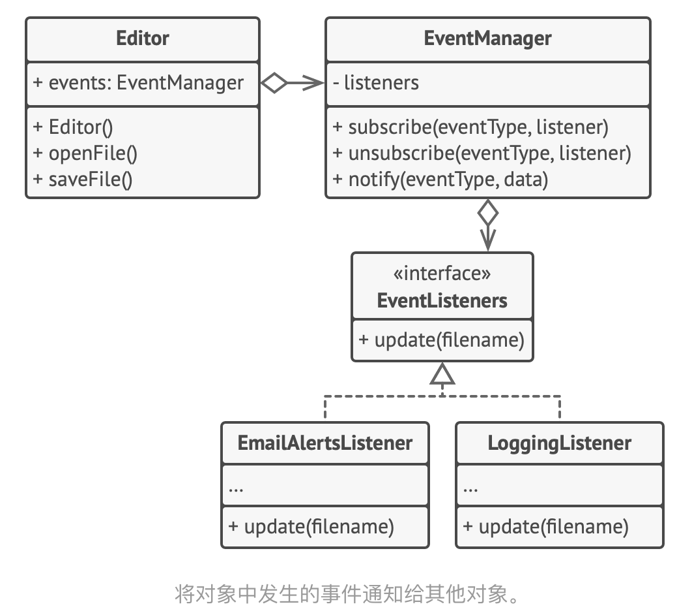

- > https://refactoringguru.cn/design-patterns/observer
- > **亦称： **事件订阅者、监听者、Event-Subscriber、Listener、Observer
- ## 意图
	- **观察者模式**是一种行为设计模式， 允许你定义一种订阅机制， 可在对象事件发生时通知多个 “观察” 该对象的其他对象。
- ## 问题
	- 假如你有两种类型的对象： ​ `顾客`和 `商店` 。 顾客对某个特定品牌的产品非常感兴趣 （例如最新型号的 iPhone 手机）， 而该产品很快将会在商店里出售。
	- 顾客可以每天来商店看看产品是否到货。 但如果商品尚未到货时， 绝大多数来到商店的顾客都会空手而归。
	- 另一方面， 每次新产品到货时， 商店可以向所有顾客发送邮件 （可能会被视为垃圾邮件）。 这样， 部分顾客就无需反复前往商店了， 但也可能会惹恼对新产品没有兴趣的其他顾客。
	- [[#red]]==我们似乎遇到了一个矛盾==： 要么让顾客浪费时间检查产品是否到货， 要么让商店浪费资源去通知没有需求的顾客。
- ##   解决方案
	- 拥有一些值得关注的状态的对象通常被称为[[#green]]==*目标*==， 由于它要将自身的状态改变通知给其他对象， 我们也将其称为[[#green]]==*发布者*== （publisher）。 所有希望关注发布者状态变化的其他对象被称为[[#green]]==*订阅者*== （subscribers）。
	- 观察者模式建议你为发布者类添加**订阅机制**， 让每个对象都能订阅或取消订阅发布者事件流。  该机制包括
		- 1） 一个用于存储订阅者对象引用的列表成员变量；
		- 2） 几个用于添加或删除该列表中订阅者的公有方法。
		- 
	- 实际应用中可能会有十几个不同的订阅者类跟踪着同一个发布者类的事件， 你不会希望发布者与所有这些类相耦合的。 此外如果他人会使用发布者类， 那么你甚至可能会对其中的一些类一无所知。
	- 因此， 所有订阅者都必须实现同样的接口， 发布者仅通过该接口与订阅者交互。 接口中必须声明通知方法及其参数， 这样发布者在发出通知时还能传递一些上下文数据。
		- 
- ## 观察者模式结构
	- 
- ## 伪代码
	- 在本例中， **观察者**模式允许文本编辑器对象将自身的状态改变通知给其他服务对象。
		- {:height 493, :width 543}
	- 订阅者列表是**动态生成**的： 对象可在运行时根据程序需要开始或停止监听通知。
	-