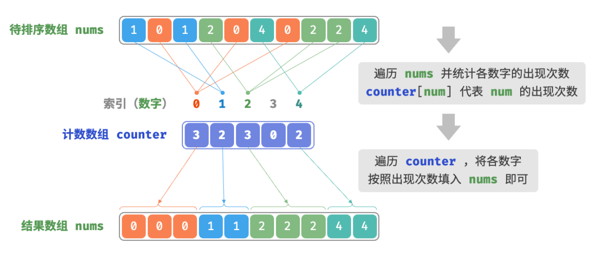

- > https://www.hello-algo.com/chapter_sorting/counting_sort/
-
- **「计数排序 Counting Sort」**通过统计元素数量来实现排序，通常应用于**整数数组**。
- ## 简单实现
	- 给定一个长度为 $n$ 的数组 `nums` ，其中的元素都是“非负整数”。计数排序的整体流程如下：
		- 1. 遍历数组，找出数组中的最大数字，记为 $m$ ，然后创建一个长度为 $m+1$ 的辅助数组 `counter` ；
		- 2. **借助 `counter` 统计 `nums` 中各数字的出现次数**，其中 `counter[num]` 对应数字 `num` 的出现次数。统计方法很简单，只需遍历 `nums`（设当前数字为 `num`），每轮将 `counter[num]` 增加 1 即可。
		- 3. **由于 `counter` 的各个索引天然有序，因此相当于所有数字已经被排序好了**。接下来，我们遍历 `counter` ，根据各数字的出现次数，将它们按从小到大的顺序填入 `nums` 即可。
	- 
	- ```
	  /* 计数排序 */
	  // 简单实现，无法用于排序对象
	  function countingSortNaive(nums) {
	      // 1. 统计数组最大元素 m
	      let m = 0;
	      for (const num of nums) {
	          m = Math.max(m, num);
	      }
	      // 2. 统计各数字的出现次数
	      // counter[num] 代表 num 的出现次数
	      const counter = new Array(m + 1).fill(0);
	      for (const num of nums) {
	          counter[num]++;
	      }
	      // 3. 遍历 counter ，将各元素填入原数组 nums
	      let i = 0;
	      for (let num = 0; num < m + 1; num++) {
	          for (let j = 0; j < counter[num]; j++, i++) {
	              nums[i] = num;
	          }
	      }
	  }
	  
	  ```
	- > **计数排序与桶排序的联系**
	  >
	  > 从桶排序的角度看，我们可以将计数排序中的计数数组 `counter` 的每个索引视为一个桶，将统计数量的过程看作是将各个元素分配到对应的桶中。本质上，计数排序是桶排序在整型数据下的一个特例。
- ## 完整实现
	- **如果输入数据是对象，上述步骤 `3.` 就失效了**。
	- 例如，输入数据是商品对象，我们想要按照商品价格（类的成员变量）对商品进行排序，而上述算法只能给出价格的排序结果。
	- 那么如何才能得到原数据的排序结果呢？我们首先计算 `counter` 的**「前缀和」**。顾名思义，索引 `i` 处的前缀和 `prefix[i]` 等于数组前 `i` 个元素之和，即
	- $$prefix[i]=\sum_{j=0}^{i}counter[j]$$
	-
-