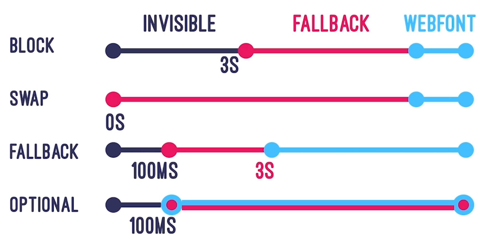

- ## 资源的压缩和合并
	- ### 减少 http 请求数量
	  background-color:: pink
	- ### 减少请求资源的大小
	  background-color:: pink
		- HTML、CSS 压缩
		- JS 压缩与混淆
- ## 图片优化
	- ### 图片格式比较
	  background-color:: pink
		- `JPEG/JPG`
			- 压缩比高，画质好，100k以内
			- 展示用图片
			- JPEG/JPG 压缩工具： [imagemin](https://github.com/imagemin/imagemin)
			- [[#red]]==缺点==： 有损
		- `PNG`
			- 细节纹理，但体积比 `JPEG/JPG` 大
			- 图标、logo
		- `webp`
			- 体积比 `PNG` 小，质量更高
			- [[#red]]==缺点：浏览器兼容性==
	- ### 图片加载优化
	  background-color:: pink
		- #### 图片懒加载 (lazy loading)
			- 原生图片懒加载方案：
			  collapsed:: true
				- [[#green]]==推荐使用方案四==
				- {{embed ((652372ba-d93c-46a0-b652-54860090d041))}}
			- 第三方图片懒加载方案
		- #### 使用渐进式图片
			- 
			- Progressive JPEG 格式
		- #### 使用响应式图片
			- 适配不同屏幕尺寸
			- ```
			  
			  ```
	- ### 字体优化
	  background-color:: pink
		- ### FOIT (Flash Of Invisible Text) 和 FOUT (Flash Of Unstyled Text)
			- 字体未下载完成时，浏览器隐藏或自动降级，导致字体闪烁
			- 使用 `font-display`
			  collapsed:: true
				- 
		- ### 字体的引入
		  collapsed:: true
			- `font-face`
				- font-family
				- font-style
				- font-weight
				- src
				- ...