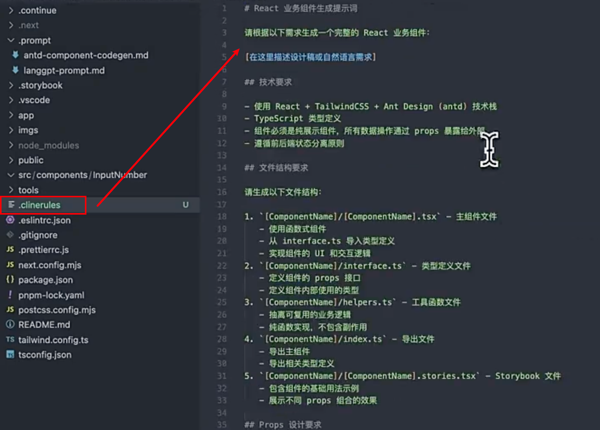
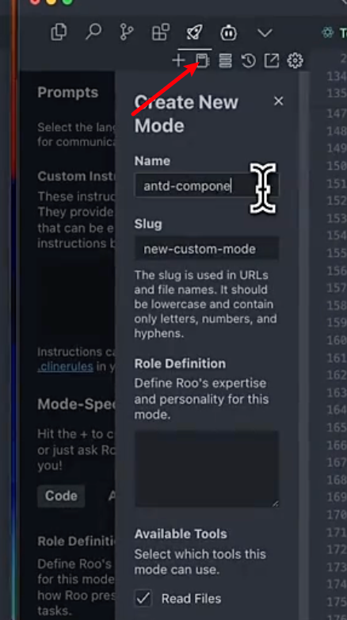

## Cline 集成 AI 应用
	- ### 初始化配置
		- 在 Settings 中配置`Provider Settings`
		  logseq.order-list-type:: number
		- 选择`OpenAI Compatible`的 API Provider
		  logseq.order-list-type:: number
		- 配置 302 的 BaseUrl 和 API Key
		  logseq.order-list-type:: number
	- ### 方式一：.clinerules
	  background-color:: green
		- `集成步骤`
			- 在项目根目录下创建 `.clinerules` 文件
			  logseq.order-list-type:: number
			- 在`.clinerules`文件中写入提示词
			  logseq.order-list-type:: number
			- 
	- ### 方式二：.clinerules + prompt file
	  background-color:: green
		- `集成步骤`
			- 在项目的根目录下新建`.clinerules`文件
			  logseq.order-list-type:: number
			- 让 AI 根据下面的提示词生成对应的`.clinerules` prompt
			  logseq.order-list-type:: number
				- ```
				  帮我重构.clinerules中的prompt，当用户提出“生成业务组件”相关的需求的时候，能够去读取@antd-component-codegen.md 中规则，并按照规则来生成业务组件的代码
				  ```
	- ### 方式三：自定义 prompt 系统角色
	  background-color:: green
		- `集成步骤`
			- 打开 `Prompt` 配置
			  logseq.order-list-type:: number
			- 新增一个 prompt role
			  logseq.order-list-type:: number
			- {:height 475, :width 274}
	- ### 方式四：MCP
	  background-color:: green
		- `集成步骤`
			- 打开 MCP setting 文件
			  logseq.order-list-type:: number
			- 写入下面的内容
			  logseq.order-list-type:: number
				- ```json
				  {
				    "mcpServers": {
				      "dify": {
				        "command": "node",
				        "args": ["/Users/lv/workspace/dify-mcp-server/build/index.js"],
				        "env": {
				          "DIFY_API_KEY": "app-wT7iLq0uGhEvjKrx9lgeGhmj"
				        },
				        "disabled": false,
				        "alwaysAllow": []
				      }
				    }
				  }
				  ```
	-
-