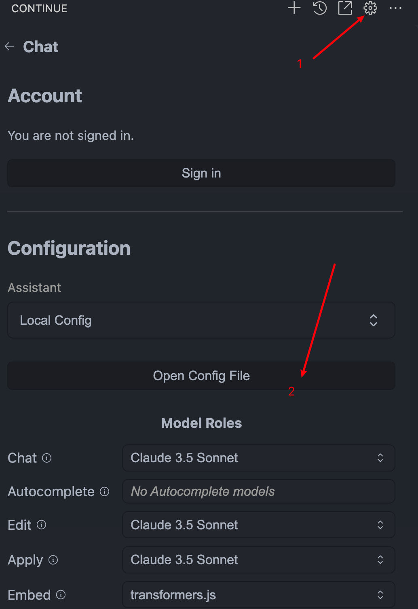
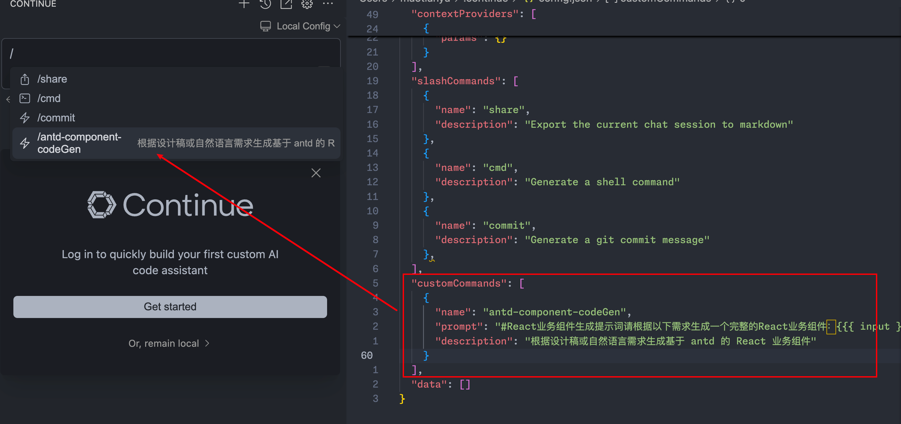
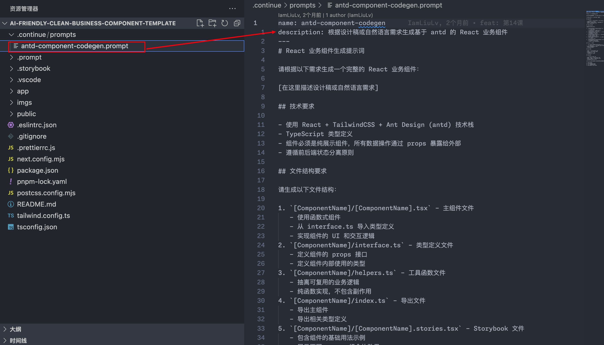
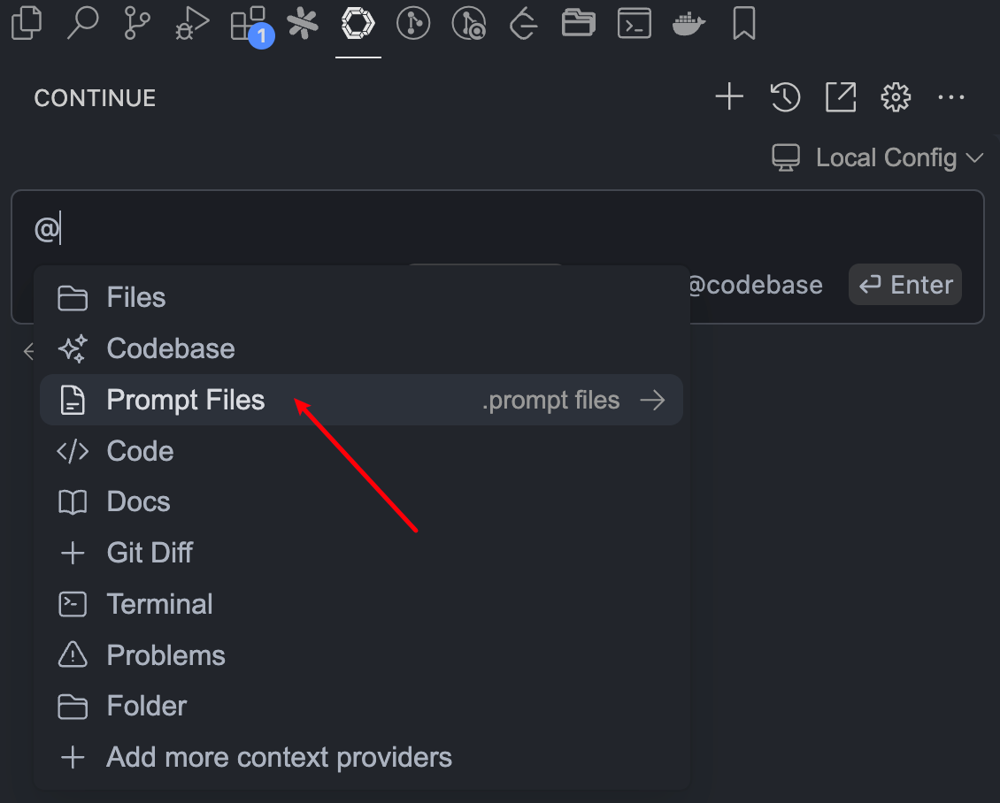
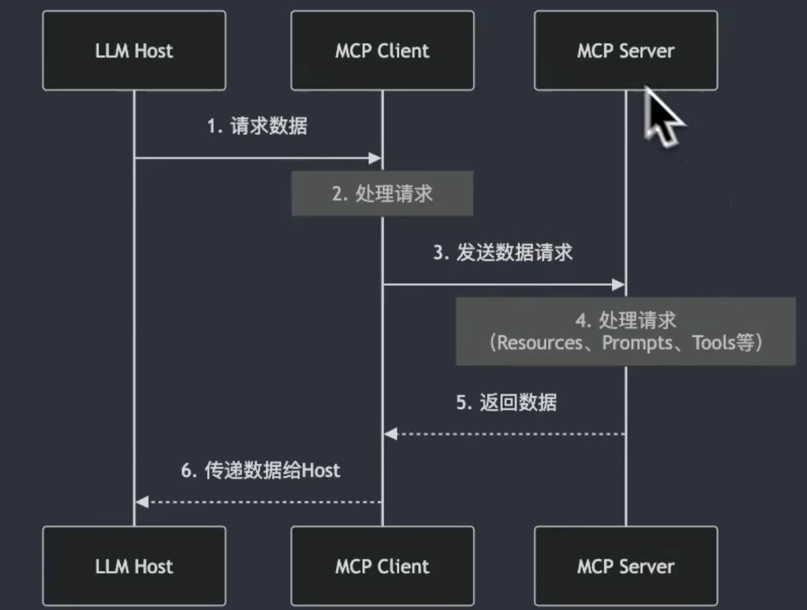

## Continue 介绍
	- ### 基本功能：
		- AI Chat
		- 自动补全
	- ### 客制化
		- Model Provider： Chat 选择模型
		- Command：在 Chat 中通过`/`来调用
		- Context Provider：在 Chat 中通过`@`来调用
- ## 集成 AI 应用
	- ### Command
	  background-color:: pink
		- `集成步骤`:
			- 打开 Contunue 的配置文件`~/.continue/config.json`文件
			  logseq.order-list-type:: number
				- {:height 488, :width 370}
			- 配置`customCommands`:
			  logseq.order-list-type:: number
				- 
	- ### Context Provider
	  background-color:: pink
		- `集成步骤`
			- 在项目根目录新建`.continue/prompts/antd-component-codegen.prompt`文件
			  logseq.order-list-type:: number
				- 
			- 通过 `@Prompt Files` 调用 prompt 文件
			  logseq.order-list-type:: number
				- 
	- ### Model Provider
	  background-color:: pink
		- `集成步骤`
			- 在 `config.json models` 的 **systemMessage** 中添加 prompt
			- ```markdown
			  {
			    "model": "claude-3-5-sonnet-latest",
			    "title": "Antd Component Codegen",
			    "systemMessage": "#React业务组件生成提示词请根据以下需求生成一个完整的React业务组件：[在这里描述设计稿或自然语言需求]##技术要求-使用React+TailwindCSS+AntDesign(antd)技术栈-TypeScript类型定义-组件必须是纯展示组件，所有数据操作通过props暴露给外部-遵循前后端状态分离原则##文件结构要求请生成以下文件结构：1.`[ComponentName]/[ComponentName].tsx`-主组件文件-使用函数式组件-从interface.ts导入类型定义-实现组件的UI和交互逻辑2.`[ComponentName]/interface.ts`-类型定义文件-定义组件的props接口-定义组件内部使用的类型3.`[ComponentName]/helpers.ts`-工具函数文件-抽离可复用的业务逻辑-纯函数实现，不包含副作用4.`[ComponentName]/index.ts`-导出文件-导出主组件-导出相关类型定义5.`[ComponentName]/[ComponentName].stories.tsx`-Storybook文件-包含组件的基础用法示例-展示不同props组合的效果##Props设计要求-所有异步操作（如数据获取、提交）都通过回调函数形式的props暴露-使用TypeScript为所有props提供完整的类型定义-props命名要符合业务语义-必要时提供默认值##样式要求-优先使用TailwindCSS类名-合理使用AntDesign组件-遵循响应式设计原则-注意组件间距和对齐##代码规范-使用ESLint推荐配置-组件和函数使用PascalCase命名-props和变量使用camelCase命名-代码需要适当的注释说明请根据以上要求，生成完整的组件代码。生成的代码应当：1.可以直接运行2.包含必要的类型定义3.包含基础的错误处理4.提供清晰的props文档",
			    "provider": "anthropic",
			    "apiKey": "sk-GNlgnfG5sZLN6B8xykDN3J0spjxnLApZPBmEYqxM7KpPoVrY",
			    "apiBase": "https://api.302.ai/v1",
			    "completionOptions": {
			      "maxTokens": 8192
			    }
			  }
			  ```
	- ### MCP
	  background-color:: green
		- `MCP 定义`：Model Context Protocol 是一个开放的协议，用于帮助 AI 模型与外部系统进行交互，从而让 AI 可以获取外部的资源，或者调度外部系统的能力。
		- `LLM Host MCP Client、MCP Server 之间的数据流转`
			- 
		- `集成步骤`：
			- 准备一个 MCP Server
			  logseq.order-list-type:: number
			- 在 Continue 中配置 MCP Server
			  logseq.order-list-type:: number
				- ```markdown
				  {
				    "experimental": {
				      "modelContextProtocolServers": [
				        {
				          "transport": {
				            "type": "stdio",
				            "command": "/Users/lv/.nvm/versions/node/v23.5.0/bin/node",
				            "args": ["/Users/lv/workspace/dify-mcp-server/build/index.js"],
				            "env": {
				              "DIFY_API_KEY": "app-wT7iLq0uGhEvjKrx9lgeGhmj"
				            }
				          }
				        }
				      ]
				    }
				  }
				  ```