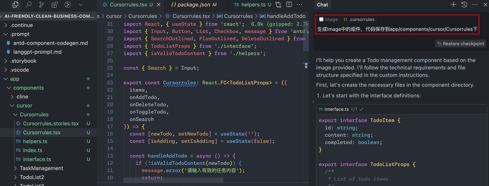

## 集成 AI 应用
	- ### 方式一：.cursorrules
	  background-color:: green
		- 在项目根目录下创建 `.cursorrules` 文件（or cursor settings 中配置 Rules for AI）
		  logseq.order-list-type:: number
		- 写入`antd-component-codegen.md` 中的提示词
		  logseq.order-list-type:: number
			- 
		- **提示词调度分析**:
			- 类似于 `Cline` 的`clinerules`调度机制
			- 通过 `system prompt` 注入的方式
	- ### 方式二：Notepad
	  background-color:: green
		- [Cursor Notepad](https://docs.cursor.com/features/beta/notepads#what-should-i-write-in-notepads)
	- ### 方式三：cursorrules + prompt file
	  background-color:: green
	- ### 方式四：.cursor/rules
	  background-color:: green
	- ### 方式五：自定义 Composer Agent Command Tools
	  background-color:: green
		-