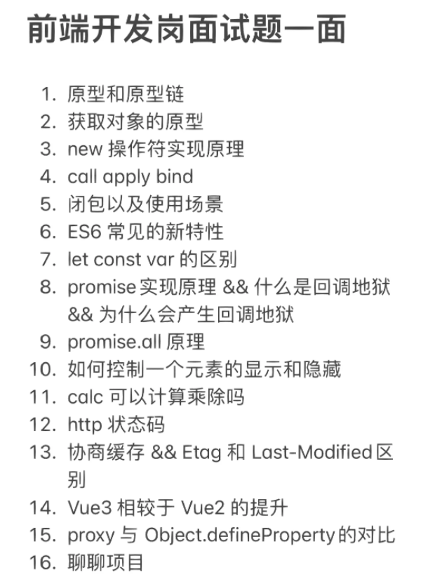
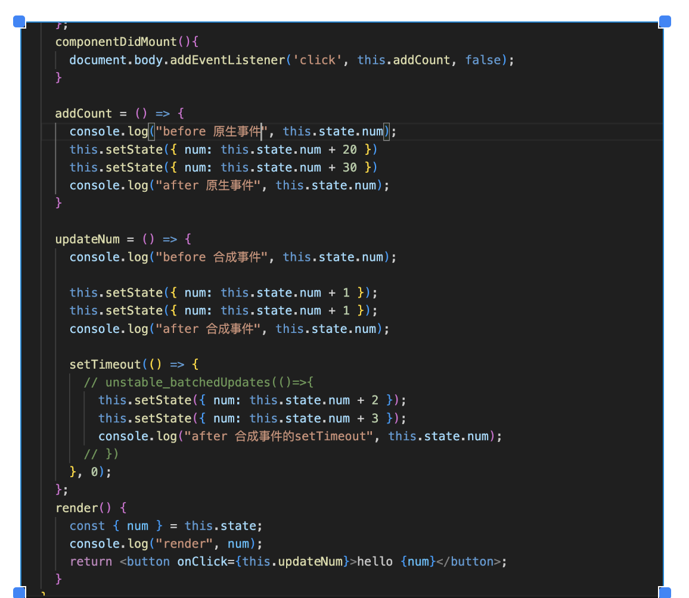

## 1. [shein](https://talent.sheincorp.cn/JobList.html?jobtype=&hireMode=1)
background-color:: gray
collapsed:: true
	- ### JD
	  background-color:: green
		- [上海-前端开发工程师（电商C端）](https://talent.sheincorp.cn/JobListInfo.html?language=zh&id=66902&mokaJobId=fee49d51-6406-42d0-8941-36dfc695cce2)
			- `投递状态`：[[#red]]==暂不符合==
			- 1.JavaScript 基本功扎实，3年左右相关工作经验，
			- 2.熟练使用vue、react
			- 3.熟悉基本的计算机网络概念，熟悉 HTTP 协议，了解 TCP/IP 的基本工作原理，
			- 4.熟悉各种 WEB 标准规范，
			- 5.有后台开发经验，
			- 6.熟悉 linux、喜欢钻研前沿技术的优先。
		- [高级/资深前端开发工程师（风控）](https://talent.sheincorp.cn/JobListInfo.html?language=zh&id=66938&mokaJobId=33149fbe-27b2-43f4-99f6-166c5bffb85d)
			- `投递状态`：[[#blue]]==业务复筛==
			- 1、2年以上前端研发经验；
			- 2、熟悉React前端开发框架，并了解基本原理，对其实现有深入理解；
			- 3、掌握WEB前端开发技术，对后端技术栈有一定了解，熟悉与后端的协作模式；
			- 4、积极乐观，认真负责，乐于协作。
			- 加分项
			- 有Redux或其他状态管理库的实际开发经验
			- 熟悉Webpack、Babel等构建工具的使用
			- 熟悉Node.js或其他后端开发语言
	- ### 公司详情
	  background-color:: blue
		- 办公地点：人民广场
		- 作息时间：10:00 - 22:00，242 工时（11 h* 22 d）
	- ### 面经：
	  background-color:: pink
		- {:height 474, :width 355} #card
- ## 2. [友塔游戏](https://www.zhipin.com/job_detail/7fa5a60814e4e44d1XR529-6EVBU.html?ka=hot-job-1)
  background-color:: gray
  collapsed:: true
	- ### JD
	  background-color:: green
		- 1.计算机或相关专业，本科及以上学历，1-3年前端开发经验；
		  2 .了解JS、CSS、HTML等前端技术，有任意⼀个或多个主流前端框架（React、Vue、Angular 等）使⽤经验者优先；
		  3.有良好的代码习惯，能掌握好代码复⽤和结构分层的平衡，代码冗余率低；
		  4. 对⼯作有⾜够的责任感，喜欢探索新技术，懂得团队合作，能承受⼯作压⼒
	- ### 公司详情
	  background-color:: blue
		- 办公地点：金虹桥国际中心（拼多多对面）
	- ### 面经
	  background-color:: pink
- ## 3. [携程](https://job.ctrip.com/#/jobList?cityCode=CO0009)
	- ### JD
	  background-color:: green
		- [前端开发工程师(MJ017713)](https://job.ctrip.com/#/job-detail/MJ017713)
			- 工作职责：
			- 1、负责APP RN开发及内部管理系统前端开发工作，保障相应产品的持续迭代
			- 2、负责前端工程化体系建设，逐步提升开发和交付效率，保障产品工程质量
			- 3、优化产品系统的性能，易用性，提升线上用户体验
			- 任职要求：
			- 1、掌握 HTML, JavaScript / ES6, CSS 等前端基础技能
			- 2、熟悉 React， Vue，对其实现有深入理解，[[#red]]==了解 React Native==，对前端 React 组件化有一定实践
			- 3、熟悉 Webpack,  Rollup，Babel 等前端编译构建技术
			- 4、熟悉 Web 应用的[[#green]]==渲染原理==，掌握 HTTP 等基本协议
			- 5、熟悉业界主流的[[#green]]==性能优化==措施
			- 6、对小程序开发，原生开发，动画、编译构建、网络、性能优化等方向有了解
		- [高级App前端开发工程师(MJ018593)](https://job.ctrip.com/#/job-detail/MJ018593)
			- 职位描述
			- 1. 根据产品或项目要求进行开发，独立完成模块分析和设计；
			- 2. 使用RN等前端技术进行App的开发；
			- 3. 持续优化项目技术，确保项目质量，解决前端开发流程中的问题；
			- 4. 探索前沿技术，通过技术和工具的引入，优化开发流程。
			- 任职资格
			- 1. 本科及以上学历，计算机基础扎实，3年左右H5或者App跨端开发经验(React Native / Flutter)；
			- 2. 扎实的前端基础，熟练掌握并使用JavaScript，熟悉React.js或React Native、熟悉React Hooks，并有大型项目经验；
			- 3. 熟练使用Redux / Redux Toolkit / Rematch进行前端页面状态管理，[[#green]]==掌握其原理==；
			- 4. 能熟练使用Git，有良好的编码规范，注重产品体验和细节；
			- 5. 有强烈的上进心和求知欲，善于学习和运用新知识，善于沟通和逻辑表达，有强烈的团队意识和执行力；
			- 6. 熟悉前端性能优化；
			- 7. 具备责任心、求知欲强，工作积极主动，具备独立思考和良好的表达能力。
	- ### 公司详情
	  background-color:: blue
		- 办公地点：长空 soho
	- ### 面经
	  background-color:: pink
		- #### 一面
			- 如何系统地检测react代码中存在重复渲染
			  logseq.order-list-type:: number
			- 原生事件与合成事件
			  logseq.order-list-type:: number
				- 
			- 事件循环练习题
			  logseq.order-list-type:: number
			- 场景题：
			  logseq.order-list-type:: number
				- 同一个请求结果复用，缓存
				- 参考 ahooks - useRequest
		- #### 二面
			-
- ## 4. [小红书](https://job.xiaohongshu.com/jobs)
  collapsed:: true
	- ### JD
	  background-color:: green
		- [前端开发工程师-社区增长](https://job.xiaohongshu.com/jobs/8047/social) - 招聘人数： 2
			- 计算机或相关专业本科以上学历，2年及以上WEB端开发经验；
			- 熟悉JS、HTML、CSS开发与调试技术，熟悉Vue或者React框架；
			- 有过低代码平台开发经验或游戏工具类项目开发经验者优先；
		- [社区前端工程师-上海](https://job.xiaohongshu.com/jobs/3316/social) - 招聘人数： 1
			- 1. 本科及以上学历，两年以上前端开发经验，有移动端或跨平台应用开发经验
			  2. 熟练掌握前端领域相关技术，包括但不仅限于 JS/TS、Node.js 等
			  3. 熟练掌握 Vue / React / React Native 前端 UI 框架，了解框架基本原理
			  4. 了解跨端应用性能优化方案并有成熟思路，能够建立较好的业务性能指标并分析和优化性能数据
			  5. 乐观细心，具备良好的跨团队协作和沟通能力，作为业务 BP（Business Partner）积极推动项目进展
	- ### 公司详情
	  background-color:: blue
		- 办公地点：黄浦区 复兴soho
		- 作息时间：10:00 - 22:00 大小周
- ## 5. [拓竹科技 BambuLab](https://bambulab.cn)
  collapsed:: true
	- ### JD
	  background-color:: green
		- [前端开发工程师](https://bambulab.jobs.feishu.cn/experienced/position/7088878985438136613/detail)
			- 1. 大学本科以上学历, 2年以上的前端开发工作经验，有大型网站的前端架构设计经验者优先 ;
			  2. 精通Web前端技术，如HTML5、JavaScript、TypeScript、CSS3、Sass等 ;
			  3. [[#green]]==对测量和提升前端性能有一定经验 ;==
			  4. 对持续集成/持续交付有相关经验者优先 ;
			  5. 有强烈的好奇心、责任心和团队精神，善于沟通合作，学习能力强，能独立完成相关设计和编码。
	- ### 公司详情
	  background-color:: blue
		- 3D 打印科技公司
		- 关联：大疆
		- 办公地点：张江
- ## 6. [Orthogonal](https://www.orthogonal.cc)
  collapsed:: true
	- ### 笔试一面
	  collapsed:: true
		- TimelinePicker 组件
		- {{video https://uploads.codesandbox.io/uploads/user/dd6f99c4-2d70-4f25-a7a2-4ebbf857f313/MieN-quest.mp4}}
		- 实现：
			- TODO 实现 timeline picker，config
			- TODO 实现 拖拽功能  react-dnd react-draggable
			- TODO 实现跨组件拖拽
- ## 7. 阿里
  collapsed:: true
	- ### 笔试一面 11.13
		- Promise.all
		  logseq.order-list-type:: number
		- deepclone
		  logseq.order-list-type:: number
		- jsonp
		  logseq.order-list-type:: number
		- quicksort
		  logseq.order-list-type:: number
		- sleep
		  logseq.order-list-type:: number
- ## 8. 字节
  collapsed:: true
	- http 缓存 —— 强制缓存和协商缓存
	  logseq.order-list-type:: number
		- ((655b7127-9f32-4319-9fcd-f606c86997d3))
		- 强制缓存与协商缓存区别
		- 性能
		- 最佳缓存策略
	- fiber 是用来做什么的
	  logseq.order-list-type:: number
		- https://q.shanyue.tech/fe/react/165
	- html2canvas
	  logseq.order-list-type:: number
		- 原理
		- 不使用 svg 怎么实现
			- Nodejs服务端生成：通过调用chrome内核来加载对应的页面，然后使用浏览器等内置API进行截图，例如使用 puppeteer 生成 pdf。
			  logseq.order-list-type:: number
			- 前端生成：直接使用 HTML5 canvas 的API直接绘制。
			  logseq.order-list-type:: number
		- 兼容性，最佳方案是什么
			- 移动端调用原生截图
	- LRU
	  logseq.order-list-type:: number
- ## 9. 乌鸫
	- 笔试：
		- 深拷贝
		  logseq.order-list-type:: number
		- reduce
		  logseq.order-list-type:: number
			- ((6532a187-f3fc-4b0f-9b54-dd556b39d65a))
		- throttle
		  logseq.order-list-type:: number
	- 电话面：
		- 水平垂直居中
		  logseq.order-list-type:: number
			- ((64b0bc44-768e-473d-9bd2-57abedfe9da5))
		- fiber 的理解
		  logseq.order-list-type:: number
		- 事件循环 event loop
		  logseq.order-list-type:: number
			- 使用setInterval实现一个倒计时功能，倒计时渲染在页面的时间是准确的吗？怎么获取准确的时间？
				- 不准确，由于event loop 可能有十几毫秒的延迟
				- 准确时间：使用 requestAnimationFrame()
					- https://www.sanks-blog.com/requestAnimationFrame/
					- ((655f6004-d486-44ab-97ef-53484074f049))
		- FCP
		  logseq.order-list-type:: number
			- 定义
			- 计算（时间节点怎么获取）
				- ((655f6e06-e656-4a73-81b4-7de2d2e77938))
- ## 10. 肯斯抓特
	- JSBridge 原理
	- 算法题：无重复最长子数组-滑动窗口
	- 场景题：Modal 实现，类似 Modal.show() 函数式调用