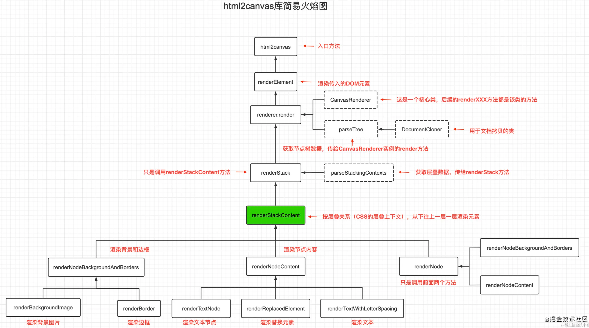
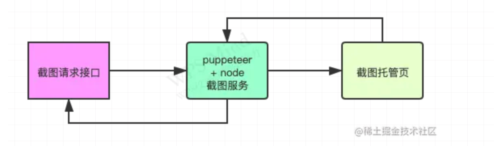
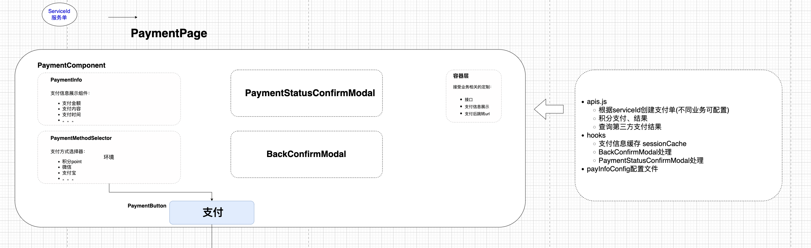
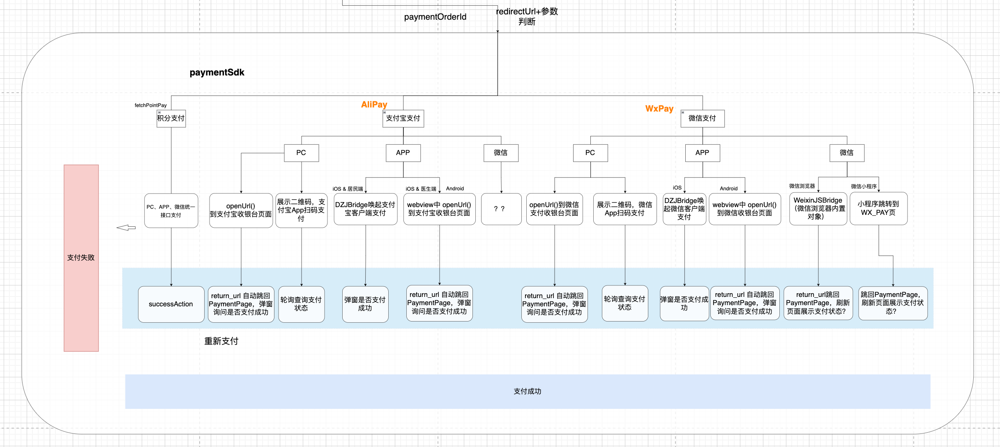

## 自我介绍
	- 我叫XXX。我[[#green]]==毕业于西安交通大学==信息工程专业。之前任职于上海明品医学（医学数据公司），有两年左右 React 前端开发经验，在职期间主要负责公司互联网医疗平台相关项目和研发，对 H5 与移动端混合开发、前端性能优化等问题都有一定的经验，对行业相关的研发设计流程也比较熟悉，因此决定面试XXX的前端研发岗位，希望能获此机会。
	- #admon-lists List
		- **基本情况**：我叫XXX。我[[#green]]==毕业于西安交通大学==信息工程专业。之前任职于上海明品医学（医学数据公司），有两年左右 React 前端开发经验，在职期间主要负责公司互联网医疗平台相关项目和研发。
		- **自身优势**：对 H5 与移动端混合开发、前端性能优化等问题都有一定的经验，对行业相关的研发设计流程也比较熟悉。
		- **求职动机**：可针对不同企业优化
	- [[#red]]==在我看来，作为一名前端开发工程师，细致入微的注意细节和良好的沟通能力是非常重要的。我喜欢追求技术的创新和学习，并且乐于与团队成员合作，共同完成项目的开发。我相信我的技术能力和团队合作精神将使我成为贵公司的有价值的成员。==
- ## 项目面试
	- ### Redux
	  background-color:: green
		- ((6499b665-777d-4d8a-8dab-9ef1b34c0a36))
		- ((64b4dcbf-f5f5-4575-a537-c6bc27b18dfc))
		- ((64c87633-9bcc-48f2-813b-d6ede014c425))
		- 项目中的实际应用：
			- 健康画像是用户的健康数据集合DTO，包括基本信息、医疗信息（自主输入的）、系统推送的潜在健康风险。
	- ### html2canvas
	  background-color:: green
		- #### 业务场景 —— Situation
			- 用户查看健康报告、运动打卡、新年活动等场景，截图生成海报并分享
		- #### 任务 —— Task
			- 对当前H5页面截图 —— html2canvas，也可嵌入用户 qrcode；
			  logseq.order-list-type:: number
			- 调用原生分享组件；
			  logseq.order-list-type:: number
			- 分享截图海报到微信、朋友圈等；
			  logseq.order-list-type:: number
		- #### html2canvas 截图原理
			- 将DOM对象进行迭代克隆和解析，按照层叠关系自顶向下逐步绘制到 canvas 对象里，然后利用 canvas 的底层 API `toDataURL`和 `toBlob`转换成图片数据。
			- 
		- #### [[#blue]]==html2canvas 在 React 中的使用==
		  collapsed:: true
			- 1. 获取节点：`let img = document.querySelector("#myImg");`
			- 2. 配置需要参数：
				- ```
				  let options = {
				          useCORS: true,// 开启跨域
				          backgroundColor: "#caddff",// 背景色
				          ignoreElements: (ele) => {},// dom节点
				          scale: 4,// 渲染出来的比例
				  };
				  ```
			- 3. 调用方法，在回调中即可获取到对应的`canvas`对象，通过`canvas.toDataURL`可以将`canvas`对象转换为`base64`的图片地址，再创建一个`a`标签模拟点击即可触发图片下载到本地：
				- ```
				  html2canvas(img, options).then((canvas) => {
				          let url = canvas.toDataURL("image/png"); // canvas转png（base64）
				  		const link = document.createElement('a');
				  		link.href = dataURL;
				  		link.download = 'poster.png';
				  		// 模拟点击链接，触发下载
				  		link.click();
				        });
				  ```
		- #### [[#green]]==html2canvas基本参数说明==
		  collapsed:: true
			- |属性名|默认值|描述|
			  |--|--|--|
			  |allowTaint|false|是否允许跨域图像。会污染画布，导致无法使用canvas.toDataURL 方法|
			  |backgroundColor|#ffffff	|画布背景色（如果未在DOM中指定），设置null为透明|
			  |canvas|null|现有canvas元素用作绘图的基础|
			  |foreignObjectRendering|false|如果浏览器支持，是否使用ForeignObject渲染|
			  |scale|window.devicePixelRatio|用于渲染的比例。默认为浏览器设备像素比率|
			  |useCORS|false|是否尝试使用CORS从服务器加载图像|
		- #### 使用时遇见的坑点及解决方案
		  background-color:: pink
			- #### **图片跨域问题**
				- html2canvas的配置项中配置 `allowTaint:true` 或 `useCORS:true`(二者不可共同使用)
				  logseq.order-list-type:: number
				- img 标签增加 `crossOrigin='anonymous'`图片服务器配置 Access-Control-Allow-Origin 或使用代理；
				  logseq.order-list-type:: number
				- 服务器需要配置 `Access-Control-Allow-Origin`信息。
				  logseq.order-list-type:: number
			- #### **图片清晰度差**
				- 调整配置项 `scale`；
				  logseq.order-list-type:: number
				- 两次canvas绘制方案：
				  logseq.order-list-type:: number
					- 使用html2canvas进行预渲染：在JavaScript代码中，使用html2canvas库的`html2canvas()`函数对要截图的元素进行预渲染。将要截图的元素作为参数传递给该函数。
					  logseq.order-list-type:: number
						- ```
						  var elementToCapture = document.getElementById('elementId');
						  
						  html2canvas(elementToCapture, {
						    canvas: document.getElementById('preCanvas')
						  }).then(function(preCanvas) {
						    // 预渲染完成后执行下一步操作
						  });
						  ```
					- 调整预渲染canvas的大小：由于预渲染canvas的大小可能与所需的截图大小不匹配，需要调整预渲染canvas的大小以适应所需区域的尺寸，并结合设备像素比进行缩放。
					  logseq.order-list-type:: number
						- ```
						  var desiredWidth = 800;
						  var desiredHeight = 600;
						  var devicePixelRatio = window.devicePixelRatio || 1;
						  
						  var preCtx = document.getElementById('preCanvas').getContext('2d');
						  preCtx.canvas.width = desiredWidth * devicePixelRatio;
						  preCtx.canvas.height = desiredHeight * devicePixelRatio;
						  preCtx.scale(devicePixelRatio, devicePixelRatio);
						  ```
					- 在最终canvas上进行绘制：使用`drawImage()`方法将预渲染canvas上的内容绘制到最终canvas上，并结合设备像素比进行缩小绘制。
					  logseq.order-list-type:: number
						- ```
						  var finalCtx = document.getElementById('finalCanvas').getContext('2d');
						  finalCtx.canvas.width = desiredWidth;
						  finalCtx.canvas.height = desiredHeight;
						  
						  finalCtx.drawImage(preCanvas, 0, 0, desiredWidth, desiredHeight);
						  ```
					- 获取最终截图：使用最终canvas上的`toDataURL()`方法获取最终截图的数据URL，可以将其保存为图像或进行其他操作。
					  logseq.order-list-type:: number
						- ```
						  var finalDataURL = document.getElementById('finalCanvas').toDataURL();
						  console.log('Final screenshot:', finalDataURL);
						  ```
			- #### **滚动元素截图不全**
				- 设置滚动元素提前滚动到顶部。
				- `document.body.scrollTop = document.documentElement.scrollTop = 0;`
		- #### 总结
		  background-color:: pink
			- 基于前端 JS 生成方案具有很多限制：
				- 1. 客户端经常会有些小的兼容性问题，特别是IOS端；
				  2. 在终端差异较大时无法保证不同终端生成的图片完全一样；
				  3. 性能开销比较大，无法预先生成。
			- [[#green]]==考虑替代方案：==
				- 1. 在APP端借助于原生的截图能力；在浏览器里借助人机交互接口进行截图，进而获得真正的用户所见即所得的截图效果。
				- 2. 后台生成是指在 Nodejs 服务端中，通过调用 chrome 内核来加载对应的页面，然后使用浏览器等内置API进行截图，例如使用 puppeteer 生成 pdf。
					- 
	- ### QRCode.js
	  background-color:: green
	  collapsed:: true
		- ```
		  var qrcode = new QRCode('qrcode', {
		      text: 'your content',
		      width: 256,
		      height: 256,
		      colorDark: '#000000',
		      colorLight: '#ffffff',
		      correctLevel: QRCode.CorrectLevel.H
		  });
		  ```
	- ### Hybrid 混合开发
	  background-color:: green
		- [JSBridge 原理](https://juejin.cn/post/6844903585268891662)
		- 
		- **注入 API 方式**的主要原理是，通过 WebView 提供的接口，向 JavaScript 的 Context（window）中注入对象或者方法，让 JavaScript 调用时，直接执行相应的 Native 代码逻辑，达到 JavaScript 调用 Native 的目的。
	- ### Antd Form 和配置化 JSON ⽣成表单
	  background-color:: blue
		- #### 业务场景 —— Situation
			- 在后台管理平台端，包括App 的医生端，存在大量的表单页面需求，如果以传统方式逐一编写组件，有大量的重复劳动（表单项输入组件类似），因此需要开发一个formbuilder组件，能够根据 Json 表单结构一次性生成复杂表单
		- #### 任务 —— Task
			- 完善formbuilder，支持嵌套表单、校验逻辑、数据联动等
		- #### Action
			- 关键原则是它应该只帮助定义表单字段和布局，同时不会降低 antd 原始表单 API 的灵活性。
			- 与后端沟通协商表单项组件编码，支持后端维护表单Json结构
			- #### 核心代码
			  background-color:: green
			  collapsed:: true
				- ```
				  // FormBuilder
				  function FormBuilder(props) {
				    const { meta, initialValues, disabled = false, form = null } = props
				    if (!meta) return null
				    
				    const { fields } = meta
				    return (
				    	fields.map(field => 
				      field.hasChildren
				      ? 
				      <FormBuilder {...field} />
				      :
				      <FormBuilderField
				        key={field.key}
				        field={field}
				        disabled={disabled}
				        meta={meta}
				        form={form}
				      />
				      )
				    )
				  }
				  
				  // FormBuilderField
				  const isV4 = !!Form.useForm
				  function FormBuilderField(props) {
				    const { field, meta, form } = props
				    const formItemProps = {
				      key: field.key,
				      colon: meta.colon,
				      ...field.formItemProps,
				    };
				    
				    const fieldProps = {
				      initialValue,
				      rules,
				      ...field.fieldProps,
				    };
				    
				    if (isV4) {
				      Object.assign(formItemProps, fieldProps)
				    };
				    
				    const FieldWidget = field.widget || Input;
				    const ele = (
				      <FieldWidget {...widgetProps} {...valueProps}>
				        {field.children || null}
				      </FieldWidget>
				    )
				    // antd v3.x 和 v4.x api区别
				    const ele2 = isV4 ? ele : form.getFieldDecorator(field.id || field.key, fieldProps)(ele)
				    if (isV4) {
				      // antd v4 always has form item
				      return <FormItem {...formItemProps}>{ele}</FormItem>
				    }
				    return <FormItem {...formItemProps}>{ele2}</FormItem>
				  }
				  ```
			- #### ant v3.x 与 v4.x 的区别
			  background-color:: blue
				- 动态表单：
				  logseq.order-list-type:: number
					- `v3.x `在 v3 中，当任何表单字段发生更改时，组件将重新渲染，因为它是基于高阶组件的。
						- ```
						  <Form>
						    {form.getFieldValue('f1') === 'foo' && <Form.Item {...}/>}
						  </Form>
						  ```
					- `v4.x`在 v4 中，每当字段发生更改时，使用 antd 表单的组件将永远不会重新渲染。使用 `shouldUpdate` 或 `dependencies`。
						- ```
						  <Form form={form}>
						    <Form.Item label="Field1" name="f1">
						      <Input />
						    </Form.Item>
						    <Form.Item shouldUpdate>
						      {() =>
						        form.getFieldValue("f1") === "foo" && (
						          <Form.Item label="Field2" name="f2">
						            <Input />
						          </Form.Item>
						        )
						      }
						    </Form.Item>
						  </Form>
						  ```
				- 获取 formInstance 的方式：
				  logseq.order-list-type:: number
					- `v3.x` 高阶组件`Form.create(Component)`，组件 props 中将传入 form。
					- `v4.x`
						- 对于类组件：
							- ```
							  import FormBuilder from 'antd-form-builder';
							  
							  export default class App extends Component {
							    formRef = React.createRef()
							    render() {
							      const meta = [{ key: 'name', label: 'Name' }]
							      return (
							        <Form ref={formRef} onValuesChange={() => this.forceUpdate()}>
							          <FormBuilder meta={meta} form={this.formRef} />
							        </Form>
							      )
							    }
							  }
							  ```
						- 对于函数组件：
							- ```
							  import { Form } from 'antd';
							  import FormBuilder from 'antd-form-builder'
							  
							  export default () => {
							    const [form] = Form.useForm()
							    const forceUpdate = FormBuilder.useForceUpdate();
							    const meta = [{ key: 'name', label: 'Name' }]
							    return (
							      <Form form={form} onValuesChange={forceUpdate}>
							        <FormBuilder meta={meta} form={form} />
							      </Form>
							    )
							  }
							  ```
						- [[#green]]==将 forceUpdate 传递给 antd 的 `Form` 的 `onValuesChange`：==
							- 因为在 v4 Form 中，当字段更改时，组件不会重新渲染。更灵活地控制动态逻辑，可以自己使用 `shouldUpdate` 和 `Form.Item` 。
		- #### Result
			- 提升开发效率
	- ### Echarts 封装
	  background-color:: blue
		- #### **折线图：src/components/LineChart**
		  collapsed:: true
			- ```
			  import React, { useEffect, useRef } from 'react';
			  import { IProps } from "./type";
			  import * as echarts from "echarts";
			  
			  const Index: React.FC<IProps> = (props) => {
			  
			      const chartRef:any = useRef();  //拿到DOM容器
			  
			      // 每当props改变的时候就会实时重新渲染
			      useEffect(()=>{
			          const chart = echarts.init(chartRef.current);   //echart初始化容器
			          let option = {  //配置项(数据都来自于props)
			              title: {
			                  text: props.title ? props.title : "暂无数据",
			              },
			              xAxis: {
			                  type: 'category',
			                  data: props.xData,
			              },
			              yAxis: {
			                  type: 'value'
			              },
			              series: [{
			                  data: props.seriesData,
			                  type: 'line'
			              }]
			          };
			  
			          chart.setOption(option);
			      }, [props]);
			  
			      return <div ref={chartRef} className="chart"></div>
			  }
			  
			  export default Index;
			  
			  ```
	- ### 支付类 SDK 封装
	  background-color:: blue
	  collapsed:: true
		- 
		- 
	- ### unstated-next
	  background-color:: blue
	  collapsed:: true
		- > unstated-next是针对 Function Component 的升级版，且特别优化了对 Hooks 的支持。
		  > unstated-next 只有不到 40 行，但想象空间却更大，且用法符合直觉。
		- #### 使用方式
			- unstated-next 本质上利用了 `useState`，利用了自定义 Hooks 可以与 UI 分离的特性，加上 `useContext` 的便捷性，利用不到 40 行代码实现了比 `unstated` 更强大的功能。
			- ```
			  import { createContainer } from "unstated-next";
			  
			  function useCounter() {
			    let [count, setCount] = useState(0);
			    let decrement = () => setCount(count - 1);
			    let increment = () => setCount(count + 1);
			    return { count, decrement, increment };
			  }
			  
			  let Counter = createContainer(useCounter);
			  
			  function CounterDisplay() {
			    let counter = Counter.useContainer();
			    return (
			      <div>
			        <button onClick={counter.decrement}> - </button>
			        <p>You clicked {counter.count} times</p>
			        <button onClick={counter.increment}> + </button>
			      </div>
			    );
			  }
			  
			  function App() {
			    return (
			      <Counter.Provider>
			        <CounterDisplay />
			        <CounterDisplay />
			      </Counter.Provider>
			    );
			  }
			  
			  ```
			- `createContainer` 可以将任何 Hooks 包装成一个数据对象，这个对象有 `Provider` 与 `useContainer` 两个 API，其中 `Provider` 用于对某个作用域注入数据，而 `useContainer` 可以取到这个数据对象在当前作用域的实例。
- ## 职业规划